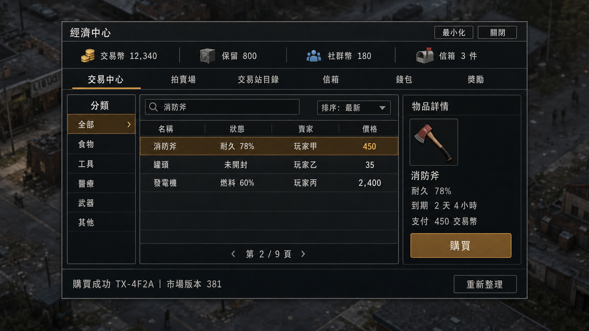
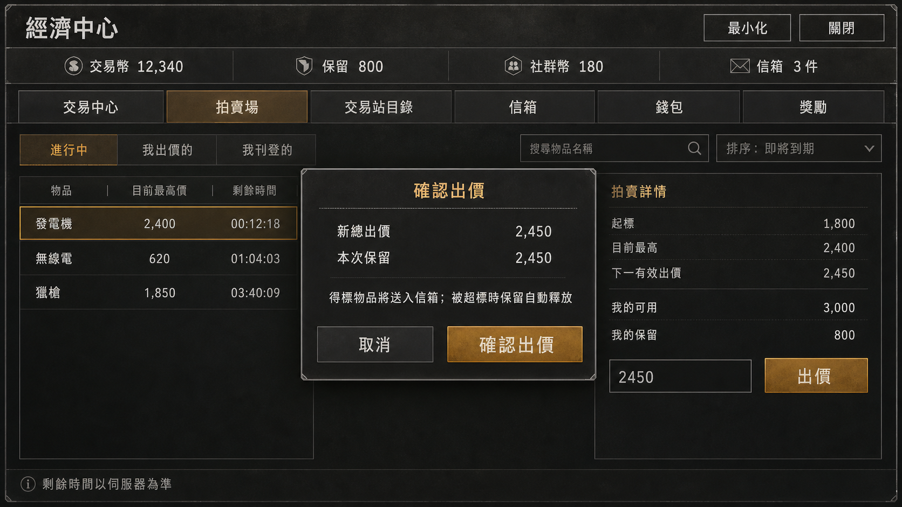
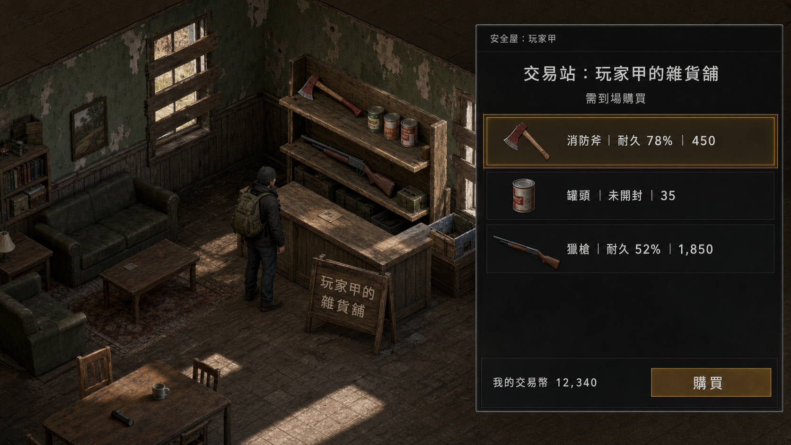
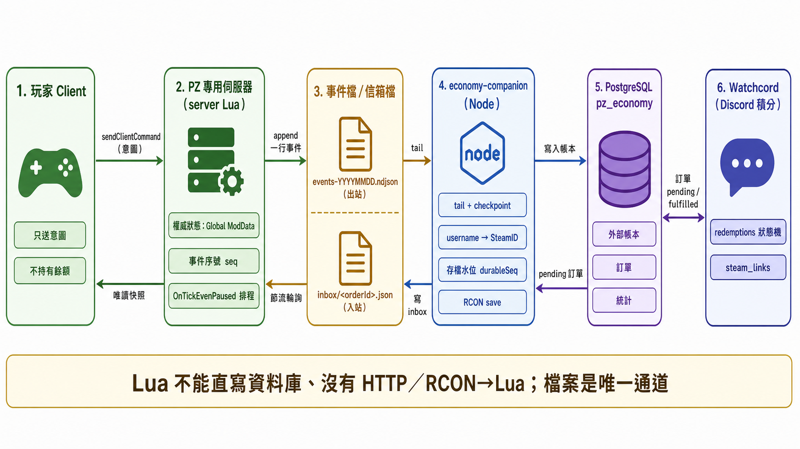
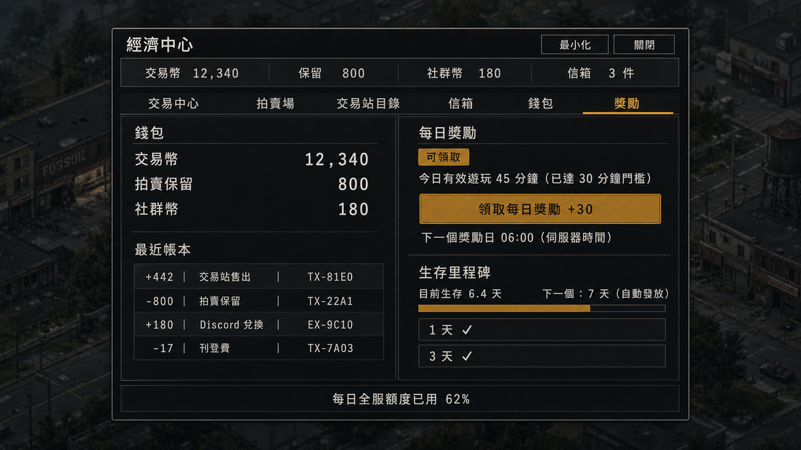

# 經濟系統設計方案比較與推薦

- 文件性質：三份獨立設計稿的比較、分歧裁決與整合路線
- 日期：2026-09-02
- 目標：Project Zomboid Build 42.20.4 多人 dedicated server（單人非目標）
- 設計稿來源：`docs/design-proposals/A-central-exchange.md`、`B-player-stalls.md`、`C-hybrid-system-shop.md`（由 OpenAI Codex 依主分析文件與反編譯快照獨立撰寫，屬草稿；其中的 PZ API 主張只在附有 `*.java:行號` 或原版 Lua 出處時視為已查證）
- 相關文件：`docs/economy-system-analysis.md`（主分析）、`docs/economy-persistence-and-integration.md`（引擎查證與儲存決策）

## 1. 結論

三份設計稿沒有一份能單獨採用，但合起來覆蓋了完整的解空間。推薦的第一版是**組合方案**：

| 面向 | 採用來源 | 內容 |
|---|---|---|
| 經濟骨架 | C | 共同入口、共同錢包、`Transaction + Posting[]` 守恆帳本、mint／burn 分類、經濟儀表板、系統商店作價格錨與貨幣回收口（系統售出先於系統收購上線） |
| 第一個玩家市場 | A（中央託管）＋管理員終端（2026-09-06 反轉，原採 B 實體容器變體） | 管理員在公共區域建造 ATM／交易站終端，所有終端開同一介面、連同一市場；物品中央託管（白名單快照重建）；賣家離線也能成交 |
| 離線交付與中央託管 | A | 帳號綁定的信箱（delivery claim）、slot 預留、mailbox 狀態機；中央託管刊登與拍賣只開放通過重建矩陣的物品白名單 |
| 拍賣 | A＋C | 獨立拍賣頁與狀態機、reserve／outbid release、賣家不可自出價、空服到期以 `OnTickEvenPaused` 結算；只接受中央託管白名單物品 |
| Discord 兌換 | C | whitelist 資料庫對應身分、inbox 檔、有生命週期的 tombstone、存檔水位後才 fulfilled |

推薦順序：錢包與獎勵 → 系統商店售出（burn）→ 交易站＋目錄 → 信箱與中央託管白名單 → 拍賣 → 系統收購（mint，最後開）→ Discord 兌換。每一步的退出 gate 沿用 C §9.1 與主分析 §12。

## 2. 三份設計稿摘要

### 2.1 A：中央交易中心＋拍賣場（純 UI 面板）

- 入口：任何地點開窗；不綁 `F2`，不做 launcher。
- 交易：單件固定價刊登、獨立拍賣頁、帳號信箱領取；所有物品進 server escrow。
- 強項：信箱與 slot 預留的狀態機最完整（listing 建立即預留 return slot、購買前取得 delivery slot、最高 bidder 持有 win slot）；查詢 revision 與 IME 搜尋規則具體；管理面板與 audit 裁切清楚。
- 弱項：把「任意 MOD 物品無損託管」當前提，自評 Escrow／Delivery／Persistence 三項為 XL／Critical；不處理系統商店與貨幣回收；未利用交易站避開序列化。
- 值得直接採用：mailbox obligation slot、`item:getID()` 只作本次 request locator 不升格為 durable ID、stale response 以 `queryRevision` 丟棄、READY delivery 永不因信箱上限被刪。

### 2.2 B：玩家自建交易站（世界物件攤位）

- 入口：全服目錄只顯示位置與價格；購買必須到場，server 重新解析世界物件、距離、同層、可及性與 SafeHouse 政策。
- 範圍：v1 只允許 server 能證明 owner／member 的 SafeHouse；非 SafeHouse 基地列為 blocking 擴充。
- 關鍵決策：世界物件只作錨點，**商品改放 server 端虛擬庫存**，理由是普通 inventory transfer 的 server 路徑沒有交易站 owner／價格／SafeHouse gate，物件被破壞時容器內容會倒在地上（`IsoObject.java:5274-5279, 5747-5761`、`RemoveInventoryItemFromContainerPacket.java:99-116`）。
- 強項：查證最嚴格——指出 `GlobalModData` 任何登入玩家可讀（`GlobalModDataRequestPacket.java:11-17`）、`ObjectModDataPacket` 讓登入 client 直接寫 object modData（`ObjectModDataPacket.java:50-72`）、`SafeHouse.playerAllowed(IsoPlayer)` overload 會被 `CanGoInsideSafehouses` capability 放行故 ownership 要用 username overload（`SafeHouse.java:282-289`）、`getObjectIndex()` 不穩定不可作 GUID、`ItemContainer.getItemWithID` 是線性掃描且 `ItemNumbersLimitPerContainer` 可為 0。
- 弱項：改採虛擬庫存後，等於把 A 的 codec 問題原封搬進交易站，v1 白名單只剩「未裝備、非食物、非武器、非流體、非 drainable、非容器」的簡單物品；並要求一個尚不存在的 server-private `EconomyStore`。
- 值得直接採用：SafeHouse 判定用 `playerAllowed(username)`、`isSafehouseAllowLoot(square, actor)`；station registry 以 server state 為 SSOT、object modData 只作投影；每次 mutation 只查 registry 指定的一格並設 `MAX_ANCHOR_OBJECTS_INSPECTED`；`catalogKey → price-sorted station references` 反向索引。

### 2.3 C：混合式（系統商店＋玩家刊登＋拍賣＋貨幣回收）

- 入口：單一「經濟中心」切換系統商店、玩家刊登、拍賣、收件匣；共用錢包與帳本。
- 系統商店：無限庫存 catalog、`askPrice`／`bidPrice` 精確語意（`0 <= bidPrice < askPrice`）、每帳號每日限購、系統收購有帳號與全服每日 gross mint cap、faucet kill switch、跨 SKU 轉換環路稽核（回售、拆解、修理、充填、split／merge）。
- 玩家市場：C 稿寫的是交易站實體 custody（已被 09-06 終端模型取代）；中央託管與拍賣只收白名單這一點沿用；維護費（安全屋／車輛）預設關閉。
- 強項：與已定案的儲存決策一致（Global ModData＋`seq`、NDJSON、companion、存檔水位）；mint／burn／supply 守恆儀表板；價格改動於下一個 economic day 生效；系統收購不得與售出同時上線。
- 弱項：範圍最大，若不嚴格分階段會同時打開太多面；維護費依賴尚未查證的資產所有權 API。
- 值得直接採用：貨幣流分類表、雙向 SKU spread 規則、分層 gross mint cap、售出先於收購、儀表板增量聚合不重掃帳本。

## 3. 比較矩陣

| 面向 | A 中央交易中心 | B 交易站（虛擬庫存） | B 變體：交易站（實體容器） | C 混合 |
|---|---|---|---|---|
| 離線販售 | 有（escrow） | 有（虛擬庫存） | 有（容器留在世界） | 有（兩種 custody） |
| 物品完整性 | 依賴白名單 codec；未知物品拒絕 | 同左，v1 白名單最窄 | **保存原生完整**；可販售範圍仍依站型／商品類型矩陣逐類開放（食物等動態欄位需報價 revision 規則） | 交易站原生；中央白名單 |
| 物品被搶／損毀風險 | 無（server 持有） | 無 | 有：等同賣家安全屋內任何容器；成交前 server 重查，市場不會單邊扣款 | 交易站同左；中央無 |
| 買家體驗 | 任何地點購買、信箱領取 | 必須到場 | 必須到場 | 系統商店任何地點；玩家刊登依 custody |
| 玩家聚點與旅程 | 無 | 有 | 有 | 部分 |
| 序列化工作量 | 大 | 大 | **零** | 中（只中央） |
| 持久化需求 | 要求 server-private store（自評 Critical） | 要求 server-private `EconomyStore`（blocking） | Global ModData 即可 | Global ModData＋`seq` |
| 貨幣回收機制 | 刊登費、稅 | 稅 | 稅、刊登費 | 系統售出 burn、費、稅、可選維護費 |
| 價格錨 | 無 | 無 | 無 | 系統商店 ask／bid |
| 管理員工具 | 完整 | 站點管理為主 | 同左 | 完整＋儀表板 |
| 對大量第三方 MOD 物品的相容性 | 未知物品拒絕刊登 | 同左 | 保存不受影響；「可販售」仍要逐類驗證，未驗證類型不開放 | 交易站同左 |
| 對修改過 client 的暴露面（server 驗證是唯一防線） | 純 server 驗證 | 純 server 驗證 | 世界容器可被修改過的 client 走一般拿取路徑（PZ 既有問題，非本 MOD 新增） | 同左 |
| 第一版可交付時間 | 慢 | 慢 | **最快** | 中 |

## 4. 關鍵分歧與裁決

### 4.1 交易站商品：實體容器 vs 虛擬庫存（2026-09-06 裁決反轉）

**原裁決（09-02～09-05）**：第一版採 B 變體——玩家在安全屋放實體容器交易站、物品留在容器、買家到場購買、「櫃檯窗口」處理安全屋 loot 衝突；理由是 Lua 拿不到 `ByteBuffer`（`InventoryItem.java:1660-1696`），虛擬庫存白名單太窄。

**新裁決（09-06，主持人釐清需求）**：交易站**不是玩家攤位**，而是**管理員在公共區域建造的終端**；ATM 與交易站開同一個介面、連同一個市場，交易站只多電台功能。這使實體容器方案失去前提：

- 公共區域的世界容器沒有任何引擎保護——安全屋 loot 規則只對安全屋成員關係生效（`SafeHouse.java:245-264`），公共容器任何人可開；沒有查到 per-object 的 loot 拒絕 hook（`IsoThumpable` 的 padlock 只保護玩家建造物且可被破壞，`IsoThumpable.java:2453-2503`），Java patch 才可能補，不作第一版依賴。
- 「所有終端連同一市場」要求刊登可在任一終端購買與領取——物品若綁在某個實體容器裡就做不到。

因此**採 A 的中央託管**：刊登時 server 移除物品並保存有界快照，購買時重建交付；可上架物品限白名單（重建保真度可保證者），不在白名單直接拒絕。這正是 A／C 一開始的形狀，也是 Bshop 的做法；代價（保真度、重建 fallback 的維護成本）以白名單而不是 codec 能力來控制範圍。細節：主分析 §12 階段 D、§17.1；預算影響 §20。

保留下來的原則：成交是同 tick 原子（驗證 → 扣款 → 入帳 → 稅銷毀 → 重建交付 → 寫事件，任一失敗全不動）；同一件物品不得同時存在於玩家背包與 active listing；市場永遠不會出現「錢已扣、物品不在」。

### 4.2 權威狀態：Global ModData vs server 私有儲存

A、B 與跨模型審查都指出 `GlobalModData` 可被任何登入玩家以 tag 請求整表讀取（已查證：`GlobalModDataRequestPacket.java:15` 只需 `Capability.LoginOnServer`）。裁決：**維持 Global ModData 作遊戲內權威，接受「餘額與當前市場狀態對登入玩家可讀」，列為產品決策**——

- 可讀不等於可寫：client `transmit` 在 server 只觸發 `OnReceiveGlobalModData`，不自動覆寫（`GlobalModDataPacket.java:44-59`）；本 MOD 不註冊該事件存經濟表，並在每次 mutation 前自檢表參照，防其他 MOD 的粗糙 handler 代寫。
- 一致性優先：Global ModData 與世界 chunk 在同一輪 `QueuedSaveAll` 由主執行緒落盤（`ServerMap.java:373-428`；玩家背包則是背景佇列，兩個方向的不一致仍需三方對帳，見儲存文件 §2.3）；B 要求的 server-private `EconomyStore` 在目前引擎沒有現成後端，只能用 `getFileWriter` journal＋快照自建，代價是崩潰後經濟狀態領先世界狀態，且不會比 Global ModData 更能對齊玩家背包。
- 若產品決定餘額不可公開：改走 journal＋快照（事件 NDJSON 已是 journal），並以 companion 對帳補償交易站重複售出；主分析 §14 已列此決策 gate。
- 無論哪種，表內只放當前狀態，不放歷史、不放秘密、不放 Discord 識別。

### 4.3 開窗位置：任何地點 vs 到場

A 選任何地點，B 要求到場。裁決：**依交易類型分開**——錢包、獎勵、目錄搜尋、信箱、系統商店、中央託管刊登與拍賣可在任何地點；交易站購買必須到場（因為商品在世界容器）。不做「限定建築才能開錢包」的旅程設計。

### 4.4 系統商店是否進第一版

C 的系統商店同時是價格錨、貨幣回收口與受控水龍頭。裁決：**系統售出（burn）進第一版、系統收購（mint）最後開**。理由：售出只消耗貨幣、不產生套利；收購是水龍頭，需要 C §5.2–5.3 的 cap 與轉換環路稽核先就位，且要有儀表板觀測後再打開。

### 4.5 拍賣順序

三稿都把拍賣排在固定價之後。裁決：拍賣只接受中央託管白名單物品（到期結算時不能依賴 chunk 已載入），排在信箱與白名單之後；空服到期以 `OnTickEvenPaused` 節流結算。

### 4.6 Discord 兌換介面

A 提出 link challenge 與 externalTxId、B 提出 domain payload、C 與儲存文件一致（whitelist 對應、inbox、tombstone、存檔水位）。裁決：採儲存文件 §5 的形狀——companion 提供內網 HTTP API、Watchcord 是唯一呼叫方；**v1 只進不出**的固定比率存入（2026-09-06 決策）；存入時玩家在 Discord 選 username 後直接入帳，不做遊戲內綁定或領取 UI，崩潰由 inbox 重放自癒、不依賴存檔；誤存走管理員反向補償；提領保留為 v2 選項（由玩家在遊戲內發起、以自然存檔為批次邊界、只回原來源）；每種 Discord 貨幣對應一種獨立遊戲內貨幣。

## 5. 直接採用的設計細節

| 來源 | 細節 | 落點 |
|---|---|---|
| A | listing 建立時預留 seller return slot；購買前取得 buyer delivery slot；最高 bidder 持 win slot，被超標時釋放；READY delivery 不因上限被刪 | 信箱狀態機 |
| A | `item:getID()` 只作本次 request 的 locator，不作 durable ID；listing／auction／delivery／tx 用 server 產生的字串 ID | 資料模型 |
| A | 查詢帶 `queryRevision`，晚到的舊 response 丟棄；收到結果不重設 entry 文字，避免破壞 IME 組字 | UI |
| A | 主視窗不 `alwaysOnTop`；hidden 時背景同步不得 `setVisible(true)` | UI |
| B | SafeHouse ownership 用 `playerAllowed(username)` overload；購買前 `isSafehouseAllowLoot(square, actor)` | 交易站權限 |
| B | station registry 在 server state；object modData 只作投影，不放 owner／price／stock（`ObjectModDataPacket` 可被 client 寫） | 交易站資料 |
| B | 每次 mutation 只查 registry 指定的一格，設 `MAX_ANCHOR_OBJECTS_INSPECTED`；`ListItem` 只掃 root inventory 且有 inspect budget | 效能 |
| B | `catalogKey → price-sorted station references` 反向索引，增量維護 | 目錄 |
| C | `askPrice`／`bidPrice` 語意、`0 <= bidPrice < askPrice`、未開放收購用 flag 不用 0 | 系統商店 |
| C | 貨幣流分類表；fee／tax 直接 burn；補償用 `COMPENSATION_MINT/BURN` 連結原交易 | 帳本 |
| C | 分層 gross mint cap（帳號、全服、SKU）、faucet kill switch、轉換環路稽核 stale 即停收 | 系統收購 |
| C | 價格與費率變更於下一個 `economicDayKey` 生效；停用與熔斷立即生效 | 設定 |
| C | 儀表板在 commit 時增量更新 daily aggregate，不重掃帳本 | 觀測 |
| C | 交易站商品不進拍賣（到期時 chunk 可能未載入） | 拍賣 |

## 6. 三稿共同指出、必須先做的原型

去重後的 blocking 項目（與主分析 §12 階段 A 對齊）：

1. 終端：管理員以建造選單放置 ATM／交易站的 placement／sync 形狀；`OnAddToMenu` 權限過濾在 dedicated 的實際行為；`terminal.register` 後右鍵選單出現；物件被拆時登錄表轉 `disabled`。
2. 終端距離驗證：server 以座標判「玩家在任一終端 ≤ 2 格、同層」；離開後送出的寫入指令被拒且零扣款。
3. 白名單 codec：每個 subtype 的 encode → persist → restart → decode round-trip；初始白名單只含狀態單純的物品。
4. 信箱 materialize：背包滿保留 READY；claim 在「已加物品、未標 CLAIMED」之間崩潰的窗口需 quarantine 規則。
5. 帳號：username 改名／帳號合併政策；分割畫面 `playerIndex`。
6. `OnNewGame`／`OnCharacterDeath` 在 dedicated 的觸發時機與重連行為。
7. `hoursSurvived` 是否可被 client 影響；有效遊玩改用連線壁鐘。
8. 存檔水位：companion 解析 `global_mod_data.bin` 讀 `meta.seq` 的可靠性；不使用 RCON `save`（存檔會凍結全服）。
9. 兩個獨立遠端 client 的 E2E：`OnGameStart` 零 command、首個 `OnTick` 才送；空服 `OnTickEvenPaused` 推進到期與 inbox。

不在第一版查證範圍（明確延後）：玩家自建攤位、世界地圖 marker API、Lua 端完整 `ByteBuffer` round-trip、維護費所需的資產所有權 API、per-object loot 拒絕的 Java patch。

## 7. 已反映到主分析文件的修正

以下項目已寫入 `docs/economy-system-analysis.md` v2，本節只作對照：

- §12 階段順序：B 錢包／獎勵 → C 系統商店售出 → D 管理員終端＋中央託管＋簡易信箱 → E 完整信箱＋白名單擴充＋電台 → F 拍賣 → G 系統收購 → H Discord 存入 → I 依需求擴充。
- §9.3 延後表新增「玩家自建攤位」「安全屋／車輛維護費」「世界地圖 marker」。
- §14 決策新增「餘額對登入玩家可讀是否可接受」（已接受）「唯讀分頁可否遠端」「白名單初版類別」。
- §10.4 資料模型改為 `Transaction + Posting[]`、`Reservation`、`ExchangeOrder` tombstone 生命週期；§10.6 Discord 冪等鍵統一為 `discord:<orderId>`。

## 8. 視覺稿（AI 生成，討論用）

依 §1 的推薦組合，以 gpt-image-2（Codex 內建 `image_gen`）生成五張視覺稿；prompt 全文在 `docs/design-proposals/images/PROMPTS.md`（風格庫範本：`ui-screenshot-system`、`infographic-engine`）。這些圖只用來對齊資訊架構與版面密度，不是最終 UI 規格；實作時的元件仍以 PZ 原版 `ISPanel`／`ISScrollingListBox` 等為準，圖中的圖示、品牌樣式與美術不得直接進 Workshop 素材。

| 圖 | 檔案 | 對應設計 | 觀察 |
|---|---|---|---|
| 經濟中心主視窗（交易中心分頁） | `design-proposals/images/01-economy-center.png` | §1 經濟骨架、A 的三欄 list view、底列收據 | 文字逐字正確；錢包摘要列＋分頁列＋三欄的密度可接受 |
| 拍賣場與確認出價 | `design-proposals/images/02-auction.png` | A／C 拍賣狀態機、reserve 顯示 | 確認框明示「本次保留」與「得標送入信箱」，符合 §4.5 |
| 交易站現場購買 | `design-proposals/images/03-trade-stall.png` | **已過時**（B 變體安全屋攤位；09-06 改為管理員公共終端） | 由 `03c-public-terminal.png` 取代（含交易站與提款機） |
| 儲存與 Discord 整合架構 | `design-proposals/images/04-architecture.png` | `docs/economy-persistence-and-integration.md` §4 | 六模組與箭頭標籤正確；圖中 Node 六角形圖示為品牌樣式，僅供內部討論 |
| 玩家錢包對帳單 | `design-proposals/images/20-wallet-statement.png` | 主分析 §6.3（餘額鏈、三態狀態、載入收據檔） | 八列含餘額後值與狀態、「已回滾」灰字 |
| 管理案件頁 | `design-proposals/images/21-admin-cases.png` | 主分析 §19.5／§19.7（餘額異常修復、自動收斂紀錄） | 證據卡＋鏈最後 5 筆＋修復按鈕 |
| 整合 MOD 子分頁 | `design-proposals/images/22-admin-integrations.png` | 主分析 §21.5 | 來源額度、統計、最近 50 筆 |
| 錢包與獎勵分頁 | `design-proposals/images/05-wallet-rewards.png` | §1 錢包與獎勵、每日簽到與 account-season 里程碑 | 顯示有效遊玩門檻、全服額度已用比例，符合主分析 §8.3 |

### 8.1 第二輪審查對視覺稿的修改建議（待下一版重生）

| 圖 | 修改 |
|---|---|
| 01 經濟中心 | 補「系統商店」與「我的交易站」入口；每筆商品明示「到場購買」或「送入信箱」；搜尋「消防斧」時列表只顯示符合的結果；底列收據優先顯示物品去向，市場版本降為次要 |
| 02 拍賣 | 統一 header 12,340 與詳情「可用 3,000」的語意（總額／可用／保留）；確認框補商品名稱、本場原保留、本次新增保留與出價後可用額；補「確認期間被超標／到期」狀態 |
| 03 交易站 | 整張重畫為公共區域的管理員終端（`03b`）：終端旁玩家開介面、資格狀態（終端內／距離不足）、支付總額、「交付至背包」 |
| 04 架構 | 出站檔名改 `events-YYYYMMDD.json`（內容 NDJSON）；companion 改為「HTTP API＋projection＋水位」，移除「寫 PostgreSQL」與「RCON save」；Watchcord 改為「輪詢 GET /ledger、擁有帳本副本」；分開畫「Watchcord 已接收」與「遊戲存檔 checkpoint」；「信箱檔」改「整合 inbox」；client 標「餘額只讀」 |
| 05 錢包／獎勵 | 每筆收據標幣別；拍賣保留顯示為「可用→保留」而非支出；分開「本季帳號已領」與「目前角色進度」；日切時間與 server 日界規則一致 |

另需新增的畫面：刊登／取消流程（含白名單拒絕提示）、信箱領取（背包滿、隔離狀態）、管理員案件頁、pending／stale／錯誤狀態。這些在下一版 prompt 集補上。

## 9. 來源

- `docs/design-proposals/A-central-exchange.md`、`B-player-stalls.md`、`C-hybrid-system-shop.md`（2026-09-02，Codex 草稿）。
- 反編譯快照 `42.20.4-20260826`：`GlobalModDataRequestPacket.java`、`GlobalModDataPacket.java`、`GlobalModData.java`、`ServerMap.java`、`InventoryItem.java`、`IsoObject.java`、`RemoveInventoryItemFromContainerPacket.java`、`ObjectModDataPacket.java`、`SafeHouse.java`、`ItemContainer.java`（行號見各設計稿與 `docs/economy-persistence-and-integration.md`）。
- 主分析 `docs/economy-system-analysis.md` §§9–14、§16。
