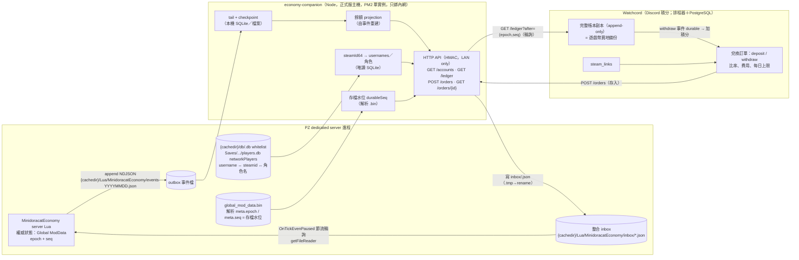

# 交易資料儲存與 Discord 積分整合調查

- 文件性質：技術決策與引擎能力查證紀錄
- 研究日期：2026-09-02
- 目標：Project Zomboid Build 42.20.4 多人 dedicated server（單人非目標）
- 反編譯快照：`42.20.4-20260826`（所有 `*.java:行號` 皆指此快照）
- 相關文件：`docs/economy-system-analysis.md`（主分析）、`docs/economy-design-proposals.md`（設計方案比較）

## 1. 結論

| 問題 | 結論 |
|---|---|
| Lua 能否直接寫 SQLite／PostgreSQL？ | **不能。** Kahlua 沒有 io library；`LuaManager` 暴露清單沒有 JDBC／`DriverManager`／`Socket`／`URL`；引擎內建的 sqlite-jdbc 只給 Java 層自用（`PZSQLUtils.java:28-37`、`ServerWorldDatabase.java:399-447`）。 |
| Lua 能否匯出 JSON？ | **能。** `getFileWriter(filename, createIfNull, append)` 寫到 `{cachedir}/Lua/`，副檔名限 `ini/cfg/txt/log/json`、可建子目錄、禁 `..`、UTF-8、標準 append（`LuaManager.java:1034, 6726-6778`）。`getFileReader` 同目錄可讀（`:5933-5963`）。 |
| 外部系統能否主動叫進 Lua？ | **不能直接。** 無 HTTP/TCP Lua API；RCON 只走 `GameServer.rcon → CommandBase`，`commands/` 目錄零 `LuaEventManager.triggerEvent`（`RCONServer.java:64-68`、`GameServer.java:1284-1358`）。唯一入站：外部程式寫檔到 `{cachedir}/Lua/`，server Lua 輪詢讀取。 |
| 交易資料最終放哪？ | **三層：遊戲內權威狀態＝Global ModData；事件流＝append-only NDJSON（`.json` 檔）；外部帳本＝Watchcord 的 PostgreSQL，由 Watchcord 輪詢 companion API 自行寫入。** companion 本機只留 checkpoint／projection（SQLite 或檔案）。「匯出 JSON」是傳輸格式，不是最終儲存。 |
| 需不需要在正式服主機另裝 PostgreSQL？ | **不需要，也不需要為本案在 Watchcord 主機建新 database。** 外部帳本是 Watchcord 自己 PG 裡的一組表；PZ 主機不裝任何 DB client。Watchcord 因此持有完整帳本副本，等於遊戲幣的異地備份（§5.5）。 |
| Discord 貨幣如何進出遊戲？ | **v1 只進不出**：Watchcord 透過 companion 的內網 HTTP API 建立存入訂單（玩家在 Discord 指定 username）→ companion 寫 inbox → Lua 直接入帳；崩潰由 inbox 重放自癒，**不依賴存檔**。每種 Discord 貨幣對應一種獨立遊戲內貨幣；**比率與上限由遊戲端 config 擁有**（沙盒預設、管理面板 runtime 覆寫），companion 以 `GET /currencies` 暴露給 Watchcord。提領（遊戲 → Discord）已設計為 v2 選項（§5.6），v1 只有管理員反向補償。 |

## 2. 引擎能力查證

### 2.1 Lua 檔案 I/O

| API | 出處 | 行為 |
|---|---|---|
| `getFileWriter(filename, createIfNull, append)` | `LuaManager.java:6726-6778` | 目錄 `{cachedir}/Lua/`（`getLuaCacheDir`，`:1263-1264`）；父目錄自動 `mkdirs()`（`:6734-6738`）；`OutputStreamWriter` UTF-8（`:6752-6753`）；`FileOutputStream(outFile, append)` |
| 副檔名白名單 | `LuaManager.java:1034` | `ini, cfg, txt, log, json`；大小寫敏感（`ZomboidFileSystem.java:1436-1439`）。**`.ndjson` 不在清單內，writer 會回 `nil`**——事件檔必須命名為 `*.json`，內容才是 NDJSON |
| 路徑限制 | `LuaManager.java:8519-8522`、`StringUtils.java:272-273` | 拒絕含 `..` 的路徑；子目錄可用（原版用例 `LastStandSetup.lua:96`） |
| `LuaFileWriter.write/writeln/close` | `LuaManager.java:12751-12775` | `writeln` 用系統換行；**沒有 flush 也沒有 fsync**，必須 `close()` 才交給 OS |
| `getFileReader(filename, createIfNull)` | `LuaManager.java:5933-5963` | 同目錄；UTF-8；無副檔名限制 |
| 刪檔 | `LuaManager.java:4590-4620, 5923-5931, 6209-6217` | 只有 `deleteDatabase`／`deleteSave`／`deleteSandboxPreset`／`deletePlayerSave` 等固定路徑；**沒有通用刪檔或 rename API** |
| `getModFileWriter` | `LuaManager.java:6119-6158` | 寫到 MOD 安裝目錄（`getCommonDir()`）——**禁用**於經濟資料，會污染 Workshop 目錄 |
| `writeLog(name, text)` | `LuaManager.java:9171-9176`、`ZLogger.java:18, 95-101` | `{cachedir}/Logs/`，每行自動時間戳；超過 10000KB 截斷；只適合人讀的 audit，不適合結構化帳本 |

Dedicated server 上 `getFileWriter` 沒有 server/client guard；server Lua 呼叫時寫在**伺服器進程**的 cachedir。client 端呼叫寫在玩家自己機器，對經濟毫無意義且不可信。

### 2.2 資料庫與網路

- 引擎內建 sqlite-jdbc 3.48（jar `META-INF`），`PZSQLUtils.java:36-37` 以 `DriverManager.getConnection("jdbc:sqlite:...")` 開啟；`ServerWorldDatabase.java:399-447` 用它存 whitelist／role／ban。**`LuaManager.Exposer.exposeAll`（`:1687+`）未暴露 `DriverManager`、`Connection`、`ServerWorldDatabase`、`PZSQLUtils`。**
- Lua 可用的 DB 相關全域只有 `checkPlayerExistsInDatabase`／`deletePlayerFromDatabase`（`LuaManager.java:6170-6196`，whitelist 封裝）與 `deleteDatabase(folder)`（`:4590-4598`，只能刪 `{cachedir}/db/*.db`）。
- 沒有 PostgreSQL 相關類別；沒有 `java.net.Socket`／`HttpURLConnection`／`URL` 暴露；`openUrl`（`:7388-7402`）是桌面瀏覽器啟動器，dedicated 無用。
- RCON：`RCONServer.java:64-68` → `GameServer.rcon`（`GameServer.java:1284-1288`）→ `handleServerCommand`（`:1292-1358`）→ `CommandBase`；`reloadlua`（`ReloadLuaCommand.java:31-42`）只重載已載入檔案，不執行字串；`LuaCompiler.loadstring` 僅 client debug console（`UIDebugConsole.java:343`）。
- `save` RCON 指令存在（`SaveCommand.java:13, 28`，需 `Capability.SaveWorld`），觸發 `ServerMap.QueueSaveAll()`。

### 2.3 Global ModData

| 面向 | 出處 | 事實 |
|---|---|---|
| Lua API | `ModData.java:16-49` → `GlobalModData.java:74-102` | `getOrCreate/get/create/remove/add/transmit/request/exists/getTableNames` |
| 落盤時機 | `ServerMap.java:373-428, 504-515` | `QueuedSaveAll` 在主執行緒同一輪依序存世界 chunk（`SaveAll`）、玩家（`ServerPlayerDB.save()`，`:379`）、`GlobalModData.instance.save()`（`:409`）；週期由 `SaveWorldEveryMinutes` 決定；關服也走同路（`:334`）。**沒有**每次 `transmit` 就落盤 |
| 檔案 | `GlobalModData.java:219-271` | `{save}/global_mod_data.tmp` → 串流複製成 `global_mod_data.bin`（不是 atomic rename）；初始 buffer 1 MiB，溢出每次 +512 KiB（`:40-41, 208-216`） |
| 可序列化型別 | `KahluaTableImpl.java:365-404` | key 只能 String／number；value 只能 String／number／boolean／巢狀 table；其他型別**靜默丟棄** |
| 網路：client → server | `GlobalModData.java:112-151`、`GlobalModDataPacket.java:16-59` | client `transmit` 送到 server 時，server 端 `parse` **只觸發 `OnReceiveGlobalModData(tag, table)`，不會自動寫入 `GlobalModData.instance`**；但任何 MOD 若在該事件裡不檢查 tag 就 `ModData.add(tag, table)`，就等於讓 client 覆寫 server 表。本 MOD 不註冊此事件存經濟表，且每次 mutation 前以 `rawequal(ModData.get(TAG), 本地參照)` 自檢，被替換即回寫並記安全事件 |
| 網路：任何玩家可讀 | `GlobalModDataRequestPacket.java:11-34`、`GlobalModData.java:153-205` | `request(tag)` 封包只需 `Capability.LoginOnServer`，server 把整張表序列化回給請求者 → **任何登入玩家都能讀取 server 上任一 tag 的 Global ModData**。經濟表視為「公開可讀」：不放秘密、不放歷史、只放當前狀態並保持小型（避免 1 MB 表被反覆請求造成放大流量） |
| 存檔事件 | `GameWindow.java:1020, 1047`、`ServerMap.java:373-428` | `OnSave`／`OnPostSave` 只在 `GameWindow.save`（client／host 路徑）觸發；`ServerMap.QueuedSaveAll` **沒有** Lua 事件，dedicated 上 Lua 不知道存檔何時完成 |
| 存檔失敗仍印完成 | `ServerMap.java:408-412, 426` | `GlobalModData.instance.save()` 的例外被 catch 後只印 log，流程繼續並印 `Saving finish` → **console 完成訊息不是經濟表已落盤的證明**；companion 要另外驗證 `global_mod_data.bin` 內容 |
| 玩家存檔是佇列 | `ServerPlayerDB.java:98-122, 83-90`、`ServerMap.java:418-419` | `save()` 只把玩家資料加入 `charactersToSave` 佇列，由背景執行緒逐筆寫 SQLite；只有關服路徑 `saveFinishWait` 會等佇列清空 → **世界與 ModData 已落盤時，玩家背包可能尚未提交**，反向不一致（買家已付款、背包未保存）也會發生 |
| `.bin` 損毀會擋啟動 | `GlobalModData.java:274-307`、`IsoWorld.java:1995` | `load()` 解析失敗會 rethrow `IOException`，`init()` 在世界載入期間被呼叫，例外會中止啟動 → 損毀復原是**主機層啟動前流程**（還原備份或移除檔案），Lua 沒有機會自救 |
| `.bin` 可被外部解析 | `GlobalModData.java:290-299`、`KahluaTableImpl.java:365-404` | 格式：`int worldVersion`、`int tableCount`、每表 `int blockSize`＋UTF 字串 tag＋table 內容（只有 string／number／boolean／table 四型）→ companion 可解析出本 MOD 表的 `meta.seq`，作為精確的存檔水位 |

設計含意：Global ModData 與世界在**同一輪存檔**由主執行緒依序寫出，是遊戲內權威狀態最一致的位置。但不能宣稱「錢與物品一起回滾」：(1) 崩潰時最多回滾一個存檔週期（正式服的週期以小時計，現值記錄於本機 `AGENTS.md`；**不**以 RCON `save` 縮短，因為存檔會凍結全服）；(2) 玩家背包由背景佇列另行提交，與世界／ModData 不同步，崩潰後兩個方向都可能發生——「背包已含物品但錢包與交易站回滾」（複製）與「錢包與世界已保存但背包未提交」（買家付了錢、物品消失）——這與 PZ 原生容器拾取在崩潰時的行為屬同一類，只能靠 companion 三方對帳（世界容器、玩家資料、經濟義務）減災，未證明交付的物品進隔離待管理員處理；(3) 表內容對所有登入玩家可讀，餘額不算秘密但屬公開資訊——若產品上不接受餘額可被讀取，替代方案是把權威狀態改寫在 server 私有檔案（`{cachedir}/Lua/` 事件 journal＋定期快照重放），代價是失去與世界同輪存檔的一致性。本文件建議維持 Global ModData 並接受公開可讀，列為產品決策。

### 2.4 時間與事件

| 項目 | 出處 | 事實 |
|---|---|---|
| `getTimestampMs()` | `LuaManager.java:9267-9272` | `System.currentTimeMillis()`，epoch ms UTC——**經濟一律用這個** |
| `getTimestamp()` | `:9259-9264` | epoch 秒 |
| `getGametimeTimestamp()` | `:9283-9288` | 遊戲曆時間，非壁鐘，**不可用於到期／每日判定** |
| `os.time()`／`os.date()` | `OsLib.java:69-124, 334` | 秒（double）；`os.date` 固定 UTC，無時區設定 |
| `EveryOneMinute/TenMinutes/Hours` | `GameTime.java:513-514, 621-656` | 只在 `!isGamePaused()` 推進；dedicated 且 `PauseEmpty=true` 時空服**停止**（`GameTime.java:181-183`、`IngameState.java:1496+`） |
| `OnTick` | `IngameState.java:1533-1534, 1624-1625` | 同樣受 paused 影響 |
| `OnTickEvenPaused` | `IngameState.java:1317` | 在 paused 判斷之前，dedicated 每迴都觸發（約 10 Hz） |

正式服目前 `PauseEmpty=true`：拍賣到期、每日獎勵日切、inbox 輪詢**不能**依賴 `EveryOneMinute`；要用 `OnTickEvenPaused` 自行節流（例如每 5 秒一次），或在玩家連線時補算。台灣時區固定 UTC+8 無夏令時間，`rewardDayKey = floor((getTimestampMs()/1000 + 8*3600) / 86400)` 即可，與 Watchcord 的 Asia/Taipei 日界一致。

### 2.5 玩家身分

| 項目 | 出處 | 事實 |
|---|---|---|
| `OnClientCommand` 的 `player` | `GameServer.java:2246-2297` | 由 `UdpConnection` + `playerIndex` 解出，不來自 args → **可信** |
| `player:getUsername()` | `IsoPlayer.java:6445-6446`、`GameServer.java:2816` | 連線帳號名，server 指派 → **帳戶主鍵** |
| `player:getDisplayName()` | `IsoPlayer.java:7932-7944`、`ConnectedPacket.java:181` | client 可改 → **不可作身分** |
| `player:getSteamID()` | `IsoPlayer.java:6411-6413`、`KahluaNumberConverter.java:106, 140-142` | Java `long` 轉 Lua `double`，SteamID64 超過 2^53 → **精度遺失**；server Lua 沒有無損字串 API（`SteamUtils` 未暴露；`getSteamIDFromUsername` 僅 client，`LuaManager.java:9370-9371, 9474-9478`） |
| whitelist DB | `ServerWorldDatabase.java:450, 1578-1599` | `{cachedir}/db/<servername>.db` 的 `whitelist` 表含 `username`（唯一）與 `steamid`（TEXT，無損；Steam 模式登入時由 server 寫入，`:296-303`）；`ownerid` 為 Family Sharing 擁有者，只用於封禁判定 |
| `getPlayerByOnlineID`／`getOnlinePlayers` | `LuaManager.java:3937-3944, 4437-4443` | server 可用 |
| `getPlayerFromUsername`／`getConnectedPlayers`／`isAdmin` | `LuaManager.java:9117-9122, 9110-9112, 4431-4436, 9012-9013` | 走 `GameClient` → **dedicated server 不可用** |
| 權限 | `GameServer.java:2806`、`IsoPlayer.java:7557-7559`、`LuaManager.java:2454-2455` | `player:getRole():hasCapability(Capability.X)`／`getAccessLevel()`；role 由 server 設定 |
| 死亡／新角色 | `IsoPlayer.java:6556-6574`、`IsoGameCharacter.java:4866-4867`、`CreatePlayerPacket.java:296-300` | `OnPlayerDeath` **dedicated 不觸發**；用 `OnCharacterDeath`；新角色用 `OnNewGame`；沒有 character UUID |
| 生存時數 | `IsoPlayer.java:7837-7839`、`GameTime.java:532-538` | server 端對在線玩家累加、隨遊戲時間倍率而非壁鐘；未找到 client → server 的持續同步封包（中高信心，仍列實機驗證） |
| 部署形態 | `CoopMaster.java:102-114`、`GameServer.java:405-436`、`Core.java:1618-1620` | co-op host 也會啟動 `GameServer`（帶 `-coop`）；`isServer()` 不能區分 → 部署契約明定 headless dedicated、不得 `-coop` |

**設計含意**：遊戲內帳戶鍵 = `username`（必要時附 `playerIndex` 處理分割畫面），所有 ID 一律以字串處理。Discord ↔ PZ 的對應**不在 Lua 做**：companion 以唯讀方式讀 `<servername>.db` whitelist 取得 `username → steamid`，再對應 Watchcord `steam_links.steam_id64 → member`。正式服 `AllowNonAsciiUsername=true`，username 可含非 ASCII 與 `[ ]`，匯出必須走 JSON 逸出，不能用分隔字元格式。非 Steam 模式登入的帳號沒有 `steamid`，Discord 兌換對這類帳號 fail closed。

### 2.6 物品序列化與託管

| 項目 | 出處 | 事實 |
|---|---|---|
| `InventoryItem.save/load` | `InventoryItem.java:1660-1696, 1872-1880, 3379-3383` | 需要 `ByteBuffer`；**`java.nio.ByteBuffer` 未暴露給 Lua** → Lua 無法把物品完整序列化成字串；子類可各自 override 序列化 |
| `sendAddItemToContainer`／`sendRemoveItemFromContainer` | `LuaManager.java:12302-12348`、`GameServer.java:2388-2408` | 目標必須是玩家背包／有 parent 的世界容器／地上容器；**無 parent 的隱藏容器不會同步** |
| `ItemContainer.AddItem` | `ItemContainer.java:458-496` | 本身不做網路同步 |
| command args 可傳 `InventoryItem` | `TableNetworkUtils.java:88-89, 125-134, 146-173` | 只適合瞬時傳輸；**client 送來的 InventoryItem 可完整偽造，server 絕不採用** |
| client 可同步的物品欄位 | `SyncItemFieldsPacket.java:39-45, 313-385, 512-571` | 部分欄位與 modData 可由 client 同步到 server 持有的物品 → 刊登資格、價格、權限不得只依這些欄位，必須重查 container ownership、full type 與數量 |
| 封包上限 | `UdpConnection.java:40`、`RakNetPeerInterface.java:52, 118-126` | 約 1 MB，超過直接丟包 |

**託管可行途徑排序**：

1. **物品留在世界容器（玩家交易站）**：零損耗，但前提是容器有引擎保護（安全屋成員關係）。**2026-09-06 作廢**：主持人定案交易站是管理員在公共區域建造的終端、所有終端連同一市場，公共容器無保護且物品不能綁在單一容器，故改採第 2 項。
2. **server 拖走 + 欄位重建**：server 從賣家背包依 `item:getID()` 移除，把允許清單內的欄位（type、condition、uses、fluid、有限 modData）存進 Global ModData，交付時 `instanceItem` 重建。食物腐壞、武器改裝件、衣物外觀、容器內容物會遺失 → 只能開放 deny-by-default 的「可重建物品白名單」，未知物品拒絕刊登。
3. **server 端 Java 助手**：家族已有 server 專用 bytecode patch 專案，可補一個「物品 ↔ base64」helper 給 server Lua。可行但綁 PZ 版本，每次更新要重驗；不作為第一版依賴。
4. Lua 內完整序列化：不可行。

## 3. 儲存方案比較

| 方案 | Lua 端可行性 | 外部可查詢性 | 崩潰一致性 | 維運成本 | 判定 |
|---|---|---|---|---|---|
| 只用 Global ModData | 可 | 差（`.bin` 私有格式） | 與世界同輪存檔，最一致 | 零 | **作為遊戲內權威狀態**，不作外部帳本 |
| Lua 寫 JSON 快照檔取代 ModData | 可 | 可讀 | 快照比世界新 → 崩潰後錢與物品分家 | 低 | 不作權威；只作 ModData 損毀時的第二份復原來源 |
| Lua 寫 NDJSON 事件流 | 可（append） | 可 tail | 需 `seq` 與存檔水位判定 | 低 | **採用**為唯一出站通道 |
| SQLite（companion 寫） | Lua 不可直寫 | 單機檔案，跨主機難共享 | — | 低 | 只作 companion 本機 spool／離線緩衝（選用） |
| PostgreSQL（Watchcord 擁有，輪詢 companion `GET /ledger` 自行寫入） | Lua 不可直寫 | 高；Watchcord 持有完整帳本副本 | — | 低（不新增 database、不改 pg_hba；PZ 主機無 DB client） | **採用**為外部帳本、對帳與異地備份 |
| PostgreSQL（companion 直寫獨立 database `pz_economy`） | Lua 不可直寫 | 高 | — | 中（帳號、pg_hba、跨主機連線） | 2026-09-06 作廢：API 取代 DB 共享，companion 不需要寫 PG |
| PostgreSQL 作為同步權威（Lua 每筆交易等待外部 commit） | 不可：Lua 無法在 tick 內等待外部 I/O，只能改成非同步收據 | 高 | 遊戲內每筆交易變成 pending，且物品仍隨世界存檔回滾 | 高 | 不採用 |
| server Java patch 直寫 DB | 可但綁版本 | 高 | 可同步 | 高 | 不採用為基線 |

## 4. 建議架構

companion **不主動觸發存檔**：`ServerMap.checkClientPause`（`:365-371`）在存檔超過 600 ms 時對全服送 `StartPause`，正式服規模下每次存檔都會凍結玩家；提領以自然存檔（現值每小時）為批次邊界。

### 4.1 三層責任

| 層 | 資料 | 寫入者 | 持久化 |
|---|---|---|---|
| 遊戲內權威狀態 | 錢包、刊登、拍賣、獎勵狀態、未結清兌換 tombstone（`orderId`、`creditSeq`、hash；有 hard cap）、已結清 orderId hash 環（bounded）、`meta.seq`、`meta.schemaVersion`、`meta.epoch` | 只有 server Lua | Global ModData，隨世界存檔 |
| 事件流 | 每筆 mutation 一行 NDJSON：`epoch, seq, ts, type, correlationId, actor, postings, payload` | server Lua（append，事件發生即寫，`close()` 交給 OS；同步磁碟 I/O，需量測成本） | 日切檔；companion 以 `(file, offset, epoch, seq)` checkpoint 消費 |
| 外部帳本 | 全部事件（市場、獎勵、管理、兌換）、兌換訂單、比率、durable 水位 | Watchcord（輪詢 companion `GET /ledger` 後寫入自己的 PG） | Watchcord PostgreSQL，append-only；companion 本機只留 checkpoint 與可重建的 projection |

### 4.2 存檔水位與回滾偵測（崩潰一致性）

1. 每筆事件帶 ModData 中單調遞增的 `seq` 與本次啟動的 `epoch`（啟動時 `getTimestampMs()`，只增不減，寫進 `meta.epoch`）；`seq` 與狀態同一輪存檔。事件在 mutation 當下（主執行緒）就 append，因此**任何在存檔完成前寫出的事件，都已包含在該次存檔**。回滾後新分支的 `seq` 會重用舊號，但 `epoch` 不同；companion 以 `(epoch, seq)` 為事件身分，晚到的舊 epoch 事件與 ACK 不得覆寫新分支。
2. dedicated server 沒有 Lua 存檔事件，而 console 的 `Saving finish` 在經濟表保存失敗時照印（`ServerMap.java:408-412, 426`）。因此 **`durableSeq` 只能來自已落盤的內容**：companion 以 `global_mod_data.bin` 的 mtime 前進或 console 訊息作為「去檢查」的觸發，解析 `.bin`（§2.3 格式）讀出本 MOD 表的 `meta.epoch`／`meta.seq`，解析成功才把該 `seq` 記為 `durableSeq`；解析失敗、epoch 不符或 seq 倒退一律不提升水位並告警。第一版若尚未實作解析器，退而以「mtime 前進且檔案大小非零且 console 無 `Error` 輸出」為必要條件，並把此狀態標為 `durable-unverified`，不對外執行不可逆副作用。
3. 外部副作用只對 `seq ≤ durableSeq`（同 epoch）的事件執行：Watchcord `fulfilled` 更新、通知、統計皆以水位為準；水位以下的事件標 `durable`，以上的標 `pending`。durable 之後的事件不會因程序崩潰回滾；主機斷電或還原舊備份仍可能回滾，那屬災難復原流程（第 6 點），需人工對帳。
4. server 啟動時 Lua 發 `server.started { epoch, loadedSeq, schemaVersion }`；companion 在 `GET /ledger` 中把舊 epoch 內 `seq > loadedSeq` 且未 durable 的事件標 `rolled_back`，Watchcord 據此把受影響的存入訂單回到 `pending`（inbox 檔仍在，Lua 重啟後自動重放；`orderId` tombstone 隨 ModData 一起回滾，不會擋住重放）、把受影響的提領標 `cancelled` 不加積分。玩家背包是背景佇列存檔、與 ModData 不同輪，因此設計上**市場交易只動 ModData**（物品先進信箱），跨存檔線只剩 `claim-in`／`list-out` 兩種兩階段操作，各在玩家 modData 與 ModData 留一份紀錄，登入時自動收斂（主規格 §19.7）；不再需要「三方對帳」的人工案件，只剩原生物品轉移造成的極少數例外。
5. **不以額外存檔縮短窗口**：存檔會凍結全服（`ServerMap.java:365-371`），companion 不呼叫 RCON `save`；RCON 路徑 `QueueSaveAll()`（`:149-151`）也不重置引擎的 `lastSaved`（`:507-509`），「自動存檔＋RCON 補存」會變成兩個互不知情的排程。存入方向不需要等存檔（§5.5：inbox 重放自我修復）；若日後開放提領，唯一的等待來源是自然存檔週期，要縮短就調 `SaveWorldEveryMinutes`（由引擎排程，不讓 companion 成為存檔路徑的單點）。Lua 端 UI 可用 `getServerOptions()`（`LuaManager.java:4092`）讀取間隔顯示「每 N 分鐘存檔」；companion 不預測存檔時間，只在 `.bin` mtime 前進後解析 `meta.seq` 確認。
6. 災難復原：`global_mod_data.bin` 非 atomic rename 寫入，崩潰在複製途中可能損毀；損毀時 `load()` 會 rethrow 並**中止伺服器啟動**（`GlobalModData.java:301-303`、`IsoWorld.java:1995`），Lua 沒有機會自救。復原是主機層啟動前流程：(a) 以備份 manifest（世界存檔、`<server>.db` 與 `players.db` 玩家資料、`global_mod_data.bin`、事件檔、Watchcord 帳本水位，同一時間點）還原；(b) 還原後 Watchcord 先停止兌換與外部副作用，比對事件檔與自己的帳本副本找出 `epoch`／`seq` 分歧，管理員確認後才開放；(c) 不得把 Watchcord 較新的錢包副本直接灌回較舊的世界，因為 quota、claim、config、reward、物品關聯無法只靠 postings 重建；錢包層級的復原走管理員確認的 `inbox/restore-<epoch>.json`（只在 Lua 啟動時經濟表為空且管理員旗標存在時接受）。Lua 另可每 10 分鐘寫一份 A/B 交替的 JSON 狀態快照（`snapshot-a.json`／`snapshot-b.json`）供人工比對，不作自動回灌來源。
7. Discord 存入去重分層：第一道是 Watchcord 的 PostgreSQL——訂單只在 `pending` 時 `POST`，記錄 `fulfilled`／`failed` 後永不重送；第二道是 Lua tombstone `exchange.tombstones[orderId] = { creditSeq, hash }`，覆蓋「已入帳但 Watchcord 尚未看到 durable」的窗口與 companion 重啟後的 inbox 重掃。companion 在 `deposited` 事件 durable 後刪 inbox 檔並寫 `inbox/settle-<batch>.json` 列出可 compact 的 `orderId`；Lua 移除 tombstone 時把 `sha256(orderId)` 前 16 字元放進 bounded 的「已結清環」（例如最近 4096 筆）作第三道，並回一筆 `exchange.settled` 事件。tombstone 數量達 hard cap 時 Lua 拒收新訂單（fail closed），但仍接受 settle 與既有義務的收尾。已結清環被擠出後若舊訂單再次到達，只可能來自 Watchcord PG 被還原到結清之前，屬第 6 點的災難復原，需人工對帳。

### 4.3 檔案格式

- 事件檔：`{cachedir}/Lua/MinidoracatEconomy/events-YYYYMMDD.json`（副檔名必須是 `.json`，內容為 NDJSON：每行一個 JSON 物件，UTF-8；**行尾是 `LuaFileWriter.writeln` 的 `System.lineSeparator()`——Linux `\n`、Windows `\r\n`（`LuaManager.java:12762-12765`，A1 實測），companion 與 Lua 讀取端都要容忍兩者**）；Lua 端自寫最小 JSON encoder（只需 string／number／boolean／table，字串逸出 `"\\/\b\f\n\r\t` 與控制字元）。所有 ID 以字串輸出，金額以整數輸出。companion 只消費以 `\n` 結尾的完整行，最後一行未完整時等待下一輪。
- inbox：`{cachedir}/Lua/MinidoracatEconomy/inbox/<orderId>.json`，**單一寫者是 companion**；Lua 只讀不寫（Lua 可用 `getFileWriter(name, true, false)` 截斷覆寫檔案，但沒有刪檔／rename API；設計上仍不讓 Lua 動 inbox，避免雙寫者）。companion 先寫 `<orderId>.json.tmp` 再 rename 成 `.json`，Lua 只列舉 `.json`；Lua 處理結果只透過 outbox 的 `exchange.deposited`／`exchange.failed`／`exchange.settled` 事件回報，companion 看到對應事件 durable 後刪除 inbox 檔。Lua 每輪只列舉有上限數量的檔案，並以 tombstone 略過已處理的 `orderId`。
- 大小控制：單行事件 ≤ 4 KB；60–90 人規模估每日數千筆、數 MB；Lua 不讀回 `events-*`（那是給 companion 的）。**Lua 不需要刪任何檔**：事件檔以日期命名自然輪替，舊檔由 companion（Node，有完整檔案權限）在 Watchcord 消費後歸檔或刪除，不需要 index 檔；同一 tick 內多筆事件合併成一次 `open → writeln × n → close`，避免逐筆開關檔。
- **收據檔（2026-09-06 決策：歷史用檔案、ModData 只留最少）**：`{cachedir}/Lua/MinidoracatEconomy/receipts/<username>/<YYYYMM>.json`，每帳號每月一檔、append-only、每行一筆該帳號的收據（`epoch, seq, ts, type, currency, delta, availableBefore, availableAfter, reservedBefore, reservedAfter, counterparty, txId, sourceMod?, ref?`）——前／後餘額讓收據檔本身就是一條可驗證的餘額鏈（主規格 §11.1、§19.5），與全域事件在同一 tick 一併寫出。ModData 的收據環縮到 **10 筆**只供即時顯示；面板「更多歷史」由 server Lua 以 `getFileReader` 分批讀該帳號的當月與前月檔（每 tick 讀行數有上限、同時只跑一個讀取工作、結果快取 60 秒），回傳給發起的 client。讀出的每行以 `(epoch, seq)` 對照 `meta.rolledBack`（啟動時記下「舊 epoch 且 seq > loadedSeq」的範圍，最多保留 16 段）標成 **「已回滾」**，玩家與管理員看得到哪些交易因崩潰不算。
- **稽核檔**：`audit/<YYYYMM>.json`，每筆管理員操作一行（含完整 reason）；ModData 稽核環縮到 **100 筆**。事件檔、收據檔、稽核檔三者都是 append-only、按月／日分檔，天然可追溯。
- **保留與清理**：Lua 不刪檔，但（a）目錄內放四語 `00_README.txt`（NoticeBoard 慣例）說明各目錄用途與「哪些檔可以安全刪除」；（b）server 以「已寫入筆數 × 常數」估算各目錄大小記在 `meta.diskEstimate`，管理面板「系統」顯示各目錄的**伺服器端絕對路徑**（server 以 `getMyDocumentFolder()` 組出、隨管理 snapshot 送給 admin client）、估計大小、最舊檔月份，以及每個目錄一顆「複製路徑」按鈕（client 端 `Clipboard.setClipboard`，`Clipboard.java:52-59`，家族 MiniMap 已用）；超過提醒門檻（預設 events 500 MB／receipts 200 MB）在面板與 log 提醒服主自行清理；（c）companion 若啟用，依保留期自動歸檔（預設 `events-*` 在 Watchcord durable 後保留 90 天、receipts 12 個月、audit 永久），服主不必手動處理。
- **崩潰後不做「用事件檔自動補寫回 ModData」**：事件檔比 ModData 早落盤，理論上可重放，但世界（背包、託管快照）已回滾到上次存檔，只把錢重放回去會造成「錢扣了、物品沒到」或反向。既有機制已覆蓋：Discord 存入靠 inbox 重放自癒；獎勵領取與管理員調整回滾後可直接重做（面板顯示該筆「已回滾」）；購買類回滾等於沒發生（買家有錢、賣家有刊登，帳仍一致）；companion 對 rolled_back 事件標記並開案供對帳。
- 每個事件檔開頭第一行為 `{"type":"file.header","schemaVersion":...,"realmId":...,"epoch":...,"startedSeq":...}`，companion 以此驗證來源、版本與分支。

### 4.4 事件型別（第一版）

| type | payload 要點 | correlationId |
|---|---|---|
| `server.started` | `epoch`, `loadedSeq`, `schemaVersion`, `recovery` | — |
| `tx.committed` | `txId`, `kind`, `postings[]`（account, currency, amount, reasonCode, **availableBefore／After, reservedBefore／After**）, `payload` | 依來源（`daily:`、`survival:`、`purchase:`、`bid:`、`settle:`、`discord:`、`admin:`） |
| `listing.created` / `listing.sold` / `listing.cancelled` | listingId, seller, buyer, price, itemType, qty, custody | `purchase:<listingId>:<rev>` |
| `auction.bid` / `auction.settled` / `auction.expired` | auctionId, bidder, amount, reservationId | `bid:` / `settle:` |
| `reward.daily` / `reward.survival` | account, dayKey 或 season+milestone, amount | `daily:` / `survival:` |
| `exchange.deposited` / `exchange.failed` | orderId, username, currency, amount, reason, `creditSeq` | `discord:<orderId>` |
| `exchange.withdraw` | withdrawId（`epoch:seq`）, username, `steamId64`（companion 於 `GET /ledger` 附上）, currency, amount | `withdraw:<epoch>:<seq>` |
| `exchange.settled` | orderIds[]（tombstone 已 compact） | — |
| `admin.adjust` / `admin.reconcile` | actor, target, postings, reason, `reversalOfTxId`；reconcile 另帶 `anomalyId, expected, actual, lastGoodTxId` | `admin:<actor>:<requestId>` |
| `ledger.anomaly` | account, currency, kind（chain_gap／balance_mismatch／reserved_mismatch／negative／global_conservation）, expected, actual, lastGoodTxId | — |
| `tx.committed{kind="mod"}` / `integration.rejected` | sourceMod, reasonCode, reasonText, ref{type,id}, meta；rejected 帶 error | `mod:<modId>:<requestId>` |

錢包變動一律以 `tx.committed` 的 postings 表示（每種貨幣總和為零，mint／burn 透過系統帳戶），其餘事件是可讀的 domain 摘要，companion 以 `tx.committed` 重建帳本。

## 5. Discord 貨幣兌換整合（v1 只進不出）

### 5.1 Watchcord 既有能力（已閱讀原始碼）

- 帳本唯一入口 `postTransaction()`，六型別（earn／spend／transfer_in／transfer_out／refund／admin_grant），`idempotency_key` 全域唯一，餘額不可透支；`transfer_in`／`refund` 刻意 `lifetime_delta = 0` 防洗等級。
- `steam_links(member_id PK, steam_id64 unique)`：Steam OpenID 綁定，1:1，含解綁歷史與冷卻。
- `daily_checkins`：Discord 端已有每日簽到與 streak（Asia/Taipei 日界）。
- Web 後台八頁皆走 `auditedWrite`；PM2 單實例；PostgreSQL 直連，排程用 session-level advisory lock。

### 5.2 companion HTTP API（內網、HMAC 共享密鑰、只綁內網 IP、防火牆只放 Watchcord 主機）

Lua 不可能提供 HTTP；API 由 companion 提供，Watchcord 是唯一呼叫方（pull 模式，companion 不需持有 Watchcord 憑證，防火牆只開一個方向）。所有 ID 字串、金額整數；每個 mutating 請求帶 `orderId`（冪等鍵）與 `payloadHash`。

| 端點 | 用途 | 語意 |
|---|---|---|
| `GET /currencies` | 已註冊貨幣清單：`id`、顯示名（覆寫或預設）、`enabled`、`exchange = {rateIn, perOrderMin, perOrderMax, perAccountDaily, serverDaily}`、`rateVersion`、`iconHash` | 來源：companion 從事件流的 `admin.config`／`server.started` 投影出最新 config（啟動時可解析 `.bin` 的 `config` 表校正）；Watchcord 建單前必讀並釘進訂單 |
| `GET /accounts?steamId64=` | 該 Steam 綁定的 PZ 帳號清單：`username`、角色名、`isDead`、`lastConnection`、各貨幣 available／reserved | 來源 `whitelist` + `players.db` 的**記憶體快取**（只選 `username, steamid, name, isDead, playerIndex`，絕不讀 40 MB 的 `data` BLOB；每 60 秒或 mtime 變化時刷新；查不到的 SteamID 才做一次限流的即時刷新）＋ projection；附 `durableSeq`。**開檔方式是零鎖**（見 §7 驗證表「鎖競爭」列）：先把 `players.db` 複製到暫存檔再開（或 `?mode=ro&immutable=1`，讀到 malformed 就重試），**絕不**對正式檔持有交易——PZ 的玩家存檔寫入失敗無重試（`ServerPlayerDB.java:187-190`），任何外部鎖都會讓玩家背包靜默回滾 |
| `POST /orders` | 建立**存入**訂單 `{orderId, steamId64, username, currency, points, amount, rateSnapshot, rateVersion, reason}` | companion 驗證 `username` 屬於該 `steamId64`、`currency` 已註冊且啟用、`amount` 在 `perOrderMin..perOrderMax`、`rateSnapshot`／`rateVersion` 與目前投影一致（不一致回 409 `rate_changed`，Watchcord 重讀 `GET /currencies` 後重試）→ 寫 inbox → 202；重送同 `orderId` 同 hash 回原結果，不同 hash → 409 |
| `GET /orders/{orderId}` | 查存入訂單狀態 | `pending → deposited（live）→ durable`；`failed`／`conflict` |
| `GET /ledger?after=<cursor>&limit=` | 拉取**所有**事件（不只兌換），每筆帶 `cursor`（companion 的到達序 `idx:<n>`，跨 companion 重啟穩定；`after` 也接受 `<epoch>:<seq>` 定位到該事件之後）、`durable: bool`、`rolledBack: bool`；回應另帶 `next`、`durable{epoch,seq}`、`currentEpoch`、`loadedSeq`、`realmId`。`(epoch, seq)` 不是唯一鍵（`server.started`／`ledger.anomaly` 與同 seq 的 `tx.committed` 共用），所以游標不用它 | Watchcord 寫入自己的 PG；只對 `durable=true` 的事件執行不可逆動作 |
| `GET /health` | companion 存活、事件 lag、`durableSeq`、inbox backlog、上次存檔時間 | 供 Watchcord 排程器判斷 |

API 沒有 set-balance、沒有玩家對玩家轉帳、沒有任意 debit；提領不是 API 動作，由玩家在遊戲內發起。

### 5.3 貨幣對應規則

- **一種 Discord 貨幣 ↔ 一種遊戲內貨幣**：Discord 積分 → 社群幣；日後的斗內貨幣 → 另一種獨立遊戲內貨幣（例如「贊助幣」），各有自己的 catalog。帳本本來就是多幣別（posting 帶 `currency`），`EconomyConfig.currencies` 是資料驅動註冊表，新增貨幣是設定＋catalog，不改協定。
- **v1 只進不出**（2026-09-06 決策）：兩種貨幣都只能從 Discord 存入遊戲。這拿掉了提領流程、對 Discord 的 durable 等待、`refund` 語意、來回價差與「最多等一個存檔週期」的 UX 問題。誤存走人工：管理員在遊戲內做補償 posting（`玩家 → EXTERNAL_DISCORD_<currency>`，帶 reason 與原 `txId`），Watchcord 端 `admin_grant` 退回並附 note，兩邊皆有稽核（§5.6a）。
- **若日後開放提領**：只回原來源（社群幣只換回積分、贊助幣只換回斗內幣），兩種遊戲內貨幣互不兌換，避免免費積分洗成付費貨幣；且該貨幣在遊戲內**不得有其他 mint 來源**，否則提領變成 Discord 積分的水龍頭。斗內幣即使 v2 也預設不提領（金流／政策）。
- 這些貨幣不可 P2P、不進玩家市場（既有規則不變）；社群幣 → 交易幣的單向受限兌換是另一條遊戲內政策，不受本節影響。

### 5.4 比率、費用與帳本科目

- **比率與上限由遊戲端 config 擁有**（2026-09-06 決策：主持人要能在沙盒或管理面板自由調整並同步到 Watchcord）。`EconomyConfig.currencies[id].exchange = { rateIn, perOrderMin, perOrderMax, perAccountDaily, serverDaily }`：沙盒選項是啟動預設，管理面板 runtime 覆寫寫進 Global ModData `config` 並發 `admin.config` 事件（帶遞增 `rateVersion`）；companion 投影成 `GET /currencies`；Watchcord 不再自己保存比率，只在建單前讀取並釘進訂單。
- 計算：存入 `coins = floor(points / rateIn)`，餘數留在積分不扣；訂單同時帶 `points`、`amount`、`rateSnapshot`、`rateVersion`。v2 提領才有 `points = coins × rateOut`，`rateIn ≥ rateOut` 時價差即手續費，差額在 Watchcord 端以 `spend` 銷毀。
- **改比率當下的在途訂單**（第三輪審查後修訂）：Lua 保留最近 8 個 `{rateVersion, rateIn}` 的版本環；入帳前驗證訂單的 `rateVersion` 存在於環中**且** `rateSnapshot` 等於該版本的 `rateIn`（不看時鐘，沒有寬限窗）。companion 對新建單只接受**目前**版本（舊版回 409 `rate_changed`），所以能進到 inbox 的舊版訂單只有「改比率那一瞬間已被 companion 受理」的有限集合，它們釘的比率是玩家當時看到的，照舊入帳是誠實的。驗不過 → 不入帳，事件 `exchange.failed{orderId, reason="rate_mismatch"}`。
- **退款只在 `failed` durable 之後**：Watchcord 看到 `exchange.failed` 先標 `failed_pending`，等該事件 `durable=true` 才 `refund`；companion 也在 failed durable 後才刪 inbox。理由：若在 live 階段就退款，伺服器崩潰回滾後 inbox 重放，而管理員又剛好把比率改回舊值，同一單會「已退款又入帳」。失敗終態逾時未 durable（例如伺服器長停）就繼續等，不自動退款——寧可慢，不可雙付。
- 每人每日／全服每日存入上限由 Lua 在入帳時以 `rewardDayKey` 計數強制（`exchange.failed{reason="daily_cap"}` 同樣等 durable 後退回）；**改設定不重置已用量**；companion 的 `perOrderMin..perOrderMax` 檢查只是前置擋錯，權威在 Lua。遊戲端另有貨幣餘額 cap（只擋 mint 來源，不擋管理員補償）。
- 入帳後的幣**可立即使用於遊戲內效果**（消費 catalog 內的遊戲內物品／服務會與入帳一起回滾，帳仍平）；任何**外部**效果（例如透過 Watchcord 兌現的 Discord 身分組）一律只對 durable 事件執行——這是既有原則，不需要「存入 durable 前不可花」的全域限制。
- 遊戲端帳本科目：兌換 postings 走專用系統帳戶 `EXTERNAL_DISCORD_<currency>`（不是 `SYSTEM_MINT`／`SYSTEM_BURN`）。存入＝`EXTERNAL → 玩家`，管理員補償與 v2 提領＝`玩家 → EXTERNAL`；該帳戶餘額即「目前有多少幣是 Discord 側負債」，與 Watchcord 端 `spend`／`admin_grant`／`refund` 總額一行 SQL 對帳。
- Watchcord 端：存入用 `spend`（積分離開）；管理員補償退回用 `admin_grant`、v2 提領回帳用 `refund`（兩者 `lifetime_delta = 0`），**不得用 `earn`**，否則可用「積分→遊戲→積分」洗等級。

### 5.5 存入流程（Discord → 遊戲；不需等存檔）

| 步驟 | 執行者 | 內容 |
|---|---|---|
| 1 | 玩家 | 在 Discord `/deposit`，Watchcord 呼叫 `GET /currencies` 取得目前比率與上限、`GET /accounts` 顯示該 Steam 的 username／角色名／是否死亡（`MaxAccountsPerUser` 現值 2，最多兩個），玩家選一個並看到「1,000 積分 → 1,000 貓幣（比率 1:1）」的預估 |
| 2 | Watchcord | 同一 tx：`spend` 扣積分、建立訂單（`pending`，釘住 `username`、`points`、`amount`、`rateSnapshot`、`rateVersion`）；`POST /orders`；若回 409 `rate_changed` → 同一 tx 回滾、提示玩家比率已更新並重新顯示預估 |
| 3 | companion | 重驗 `username ∈ whitelist[steamId64]`；寫 `inbox/<orderId>.json.tmp` → rename；回 202。驗證失敗回 4xx，Watchcord 立即 `failed` 並 `refund` |
| 4 | server Lua | `OnTickEvenPaused` 節流讀 inbox；以 `discord:<orderId>` tombstone 冪等；驗證幣別啟用、`rateSnapshot`／`rateVersion`（§5.4）、每日上限；通過則**直接 credit 該 `username` 的錢包**（錢包不存在則建立）；事件 `exchange.deposited{orderId, username, currency, points, amount, rateSnapshot, creditSeq}`；不通過則 `exchange.failed{orderId, reason}`；玩家在線就即時通知，離線則下次登入顯示 |
| 5 | Watchcord | 輪詢 `GET /ledger` 看到 `deposited` → 訂單 `deposited`；`durable=true` 後 → `fulfilled`；看到 `failed` → `failed_pending`，該事件 `durable=true` 後才 `refund` 積分並標 `failed` |
| 6 | companion | `deposited` 或 `failed` durable 後刪 inbox 檔 |

崩潰路徑：若 server 在下次存檔前崩潰，ModData 回滾、入帳消失，但 inbox 檔仍在（步驟 6 尚未執行），Lua 重啟後重讀、再入帳一次；`orderId` tombstone 也隨 ModData 一起回滾，所以不會擋住這次重放。**存入方向自我修復，玩家零等待，不需要任何額外存檔。**

### 5.6 提領流程（v2 選用；遊戲 → Discord；以自然存檔為批次）

v1 不實作玩家提領。以下保留為 v2 契約，開放前需先決定 `SaveWorldEveryMinutes`（等待上限＝存檔週期）。

| 步驟 | 執行者 | 內容 |
|---|---|---|
| 1 | 玩家 | 在遊戲內錢包頁選「換回 Discord 積分」，輸入幣量；UI 顯示預估積分（依 companion 最近同步的 `rateOut`）與「下次伺服器存檔後入帳（最多 N 分鐘，N 由 `getServerOptions()` 讀 `SaveWorldEveryMinutes`）」 |
| 2 | server Lua | 驗證 available、每日提領上限；posting `玩家 → EXTERNAL_DISCORD_<currency>`；事件 `exchange.withdraw{withdrawId, username, currency, amount, seq}`；`withdrawId` 由 Lua 產生（`epoch:seq`） |
| 3 | Watchcord | 輪詢 `GET /ledger`：`durable=false` 時只記 `pending`；`durable=true` 後查 `steamid`（companion 已附在事件的 `steamId64` 欄位，來源 whitelist）→ 對應 member → `refund` 積分（`points = amount × rateOut`，lifetime 不變）；冪等鍵 `pz_withdraw:<withdrawId>` |
| 4 | Watchcord | 若事件後來被標 `rolled_back`（server 回滾到提領前）→ 不加積分、訂單 `cancelled`；玩家的幣本來就已退回 |

companion 在 `GET /ledger` 回傳的 withdraw 事件中附上 `steamId64`（由 `username` 查 whitelist），Watchcord 不需要自己讀 PZ 的 SQLite。

### 5.6a 管理員反向補償（v1 的唯一「出」路徑）

| 步驟 | 執行者 | 內容 |
|---|---|---|
| 1 | 玩家 | 在 Discord 開票或私訊管理員：訂單 `orderId`、金額、原因（誤存、選錯帳號） |
| 2 | 管理員（遊戲內） | 以管理 command 對該 `username` 做補償 posting `玩家 → EXTERNAL_DISCORD_<currency>`，必填 reason 與 `reversalOfTxId`；餘額不足則拒絕（玩家已花掉的不退）；事件 `admin.adjust` |
| 3 | Watchcord | 輪詢看到該 `admin.adjust` 且 durable → 管理員在 Watchcord 後台 `admin_grant` 退回等值積分並附 note（`lifetime_delta = 0`），冪等鍵 `pz_reverse:<txId>` |

全程兩邊都有稽核；不提供玩家自助路徑。

### 5.7 遊戲 → Discord 的其他事件（後續）

事件流已包含 `reward.daily`／`listing.sold` 等，Watchcord 可選擇性轉成 Discord 通知或成就。這屬另案範圍，本文件只保證事件流有足夠欄位。

### 5.8 與 Discord 簽到的關係

Watchcord 已有 Discord 每日簽到與 streak。遊戲內簽到不重複這套規則：遊戲內簽到綁「有效遊玩時間」發交易幣，Discord 簽到發 Discord 積分；兩者只透過受控兌換相連。避免玩家同一行為領兩份。

## 6. 正式服環境事實（僅設計所需結論）

- 正式服主機是 Linux 容器，資源充足，已有 Node.js 24 與 `sqlite3` CLI，可直接執行 companion；沒有 PostgreSQL，也不需要為本案安裝。
- PZ server 以 LinuxGSM 執行；啟用空服暫停（`PauseEmpty`），且世界存檔週期以分鐘計——這是本文件對 `OnTickEvenPaused` 與存檔水位設計的直接原因。
- client 端 Lua 不可信：server 驗證是唯一防線，不依賴任何 client 完整性檢查。
- RCON 可用，但 companion **不用它觸發存檔**（存檔凍結全服）。
- `{cachedir}/Lua/` 下已有家族 MOD 與第三方 MOD 建立的子目錄，證實 dedicated server 上 `getFileWriter` 子目錄寫入實際可用。
- Discord 積分系統主機與正式服在同一內網；Watchcord 只需能連到 PZ 主機上 companion 的內網 port（防火牆單向放行），不需要任何新的資料庫帳號或 pg_hba 規則。
- 主機識別、路徑、帳號、port 與具體設定值只記錄在本機 `AGENTS.md`，不進本文件。

## 7. 待實機驗證

> 本節的待測項已整併進主規格 §12 階段 A 的引擎驗證清單（A1–A20，含通過條件與替代方案）；本表保留較細的操作步驟。

| 項目 | 驗證方式 |
|---|---|
| `getFileWriter` 在 Linux dedicated 的實際路徑與權限 | 寫一個 `MinidoracatEconomy/smoke.json`，用 companion 讀回 |
| 每次事件 `open → writeln → close` 的 tick 成本 | 用 pz-performance-profiling 量 100 筆／分鐘 |
| Global ModData 1 MiB 初始 buffer 對數千筆刊登的實際體積 | 灌測試資料後量 `global_mod_data.bin` |
| `global_mod_data.bin` mtime 作為存檔水位的可靠性 | 對照 console `Saving finish` 時間戳與事件 seq |
| `hoursSurvived` 是否可被 client 影響 | 修改 client Lua 嘗試 `setHoursSurvived` 後觀察 server 值 |
| `OnTickEvenPaused` 空服時的 CPU 成本 | 節流 5 秒一次，觀察 server load |
| whitelist SQLite 唯讀讀取與 PZ 寫入的鎖競爭 | companion 以 read-only 模式反覆查詢並觀察 `SQLITE_BUSY` |
| companion API 在 Watchcord 高頻輪詢下的成本 | 每秒 10 次 `GET /ledger`／`GET /accounts`，觀察 companion CPU 與 PZ 進程無影響 |
| 存入在存檔前崩潰的自我修復 | `POST /orders` → Lua 入帳 → `kill -9` → 重啟後 inbox 重放恰入帳一次 |
| 提領在存檔前崩潰 | Lua 扣款 → `kill -9` → 重啟後幣退回、事件標 `rolled_back`、Watchcord 未加積分 |
| `players.db`／whitelist 唯讀查詢與 PZ 背景寫入的鎖競爭 | **已驗（階段 A A9／A10）**：外部連線對 `players.db` 持有 `BEGIN IMMEDIATE` 期間，PZ 的 `serverUpdateNetworkCharacterInt` 直接 `SQLITE_BUSY` → 只 log＋rollback、不重試（`ServerPlayerDB.java:187-190`），玩家存檔那一輪整個丟失；第二個 GameServer 程序共用存檔目錄也會觸發。結論：companion 對正式檔零鎖——複製後讀，或 `immutable=1`＋malformed 重試；`busy_timeout` 只能保護 companion 自己，保護不了 PZ |
| 事件檔每 tick 合併寫入的成本 | 同一 tick 100 筆事件一次 `open → writeln × 100 → close`（事件檔＋收據檔＋稽核檔三個目標），用 profiler 量 tick 時間 |
| 面板「更多歷史」讀收據檔的成本 | 5,000 行的月檔以 `getFileReader` 逐行分批讀（每 tick ≤ 200 行），量單 tick 最大耗時與總時長；同時 3 名管理員查詢時的排隊行為 |
| `SaveWorldEveryMinutes` 由 60 改 30 對單次凍結時間的影響 | 對照改前改後 `Saving took ... ms` 各取 24 小時樣本（推論：髒 chunk 較少 → 單次較短，需驗證） |
| 白名單物品快照 round-trip | 每類合成物品：刊登（移除＋快照）→ 存檔 → 重啟 → 購買重建，逐欄比對 condition／uses／age／modData；記錄 `FluidContainer` 是否可讀寫 |
| 終端距離驗證與遠端唯讀 | 玩家在終端旁／離開後分別送購買指令；唯讀分頁遠端開啟 |
| `OnNewGame` 對重連／新角色的觸發時機 | 同帳號死亡重建與斷線重連各做一次 |
| companion 解析 `global_mod_data.bin` 讀出 `meta.seq` | 灌測試資料後比對 Lua 端 `meta.seq` 與解析結果；故意在 Lua 端寫入非法型別確認被丟棄不影響解析 |
| `claim-in`／`list-out` 的崩潰收斂 | **已驗（階段 A A9，主規格 §12）**：四象限各一次，規則三每列命中；修正 `list-out` pending 保留到 durable、ID 帶 epoch（§19.7 規則四） |
| 玩家角色 modData 在 dedicated 的存檔時機 | **已驗（階段 A A10）**：與背包同 blob；每連線 180 s（`UdpConnection.java:88`）、斷線、世界存檔、交易、建角時排入背景佇列；水位比對假設成立 |
| inbox `.tmp` → rename 與 Lua 列舉的競爭 | companion 高頻寫入時 Lua 不讀到半檔；列舉上限生效 |
| `.bin` 損毀時的啟動行為 | 人為截斷 `global_mod_data.bin` 後啟動，確認伺服器中止並記錄 log，演練還原流程 |

## 8. 來源

- 反編譯快照 `42.20.4-20260826`：`zombie/Lua/LuaManager.java`、`zombie/world/moddata/GlobalModData.java`、`zombie/world/moddata/ModData.java`、`se/krka/kahlua/j2se/KahluaTableImpl.java`、`zombie/network/RCONServer.java`、`zombie/network/GameServer.java`、`zombie/network/ServerMap.java`、`zombie/network/ServerWorldDatabase.java`、`zombie/commands/serverCommands/SaveCommand.java`、`zombie/GameWindow.java`、`zombie/GameTime.java`、`zombie/gameStates/IngameState.java`、`se/krka/kahlua/stdlib/OsLib.java`、`zombie/characters/IsoPlayer.java`、`zombie/inventory/InventoryItem.java`、`zombie/network/TableNetworkUtils.java`、`zombie/network/packets/SyncItemFieldsPacket.java`、`zombie/core/raknet/UdpConnection.java`、`zombie/network/CoopMaster.java`、`zombie/core/Core.java`。
- 原版 Lua：`media/lua/client/PZAPI/ModOptions.lua:1-5, 247-256`（client-only）、`LastStandSetup.lua:96`（子目錄寫檔用例）。
- Watchcord 原始碼（`packages/db/src/schema/{ledger,economy,steam,checkins}.ts`、`docs/runbook.md`）。
- 正式服與 Discord 系統主機唯讀探查（2026-09-02）。
- OpenAI Codex 對抗式審查（2026-09-02）：SteamID 精度、durable commit、守恆帳本、Discord 狀態機閉合等發現已納入本文件與主分析 §16。

