# MinidoracatEconomyFor42 經濟系統計劃書總覽

> 這是**最終計劃書的入口**。它用圖與名詞解釋讓人在十分鐘內看懂整體，細節一律連到三份規格文件；規格文件之間若有出入，以 `economy-system-analysis.md` 為準。
>
> 最後更新：2026-09-06。狀態：**設計完成、階段 A 引擎驗證完成（A1–A20，A17 等 UIFor42、A18 第二 client 併入階段 B）**；尚未寫正式遊戲內程式。結果與由此修訂的規則見主規格 §12、§19.7 規則四／五、§17.2／§17.3、§19.1。

## 0. 文件地圖

| 文件 | 角色 | 什麼時候讀 |
|---|---|---|
| `economy-plan-overview.md`（本檔） | 計劃書總覽：圖解、名詞、決策、待決事項 | 第一次接觸、要做決策、對外說明 |
| `economy-system-analysis.md` | **主規格**：功能盤點、雙貨幣、獎勵、市場、架構、階段、驗證情境、審查處置 | 實作任何功能前 |
| `economy-persistence-and-integration.md` | **儲存與整合規格**：引擎能力證據、事件檔、companion、Discord 存入流程、實機待測 | 動到存檔、事件、companion、Watchcord 時 |
| `economy-design-proposals.md` | 三份方案（A 中央交易所／B 玩家攤位／C 混合）的比較與裁決 | 想知道「為什麼不這樣做」時 |
| `design-proposals/A-*.md`、`B-*.md`、`C-*.md` | 歷史草案，未經修訂 | 只作參考，不當規格 |
| `design-proposals/images/` | 視覺稿與本檔的圖；`PROMPTS.md` 是生成用 prompt | 要重生或修改圖時 |

## 1. 一段話說明

玩家在 Project Zomboid 專用伺服器裡靠**簽到與生存**賺「倖存幣」，在管理員設在公共區域的**交易站／ATM 終端**上互相買賣、之後加**拍賣場**；Discord 社群的積分可以**單向存入**遊戲變成「貓幣」，在社群目錄消費。所有錢都在伺服器端的帳本上，只能加減、不能直接設定；每一筆變動都會寫成事件檔，由同一台主機上的 companion 程式整理成 API，讓 Discord 端的 Watchcord 讀取並保存一份完整副本。

## 2. 名詞解釋

依「玩家看得到的」→「伺服器內部」→「外部整合」排列。

### 2.1 玩家看得到的

| 名詞 | 說明 |
|---|---|
| 倖存幣（`survivor`） | 遊戲內主要貨幣，**市場唯一報價單位**。來源：每日簽到、生存里程碑、售出物品；用途：市場買賣、刊登費、稅。可透過市場交易在玩家之間流動。名稱是出貨預設，管理員可改。 |
| 貓幣（`cat`） | 由 Discord 積分存入而來的第二貨幣。只能在社群目錄消費，**不可轉讓、不進市場**，與倖存幣不互換（政策上可開一條「貓幣→倖存幣」單向且有上限的兌換，預設關）。名稱是出貨預設，管理員可改。 |
| 贊助幣（未來） | 若日後 Discord 有斗內貨幣，會對應到第三種獨立遊戲內貨幣與專屬目錄；預設永不提領。新增只是在貨幣註冊表加一列。 |
| 貨幣註冊表 | MOD 內宣告所有貨幣的表：id、預設名（四語翻譯）、預設圖示、是否為市場單位、是否啟用、上限。所有指令／API／設定都以「幣別」為參數，程式不寫死任何一種幣。 |
| 名稱覆寫／圖示覆寫 | 管理員在面板改顯示名（單一字串，不分語言）；把 64x64 PNG 放進伺服器 `icons/<幣別>.png` 覆寫圖示，玩家端自動同步下載。都不改就用預設。 |
| 對帳單 | 玩家在「錢包」分頁看到的**自己的**金流紀錄：每筆有時間、類型、對象、金額、**餘額後值**與狀態（已存檔／處理中／已回滾），可依幣別、類型、期間篩選，「載入上月」讀收據檔。管理員在管理面板看到同一張表加鏈狀態。 |
| 管理面板 | 經濟中心的「管理」分頁（僅 moderator 以上可見）：查玩家帳戶與對帳單、調整餘額、案件、儀表板、刊登／終端管理、貨幣設定、整合 MOD、稽核、系統狀態。見 §8。 |
| 經濟中心 | 遊戲內的主視窗，分頁：交易中心、拍賣場、終端位置、信箱、錢包、獎勵（管理員多一個「管理」）。在任一終端旁右鍵「使用終端」開啟；快捷鍵也能開，但只能看不能交易。第一版只有一套列表檢視。 |
| 每日簽到 | 每個「伺服器獎勵日」一次，需先達到最低有效遊玩時間（伺服器壁鐘計算的連線時間），手動領取。有全服每日發放上限。 |
| 生存里程碑 | 角色生存到第 N 天自動發放的一次性獎勵；以「帳號＋季」為範圍，死亡重建不重發。 |
| 終端（ATM／交易站） | **管理員**在公共區域建造的互動點；兩者開同一個經濟中心、連同一個全服市場，在 A 站刊登可在 B 站買、C 站領。差別只有一個：**交易站多電台功能**。不是玩家攤位、與安全屋無關。 |
| 中央託管 | 刊登時伺服器把物品從你背包拿走、只保存一份「有界快照」（種類、耐久、用量、年齡、少數允許的 modData）；成交時依快照重建物品交付。因此**只有白名單類別能上架**（重建不失真者），背包、含配件武器、會腐敗食物等先排除。 |
| 白名單 | 可上架物品的清單，寫在伺服器可編輯的 `whitelist.json`（MOD 附預設版）：哪些類別／物品能託管、每種物品要保存哪些欄位與哪些 modData 鍵。初版是工具與武器（含配件會自動拆下退回背包）、材料、彈藥、醫療、非腐敗食物、未讀書籍；燃料／液體容器待 API 查證。不在名單、或帶有名單外 modData 的物品會被拒絕刊登並說明原因。 |
| 終端位置 | 經濟中心的分頁，列出所有終端的座標與類型，讓玩家知道最近的交易站／ATM 在哪。 |
| 唯讀模式 | 不在終端旁時（用浮鈕或快捷鍵）也能開經濟中心看行情、餘額、收據，但所有會動錢的按鈕停用並提示「請到終端操作」；走進終端 2 格內同一個視窗自動變成可交易。沙盒選項可關掉遠端唯讀（關掉後只能看「終端位置」）。 |
| 收據檔 | 每位玩家每月一個檔案，記該帳號的每一筆收支，**每筆都帶異動前／後餘額**；面板「更多歷史」就是讀它。因崩潰回滾而不算的筆會標「已回滾」。 |
| 餘額鏈／異常 | 因為每筆都有前／後餘額，連續兩筆要接得起來、目前餘額要等於最後一筆的「後」。接不起來就是**異常**（bug、手動改資料），面板「案件」會列出是誰、差多少、最後一致的那筆，管理員可「一鍵修復」——修復是一筆帶證據的補償紀錄，不是改數字。崩潰回滾不算異常。 |
| 整合 API | 給家族其他 MOD 用的加減錢介面 `MinidoracatEconomy.v1`（伺服器端）：小地圖的月租 GPS 扣款、成就 MOD 發錢、地契租金等。每個 MOD 要先註冊、有自己的每日發行／回收額度，每筆帶「哪個 MOD、為什麼（reasonCode）、對應什麼（ref）」，收據與所有紀錄都查得到。 |
| 電台 | 交易站定時向固定頻率廣播行情摘要（新刊登、價格看板、拍賣即將到期），範圍內調到該頻率的收音機才聽得到。ATM 沒有。 |
| 拍賣場 | 中央拍賣：出價時保留買家資金，被超標自動釋放；到期由最高價者得標，物品送進信箱。 |
| 保留（reserve） | 拍賣出價時被鎖住、不可再花的餘額。錢包顯示「可用」與「保留」。 |
| 信箱 | 伺服器端的待領物品／退款。**所有物品交付都先進信箱**（與錢同一份存檔），再「領取」到背包；在終端旁購買時領取是立即自動的。這是讓錢與物品永遠一致的關鍵。 |
| 系統商店 | 玩家把白名單物品賣給伺服器換倖存幣（該物品銷毀，錢是新發行的）；反向「系統收購→玩家買」預設關閉。 |
| 刊登費／稅 | 市場的貨幣回收：刊登時收固定費、成交時抽百分比，兩者都**直接銷毀**，不進任何人的口袋。 |
| MinidoracatUIFor42 | 家族共用 UI 框架 MOD（Theme／Skin／Icons／VirtualList／FloatButton／Toast）。本 MOD 所有視窗與元件都建在它上面；需要新的單色圖示或元件時提給它，而不是在本 MOD 自畫。 |
| ImageSync（提案） | 把 NoticeBoard 已實作的「伺服器圖片同步到玩家端」管線抽到 UIFor42 成為共用能力；Economy 用它同步管理員上傳的貨幣圖示。 |

### 2.2 伺服器內部

| 名詞 | 說明 |
|---|---|
| dedicated server（專用伺服器） | 無畫面的 `GameServer` 程序。本 MOD **只支援**這種部署；單人與合作主機（`-coop`）不支援。 |
| server Lua | 跑在伺服器上的 MOD 程式；所有錢與物品的判定都在這裡。玩家端只送「意圖」，不持有餘額。 |
| 帳本／posting | 每筆交易由多條 posting 組成（誰的哪種幣加減多少），**每種幣加總為零**。餘額是 posting 的累計結果，沒有「設定餘額」這個操作。 |
| mint／burn | 發行／銷毀。發行來自簽到、里程碑、系統商店收購；銷毀來自費稅、系統商店售出。兩者都透過系統帳戶記帳，所以可以稽核。 |
| `EXTERNAL_DISCORD_<幣別>` | 代表「Discord 那一側」的系統帳戶。存入＝它付給玩家；管理員補償＝玩家付回它。它的餘額就是「目前有多少幣是 Discord 積分換來的」。 |
| Global ModData | PZ 提供給 MOD 的伺服器端資料表，**隨世界存檔一起落盤**。本 MOD 的權威狀態放在這裡。注意：任何已登入的玩家 client 都能請求讀取它（見 §6.2）。 |
| 世界存檔 | 伺服器依 `SaveWorldEveryMinutes` 定期把世界、玩家與 Global ModData 寫到磁碟，期間會**凍結全服**幾百毫秒到數秒。崩潰時一切回到上次存檔。 |
| 存檔水位（durable） | 「哪些事件已經寫進存檔、崩潰也不會消失」的分界。companion 解析 `global_mod_data.bin` 讀出 `meta.seq` 得知。 |
| epoch／seq | seq 是事件流水號；epoch 是伺服器每次啟動時取的時間戳。同一 seq 可能因回滾出現在兩個 epoch，靠 epoch 分辨哪一條是活著的時間線。 |
| 事件檔 | `events-YYYYMMDD.json`，每行一個 JSON（NDJSON），只追加；每筆已提交的變動都寫一行。副檔名必須是 `.json`（引擎白名單）。 |
| inbox | companion 寫給 Lua 的「待辦」：`inbox/<orderId>.json`。Lua 只讀不寫，處理結果用事件回報。 |
| tombstone | Lua 對已處理過的 `orderId` 留下的記號，避免同一筆存入被入帳兩次。 |
| 冪等（idempotent） | 同一個請求重送多次，效果只發生一次。所有會動錢的請求都帶唯一 ID。 |
| `OnTickEvenPaused` | 唯一在「空服暫停」時仍會觸發的事件；到期、日切、inbox 輪詢都掛在它上面並節流。 |
| 三方對帳 | 物品存檔（背景佇列）與 Global ModData（同輪存檔）不保證同時落盤，所以崩潰後要比對「容器／玩家資料／經濟義務」三方，標記可疑而不自動補發。 |
| 管理員補償 | v1 唯一的「錢從遊戲流回 Discord」路徑：管理員在遊戲內做反向 posting，再在 Watchcord 後台退回積分；兩邊都留稽核。 |

### 2.3 外部整合

| 名詞 | 說明 |
|---|---|
| Watchcord | 社群的 Discord 積分 bot（Node＋PostgreSQL）。擁有積分、比率、上限；是 companion API 的**唯一呼叫方**。 |
| companion（economy-companion） | 跑在 PZ 主機上的 Node 程式：讀事件檔、解析存檔水位、對應 username↔SteamID、提供內網 HTTP API、寫 inbox。**不寫任何資料庫**。 |
| `GET /ledger` | Watchcord 輪詢用的端點：拉取所有事件（帶 `durable` 旗標），寫進自己的 PostgreSQL 作為完整帳本副本（＝異地備份）。 |
| `POST /orders` | Watchcord 建立「存入訂單」的端點。v1 只有存入。 |
| username／SteamID64 | PZ 帳號名（伺服器指派、帳本的鍵）與 Steam 身分。Lua 拿不到無損的 SteamID64，對應由 companion 讀伺服器的 whitelist 與 `players.db` 快取完成。 |
| HMAC | API 請求簽章，確保只有 Watchcord 能呼叫 companion。 |
| rateIn／rateVersion | 存入比率：`貓幣 = floor(積分 / rateIn)`。**由遊戲端 config 擁有**（沙盒選項是啟動預設，管理面板可隨時改，每改一次 `rateVersion` +1）；companion 以 `GET /currencies` 給 Watchcord，Watchcord 建單時釘進訂單；Lua 入帳時驗證比率仍有效，不合就退回積分。 |
| v1 提領／v2 提領 | **提領＝把遊戲內貓幣換回 Discord 積分**（遊戲→Discord 方向）。v1 不做；v2 若開放，要等世界存檔後才在 Discord 端入帳（因為崩潰會回滾遊戲內扣款，但 Discord 端加分不會）。 |
| RCON | 伺服器遠端指令通道。到不了 Lua；本設計**不用**它觸發存檔（會凍結全服、且不重置引擎排程）。 |

## 3. 圖解

> 圖 6–10 生成於命名定案之前，圖中「交易幣／社群幣」即現在的「倖存幣／貓幣」。

圖由 gpt-image-2 依 `design-proposals/images/PROMPTS.md` 第二批 prompt 生成，是理解用示意；精確版本以主規格的 Mermaid 圖與文字為準。

### 3.1 系統架構

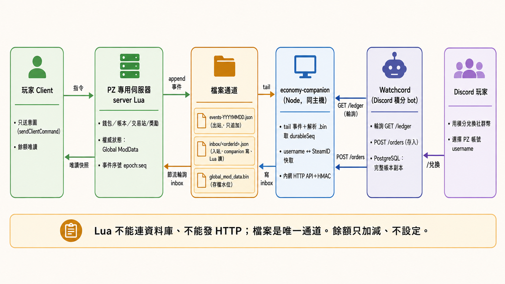

六個角色由左到右：玩家 Client 只送意圖 → server Lua 持有權威狀態 → 檔案通道（事件檔、inbox、存檔水位）→ companion 整理成 API → Watchcord 輪詢並保存副本 → Discord 玩家用積分兌換。Lua 不能連資料庫、不能發 HTTP，檔案是唯一通道。細節：`economy-persistence-and-integration.md` §4。

### 3.2 Discord 存入流程（含崩潰自癒）

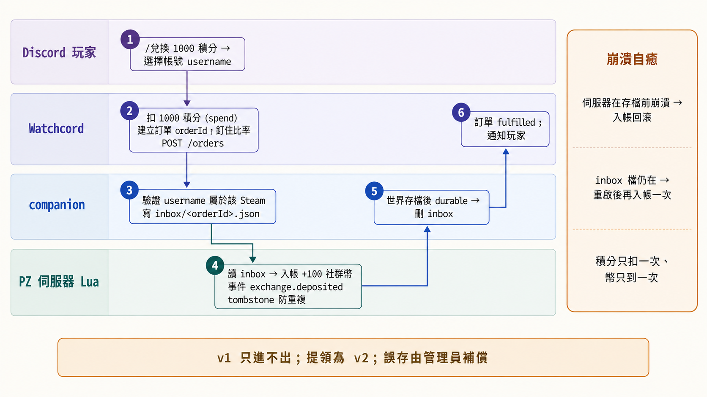

玩家在 Discord 選 PZ 帳號 → Watchcord 扣積分並建單 → companion 寫 inbox → Lua 入帳 → 存檔後 durable → 訂單完成。伺服器在存檔前崩潰時入帳會回滾，但 inbox 檔還在，重啟後再入帳一次；積分只扣一次、幣只到一次，玩家不需要等存檔。細節：`economy-persistence-and-integration.md` §5.5。

### 3.3 終端與購買流程（中央託管）

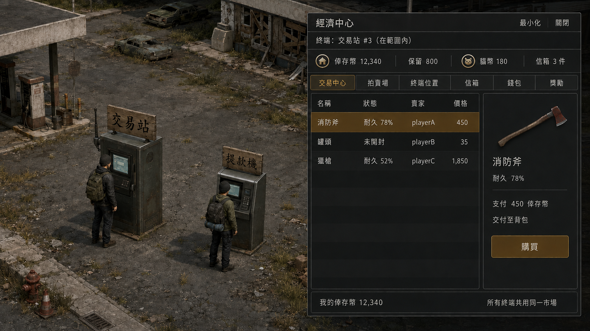

管理員在公共區域建造的兩種終端：交易站（有天線＝電台）與提款機（無天線）；玩家在任一台旁邊右鍵開同一個經濟中心、連同一個市場。

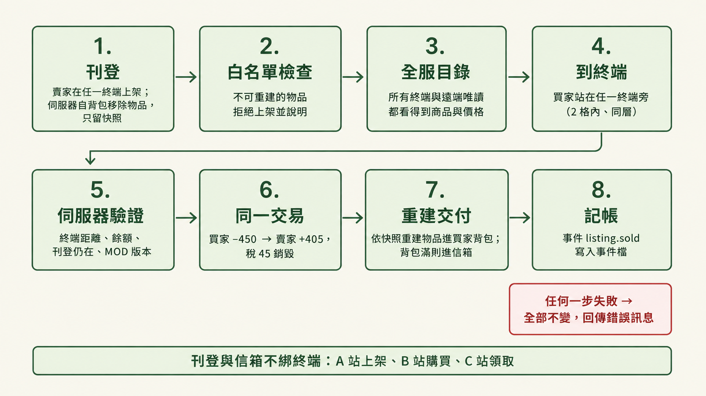

賣家在任一終端刊登：伺服器把物品從背包移除、只留快照；買家在任一終端購買：驗證在終端旁、餘額、刊登仍在 → 買家扣款、賣家入帳、稅銷毀、快照進買家信箱（同一份存檔）→ 立即領取：依快照重建物品進背包（滿了留在信箱，任一終端可領）→ 寫事件。任何一步失敗全部不變。舊圖 `08-stall-purchase-flow.png` 是安全屋攤位版本，已過時。細節：`economy-system-analysis.md` §12 階段 D、§17.1；`economy-design-proposals.md` §4.1。

### 3.4 雙貨幣流向

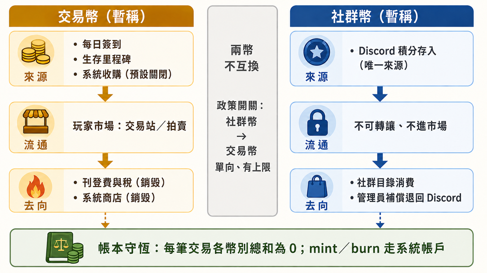

倖存幣有多個來源與銷毀口，可在市場流通；貓幣只有一個來源（Discord 存入）、不流通、只在社群目錄消費。兩幣不互換。細節：`economy-system-analysis.md` §7。

### 3.5 階段路線圖

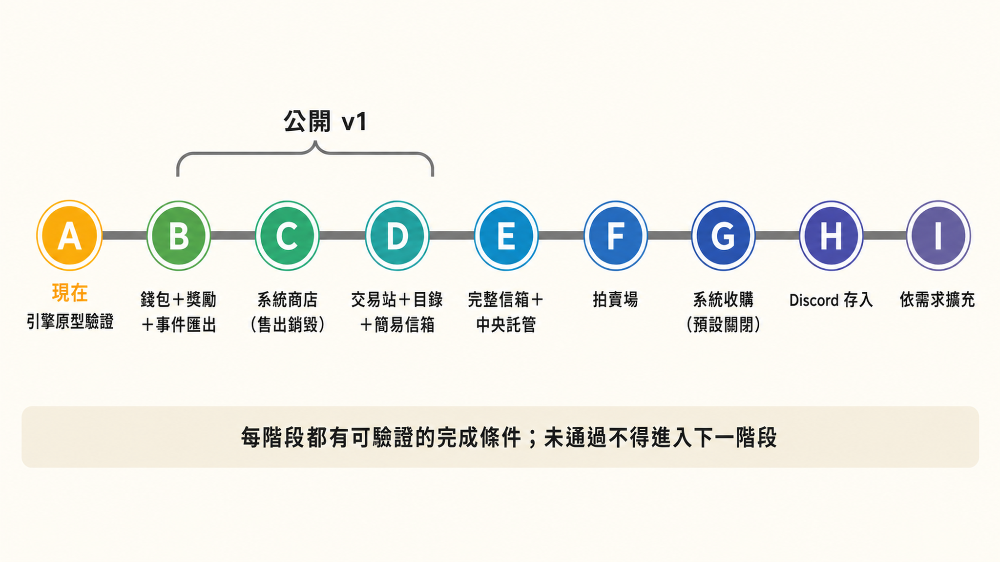

A 引擎原型驗證 → B 錢包＋獎勵＋事件匯出 → C 系統商店 → D 交易站＋目錄＋簡易信箱（**公開 v1 到此**）→ E 完整信箱＋中央託管 → F 拍賣場 → G 系統收購 → H Discord 存入 → I 擴充。每階段有完成條件，未通過不進下一階段。細節：`economy-system-analysis.md` §12。

## 4. 已定的關鍵決策

| 決策 | 一句話理由 | 出處 |
|---|---|---|
| 只支援多人專用伺服器 | 權限、指令驗證、存檔行為在單人路徑上都不同，做兩套等於沒驗證 | 主規格 §1.1 |
| 錢只能加減、不能設定 | 沒有 set-balance 就沒有「憑空改錢」的路徑；管理員調整也是一筆有理由的 posting | 主規格 §11 |
| 權威狀態放 Global ModData，接受它對登入玩家可讀 | 與世界同輪存檔是唯一能拿到的一致性；表裡沒有祕密與歷史 | 主規格 §16.1；本檔 §6.2、§9 |
| 事件檔 append-only、Lua 不讀回不刪檔 | Lua 沒有刪檔／rename API；日期輪替＋companion 歸檔就夠 | 儲存規格 §4.3 |
| 存檔水位由 companion 解析 `.bin` | console 的 `Saving finish` 在 ModData 寫入失敗時也會印，不可信 | 儲存規格 §2 |
| 不用 RCON `save` | 存檔凍結全服；RCON 路徑不重置引擎排程，會疊成兩個週期 | 儲存規格 §4.2 第 5 點 |
| 外部帳本＝Watchcord 自己的 PostgreSQL，companion 不寫 DB | 少一個資料庫、少一組密碼；Watchcord 本來就要一份副本 | 儲存規格 §1 |
| Discord v1 只進不出 | 拿掉提領、durable 等待、退款語意與價差；誤存走管理員補償 | 儲存規格 §5.3、§5.6a |
| 存入比率與上限由遊戲端擁有、可隨時調整 | 服主在沙盒或管理面板改，Watchcord 只讀取；訂單釘住比率、Lua 驗證，改動不會讓玩家看到的預估與實際入帳不同 | 儲存規格 §5.4 |
| 一種 Discord 貨幣 ↔ 一種遊戲內貨幣 | 避免免費積分洗成付費貨幣 | 儲存規格 §5.3 |
| 市場是中央託管，入口是管理員建造的 ATM／交易站終端（同介面、同市場） | 公共容器無法保護、物品也不能綁在單一容器；白名單快照重建是唯一能「任一終端買」的做法（09-06 反轉原「安全屋攤位」裁決） | 比較文件 §4.1；主規格 §12 D、§17.1 |
| 費稅直接銷毀、不建國庫 | 國庫是第二個要防守的錢包 | 主規格 §11 |
| 不做逐隻殭屍隨機發錢 | 不透明、可農、事件量高 | 主規格 §8.2 |
| 貨幣預設名倖存幣／貓幣，名稱與圖示可由管理員覆寫 | 服主想要自己的世界觀；預設值讓不改也能用 | 主規格 §18 |
| 所有指令／API／設定都指定幣別 | 未來加斗內幣時只加註冊表一列，不改協定 | 主規格 §18.1 |
| 遊戲內管理面板；完整歷史在 Watchcord | 線上經濟一定要有客服工具；但遊戲內不放歷史，避免 ModData 膨脹 | 主規格 §19、§20 |
| ModData 只放現在的狀態與有上限的短期彙總 | 每張表有硬上限與自我量測，典型 2–3 MB | 主規格 §20；本檔 §9 |
| UI 全部建在 MinidoracatUIFor42 上 | 家族 UI 不再各自實作；圖示與元件集中維護 | 主規格 §16.2 |
| 其他 MOD 透過 `MinidoracatEconomy.v1` 加減錢，不碰市場 | 一條 posting 路徑、一種可追溯欄位；每個 MOD 有獨立額度，不會有人變成印鈔機 | 主規格 §21 |

## 5. 貨幣名稱、圖示與比率

### 5.1 已定：預設名「倖存幣」與「貓幣」，管理員可覆寫

2026-09-06 拍板：市場單位叫**倖存幣**（`survivor`），Discord 存入的叫**貓幣**（`cat`）。這兩個是**出貨預設**：管理員可在管理面板改顯示名稱（單一字串、不分語言），也可把 64x64 PNG 放進伺服器的 `icons/<幣別>.png` 覆寫圖示（沿用 NoticeBoard 的圖片同步作法，玩家端自動下載）。細節：主規格 §18。

**不變量：貨幣沒有實體道具。** 兩種幣只存在於伺服器帳本，沒有可掉落、可交易、可放進容器的硬幣物品，也沒有「提領成道具」——這是為了整個繞開 PZ 物品複製漏洞這一類問題（主持人 2026-09-06 定案；主規格 §7.2）。下面的「硬幣」只是 UI 圖示的造型。

預設圖示（gpt-image-2 透明底原稿 1254x1254 → Pillow 縮 64／32；出貨前再做一次乾淨重繪或人工修邊）：

| 幣別 | 64 px | 32 px | 母題 | 狀態 |
|---|---|---|---|---|
| 倖存幣 |  |  | 褐色硬幣＋小屋剪影＋炊煙 | 定案 |
| 貓幣（**定案：日系動漫貓娘，變體 A**） |  |  | 金色外圈＋靛藍星空底＋粉髮綠眼 chibi 貓娘（貓耳白絨毛、鈴鐺項圈、小虎牙） | **定案（2026-09-06 主持人挑 A）**；64px 清楚、32px 靠金圈與粉髮辨識 |
| 貓幣（備用：動漫變體 B） |  |  | 玫瑰褐外圈＋櫻花粉底＋淡藍長髮紫眼 | 備用（32px 對比較弱） |
| 貓幣（落選：極簡貓娘） |  |  | 靛藍硬幣＋扁平貓娘大頭 | 落選（主持人：不要極簡風） |
| 貓幣（落選：貓臉） |  |  | 靛藍硬幣＋貓臉剪影 | 落選 |
| 貓幣（落選：貓掌） |  |  | 靛藍硬幣＋貓掌印 | 落選 |

風格定調：貓幣用**日系動漫 kawaii chibi**（大眼、腮紅、小虎牙、貓耳白絨毛、鈴鐺項圈、賽璐璐＋水彩感），不用極簡扁平；倖存幣維持現有褐色小屋硬幣（若要整體風格一致，日後可再出一版同風格的倖存幣）。

當初的三組候選（A 諾克斯幣＋電波幣／B 配給券＋貓掌幣／C 倖存幣＋社群點）保留在 `design-proposals/images/11–13`，供日後主題活動或斗內幣命名參考。

### 5.2 比率建議（依 Watchcord 正式庫 2026-09-06 唯讀統計）

| 觀察 | 數值 |
|---|---|
| 有餘額的成員 | 805 人；總餘額約 27.4 萬積分 |
| 餘額分佈（有餘額者） | 中位數 1、P75 29、P90 416、P99 9,301、最高 15,678 |
| 過去 30 天 | 活躍 608 人；全服每日新增約 5,700 積分；幾乎沒有消費（30 天只有 9 筆、1,800 積分） |
| 每人每日可賺上限 | 語音 240＋活動 100＋簽到約 10–20 ≈ 360 |
| 已綁 Steam 的成員 | 14 人；餘額中位數 587、最高 15,678 |

結論：積分並不「普遍很高」，而是**少數人很高**（6 人超過 1 萬，10 人在 5 千–1 萬）。而且 PZ 存入會是積分**第一個真正的消費出口**，所以比率主要影響「數字看起來的大小」，不影響公平性；真正的閘門是上限。

| 選項 | 效果 | 評估 |
|---|---|---|
| **1 積分 = 1 貓幣（推薦）** | 最高持有者 15,678 幣；中位綁定者 587 幣 | 最透明，玩家不用換算；社群目錄用百到千級定價即可 |
| 10 積分 = 1 貓幣 | 最高 1,567 幣；中位綁定者 58 幣 | 數字精緻，但低餘額者（多數人）換不到東西，且 Watchcord 端要處理餘數 |
| 1 積分 = 10 貓幣 | 數字膨脹 | 沒有好處 |

配套上限：單筆 10–5,000；每人每日 5,000；全服每日 50,000。比率與這些上限都是**遊戲端設定**（沙盒選項給啟動預設、管理面板隨時可改，改動自動同步到 Watchcord 的下一張訂單）；它們是防錯與防濫用的上限，不是遊戲設計。`rateIn` 釘進每張訂單，日後調整不影響歷史對帳；改比率當下在途的訂單若比率已失效會自動退回積分，玩家重下即可。v1 不開「貓幣→倖存幣」兌換，避免 27 萬積分變成市場通膨來源。

## 6. 待決事項（需要專案主持人決定）

### 6.1 決策清單

| # | 事項 | 選項 | 建議 |
|---|---|---|---|
| 1 | ~~貨幣名稱與圖示~~ | 已定：倖存幣／貓幣，可覆寫 | **貓幣圖示定案：日系動漫貓娘（變體 A）**（2026-09-06）；極簡版、貓臉、貓掌落選 |
| 2 | ~~存入比率與上限~~ | 已定：遊戲端沙盒／管理面板可自由調整，同步到 Watchcord | 初始沙盒值建議 1:1；單筆 10–5,000、每人每日 5,000、全服每日 50,000 |
| 3 | ~~Global ModData 對登入玩家可讀是否接受~~ | 已接受，附 §9 大小預算 | — |
| 4 | ~~唯讀分頁能否遠端開啟~~ | 已定：遠端可看（沙盒可關）、交易要到終端、距離 ≤ 2 格同層；呈現用家族浮鈕＋唯讀狀態帶 | — |
| 4b | ~~含配件武器怎麼處理~~ | 已定：自動拆配件退回背包後上架；含未知 modData 鍵的物品拒絕 | 白名單初版類別照主規格 §12 D，之後由服主編輯 `whitelist.json` 擴充 |
| 5 | ~~信箱是否跨角色死亡保留、待領是否永不過期~~ | **已定：保留＋永不過期**（信箱是帳號層資料、只存快照） | 滿（每帳號 50 筆未領）時：購買／得標／系統商店需有空位（終端旁購買立即領取會馬上釋放）、取消刊登需有空位；上架不佔信箱；系統退件（到期、下架、流標、取消）一律成功、可暫超上限（受刊登配額 5＋5 約束）；領取即結清、不算過期 |
| 6 | ~~拍賣遇維護或長停的政策~~ | **已定：自動延長** | 重啟時以「上次心跳 → 啟動」算停機長度：≤ 5 分鐘不動；5 分鐘–24 小時把停機長度加到所有進行中拍賣的截止時間（出價保留）；> 24 小時取消：託管快照退回賣家信箱、保留款釋回。不區分預告／意外 |
| 7 | ~~每日獎勵全服上限分配~~ | **已定：簽到不設全服上限**（設定保留、預設 0＝不限） | 每帳號每日一次×固定金額，總量已被在線人數綁死；里程碑每帳號每季一次；全服每日上限只留給 Discord 存入與整合 MOD 來源。「日」＝伺服器壁鐘的現實日（重置時刻可設，建議 04:00） |
| 8 | ~~是否排 v2 提領~~ | **已定：不排** | 等 v1 上線觀察需求 |
| 9 | ~~ATM 是否為錢包寫入操作的必要條件~~ | 已併入 #4：所有寫入類操作都要在任一終端（ATM 或交易站）旁 | — |
| 10 | ~~倖存幣的初始數字尺度~~ | **已定：小尺度** | 簽到 30、里程碑 100–1,000、常見商品 10–5,000；與貓幣 1:1 存入後的尺度（p90 ≈ 400、max ≈ 15,000）對得上 |
| 11 | ~~管理員調整餘額的門檻~~ | **已定：沙盒選項** | 單筆 5,000、每位管理員每日加／減各 10,000、原因 ≥ 10 字、全服每日管理調整總額 50,000；只能在沙盒／ini 改，管理面板不提供（這是限制管理員的設定，屬服主層級） |
| 12 | moderator 能否看玩家餘額與收據 | 能（唯讀）／只有 admin | **已定（A13 實測）**：能（唯讀），操作限 admin；server 以角色名清單重驗，不用 capability（moderator 也有 `AddItem`） |
| 13 | ~~圖示同步管線放哪~~ | **已定：Economy 自帶一份**（主持人：沿用 NoticeBoard 作法、不依賴 UIFor42） | 複製 NoticeBoard 的 `NBImage`／`NBImageCache`／server 掃描器到 Economy 命名空間；UI 框架仍用 UIFor42，只有圖片同步自帶；A17 在階段 B 測。日後 UIFor42 若抽出 `ImageSync` 再遷移 |
| 14 | ~~倖存幣是否跟貓幣同風格重繪~~ | **已定：同風格重繪，母題維持小屋＋炊煙、不放人物** | `icons/currency_survivor_anime_*.png`（生成中） |

### 6.2 「Global ModData 對登入玩家可讀」是什麼、有什麼差

**事實**：Global ModData 是 PZ 給 MOD 的伺服器資料表，client 只要登入就能送 `GlobalModDataRequestPacket` 索取任一張表（封包要求的權限是 `LoginOnServer`，`GlobalModDataRequestPacket.java:15`），伺服器不會問 MOD「這張表能不能給」。正常 client 不會這樣做，但改過的 client 可以。

| 選項 | 做法 | 得到 | 失去 |
|---|---|---|---|
| **接受（建議）** | 經濟表留在 Global ModData；表裡只放餘額、刊登、義務等「本來就半公開」的狀態，不放歷史、不放祕密；每次寫入自我檢查表的參照 | 與世界**同一輪存檔**的一致性：崩潰回滾時世界與錢一起回到同一時間點；引擎負責落盤 | 改過 client 的玩家能看到所有人的餘額與刊登（不能改，改了伺服器不採用） |
| 不接受 | 改用伺服器私有檔案：Lua 用 `getFileWriter` 寫 journal＋快照，啟動時重放 | client 完全讀不到 | 失去同輪一致性（世界回滾到 T1、錢在 T2）；要自己處理半寫入檔、重放、壓縮；沒有原子 rename，崩潰時檔案可能損毀 |
| 混合 | 餘額等公開資訊留 ModData；敏感資訊（管理員 reason、Discord 對應）只進事件檔與 companion | 兩者兼得 | 設計已如此：事件檔與 companion 側本來就不進 ModData |

建議接受，理由是唯一被暴露的是「餘額可被偷看」，而市場刊登本來就公開、餘額不是祕密；反過來，自製持久層失去的是**正確性**（錢與世界不同步），那是更貴的代價。

## 7. 新需求評估（2026-09-06 提出）

完整評估與引擎證據在 `economy-system-analysis.md` §17；此處只給結論。

| 需求 | 可行性 | 做法摘要 | 要先驗證的事 |
|---|---|---|---|
| ATM／交易站作為終端（同介面、同市場） | **可行** | 右鍵已登錄終端 → `OnFillWorldObjectContextMenu` 加「使用終端」開啟經濟中心；所有寫入類操作由伺服器驗證玩家在任一終端相鄰格，終端是閘門不是裝飾；唯讀可遠端 | 原版是否有可用的 ATM／櫃員機 tile（未查證）；沒有就與交易站一起做自製 tile 包 |
| 管理員專屬建造 | **可行** | B42 建造項是 `entity` 腳本；`CraftRecipe` 的 `OnAddToMenu` 回呼可依 client 權限決定是否顯示（原版 `entity Piano` 就是用它做 Debug 專屬）；伺服器只在具權限者送出 `terminal.register` 時才把該座標登錄為終端——放得出精靈圖不等於能用 | 4 面向精靈圖需自製；伺服器端直接放置物件的 API 未查證，第一版走建造選單 |
| 交易站電台功能（兩種終端唯一差異） | **可行（有限）** | 伺服器 Lua 可用 `getZomboidRadio():SendTransmission(...)` 以交易站座標為訊源、在指定頻率廣播文字，範圍內調到該頻率的收音機會收到；可註冊具名頻道「市場電台」；受天氣干擾影響 | 伺服器端 `ZomboidRadio` 實例是否存在、MOD 頻道在專用伺服器上的收發實測；廣播節流（例如每 10 分鐘一則摘要） |
| 中央託管的物品重建 | **可行（白名單）** | `InventoryItemFactory.CreateItem` 建新物品，`setCondition`／`setCurrentUses`／`setAge`／允許的 `getModData()` 鍵套回快照；Lua 拿不到完整序列化，所以只開放能無損重建的類別 | 每類白名單的 round-trip 實測；`FluidContainer` 讀寫 API |
| 生成建模 | **部分** | B42 的建築／家具是 2D 等角 tile（`SpriteConfig` 引用 tile 名），不是 3D 模型；AI 可產出四面向等角草稿，但要人工對齊 64x128 格與透明背景。3D 模型只用於物品／車輛，可用 AI 3D 工具產生再匯入，同樣需人工整理 | 先做一顆 ATM 與一座交易站的 tile 包並在專用伺服器上驗證同步 |

## 8. 面板（玩家端與管理端）

### 8.0 玩家自己的金流紀錄：錢包＝對帳單

主規格 §6.3。玩家只看得到自己的帳號；每筆帶餘額後值，狀態三態（已存檔／處理中／已回滾）；即時顯示最近 10 筆，「載入本月／上月」讀收據檔（每 30 秒一次）。

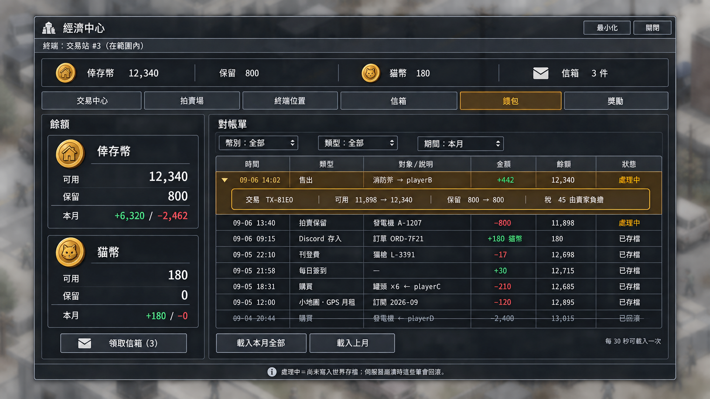

### 8.1 管理面板

完整規格在主規格 §19。以下三張是 gpt-image-2 依 `design-proposals/images/PROMPTS.md` 第三批 prompt 生成的討論用 mockup（`ui-screenshot-system` 範本，沿用經濟中心的視窗語言）。

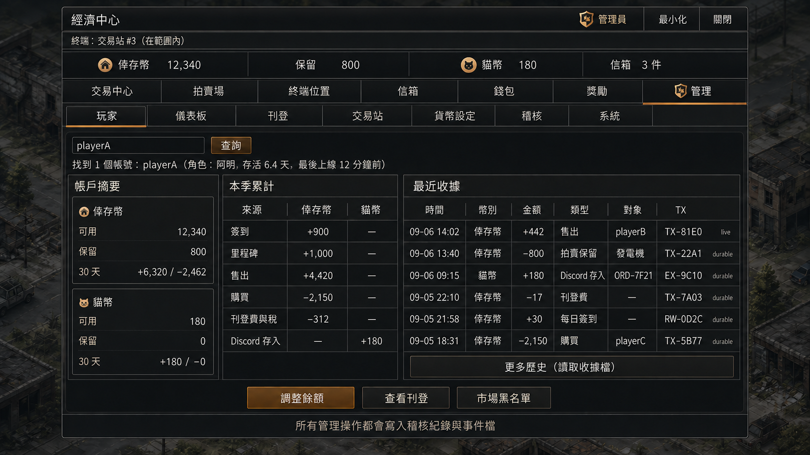

玩家子分頁：搜尋 → 帳戶摘要（各幣別可用／保留／本季累計）→ 來源統計 → 最近收據（標 live／durable）與「更多歷史（讀取收據檔）」；動作按鈕。

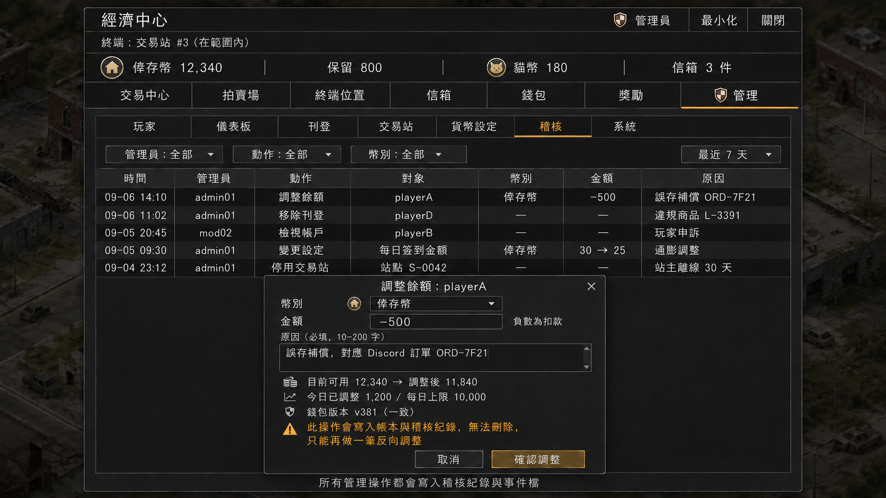

調整餘額：幣別下拉、±金額、必填原因、前後餘額與今日已調整／上限，並明示「無法刪除，只能反向再調」；背景是稽核子分頁。

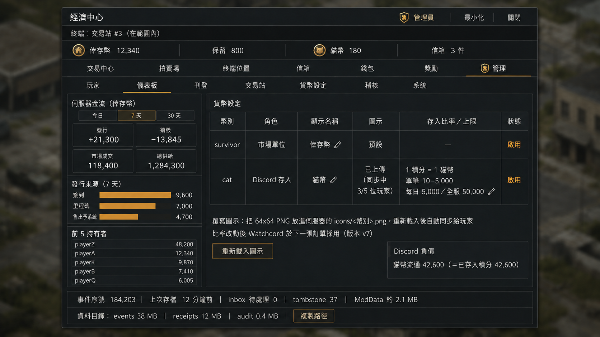

儀表板：發行／銷毀／成交／總供給 KPI、發行來源長條、前 5 持有者；右側貨幣設定（含「存入比率／上限」欄與編輯鉛筆）與 Discord 負債；底部系統狀態帶兩行，第二行是資料目錄大小與「複製路徑」。

補充畫面：

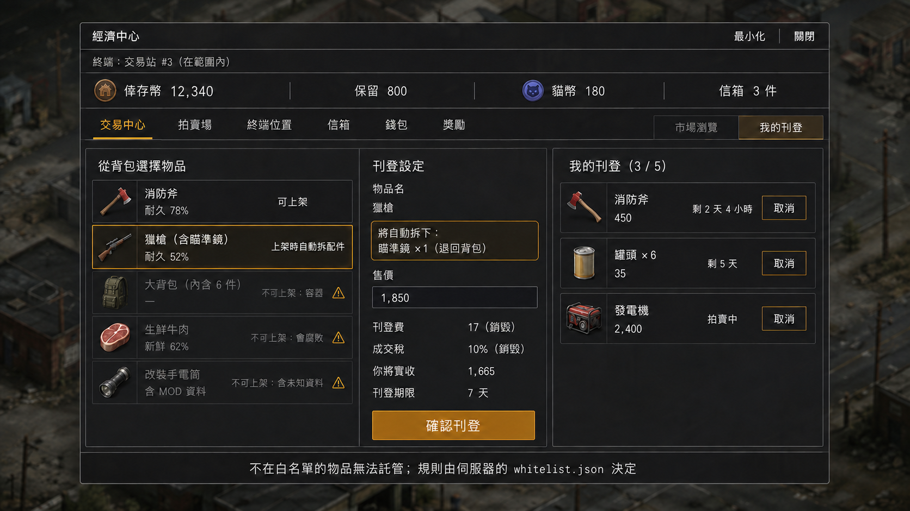

刊登：左欄背包物品標「可上架」「上架時自動拆配件」「不可上架：容器／會腐敗／含未知資料」；中欄刊登設定明示刊登費、成交稅（皆銷毀）與實收。

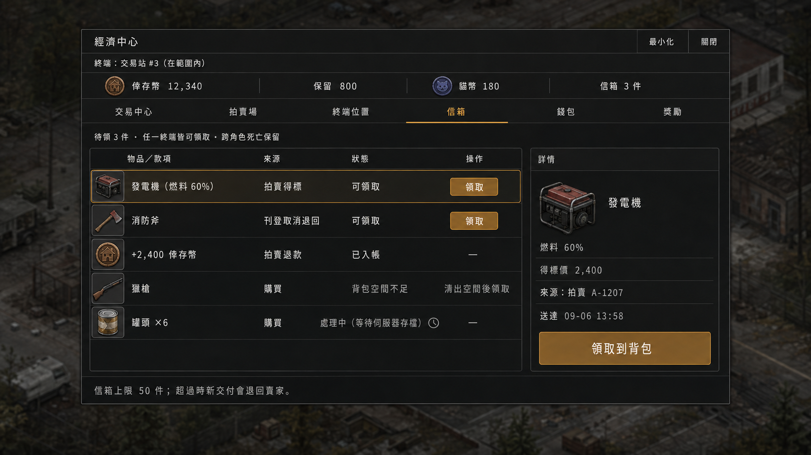

信箱：可領取、已入帳、背包空間不足、處理中（等待存檔）四種狀態；任一終端皆可領。

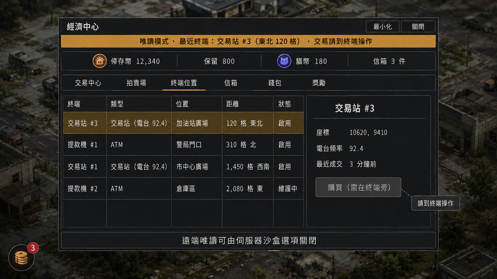

遠端開啟時的唯讀模式：琥珀色狀態帶、寫入按鈕停用＋tooltip、終端位置分頁列出所有終端與距離、左下角家族浮鈕帶信箱徽章。

| 子分頁 | v1 做什麼 | 資料從哪來 |
|---|---|---|
| 玩家 | 依 username 查：各幣別可用／保留、本季累計收支、最近 10 筆收據（標 live／durable）與「更多歷史」、刊登數、信箱待領、簽到與里程碑狀態、最後上線；按鈕：調整餘額、凍結帳號、查看刊登、市場黑名單 | 即時值與小收據環在 Global ModData；「更多歷史」讀該玩家的收據檔；30 天分來源統計看 Watchcord |
| 調整餘額 | 選幣別、±金額、必填原因（10–200 字）、前後餘額確認（帶錢包版本，避免與玩家同時交易時算錯）；單筆與每日加／減各自上限、不能調自己、不可負餘額、不可動保留款；每筆是一條有理由的帳本 posting，無法刪改，只能反向再調 | 寫 ModData＋事件檔；Watchcord 輪詢到即推 Discord 管理頻道告警；遊戲內調整與 Discord 退點由不同人負責 |
| 凍結／案件 | 帳號級凍結（拒新交易、保留既有義務）與全服「暫停新交易」；**餘額異常**（鏈斷裂／現值不符／保留不符／全域不守恆）自動開案並有「修復」按鈕（產生帶證據的 `SYSTEM_RECONCILE` 補償紀錄）；**跨存檔線操作的自動收斂紀錄**（主規格 §19.7；全部自動，僅供查閱，沙盒可改為只開案件）；回滾筆依類型標示（存入已自動補回／獎勵可重領／管理員調整一鍵重做／購買已取消） | ModData 案件環＋收據檔鏈檢查＋物品戳記／玩家水位 |
| 儀表板 | 今日／7 天／30 天發行、銷毀、市場成交、費稅銷毀；總供給；Discord 負債；前 10 持有者 | 伺服器層每日彙總（60 天） |
| 刊登 | 全服刊登與拍賣清單；移除（物品進賣家信箱）、取消拍賣退款；市場黑名單 | ModData |
| 交易站／ATM | 登錄清單、停用／解除登錄 | ModData |
| 貨幣設定 | 名稱覆寫、圖示狀態（預設／已上傳、同步進度）、啟用／停用、每日 cap、獎勵與費稅參數 runtime 覆寫 | ModData `config`＋`admin.config` 事件 |
| 稽核 | 管理員操作最近 500 筆，可篩選 | ModData 稽核環；完整版在 Watchcord |
| 系統 | 事件序號、上次存檔、inbox 待處理、tombstone、ModData 估計大小、companion 心跳；**資料目錄**：事件檔／收據檔／稽核檔／inbox／icons／whitelist.json 的伺服器路徑、估計大小、最舊檔月份，每項「複製路徑」按鈕與清理提醒 | Lua 自我量測＋companion 心跳檔；路徑由伺服器組出、client 複製到剪貼簿 |
| 整合 | 已註冊的其他 MOD：額度與今日已用、啟用／停用、統計、該 MOD 最近 50 筆 | ModData 註冊表＋收據檔篩選 |
| Discord | 查訂單狀態；反向補償用「調整餘額」帶原訂單 txId（自動填表的補償精靈是 v2） | inbox／tombstone／事件 |

權限：`moderator` 以上唯讀、`admin` 可寫；client 只決定顯不顯示分頁，**每個操作都在伺服器重驗角色**。完整歷史、匯出與跨期報表不在遊戲內做——Watchcord 有完整帳本。

最新調整後新增的兩個子分頁：

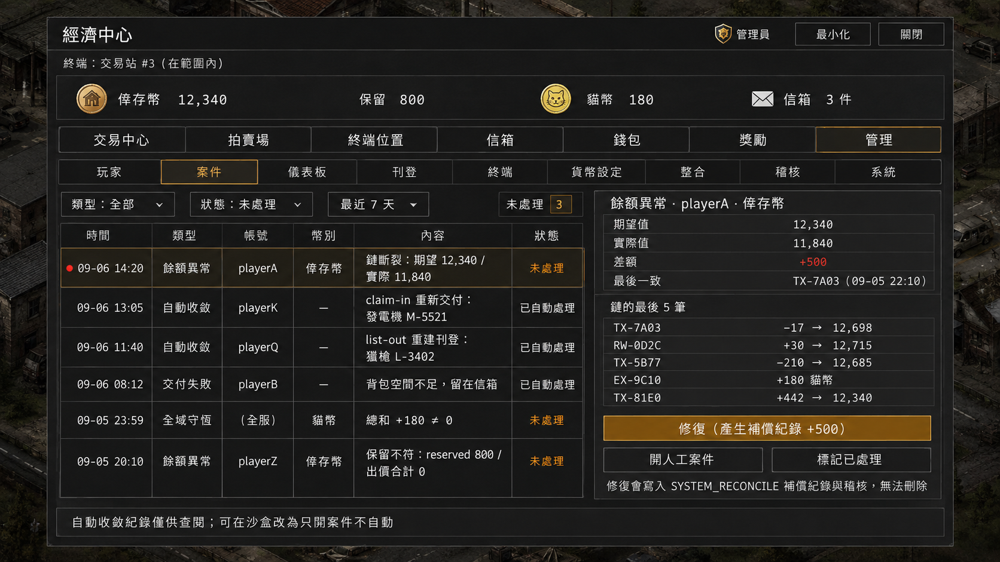

案件：餘額異常（含證據與「修復」）、自動收斂紀錄、交付失敗、全域守恆；每件可標處理結果。

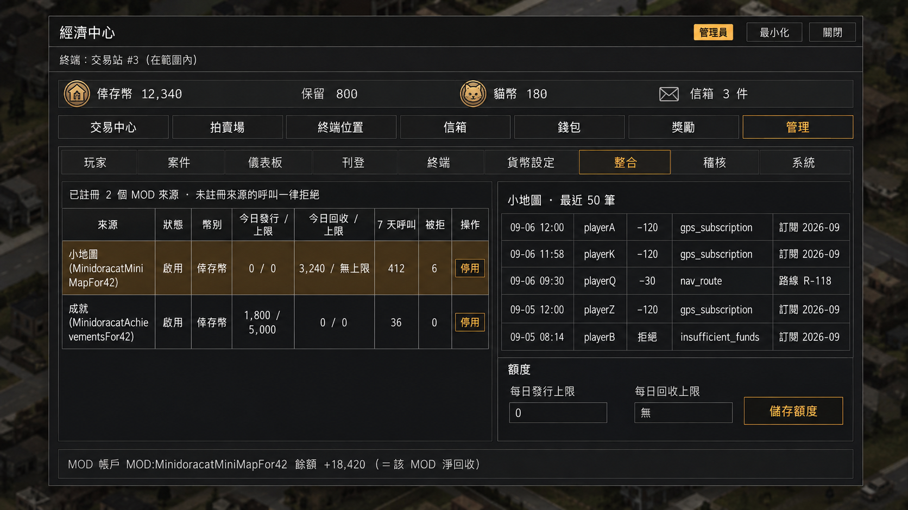

整合：已註冊的 MOD 來源、每日發行／回收額度與今日已用、呼叫與被拒統計、停用、最近 50 筆。

## 9. Global ModData 會不會膨脹

不會失控，因為規則是「ModData 只放現在的狀態與有上限的短期彙總，歷史只進事件檔」。主規格 §20 有逐表預算：

| 規模假設 | 估計 |
|---|---|
| 5,000 個曾有交易的帳號、500 個 14 天內活躍、每日 3,000 筆交易、2,000 筆刊登、3,000 件待領 | 典型 **3.5–4.5 MB**，全部撞上限約 **11 MB** |
| 最大的三張表 | 信箱待領（含物品快照，~1.5 MB）、刊登（含快照，~1.2 MB）、錢包（~1 MB）——中央託管把物品快照放進 ModData，是預算最大的兩塊 |
| 上限手段 | 快照瘦身（欄位白名單、modData ≤ 8 鍵、字串 ≤ 64 字）；刊登全服 5,000、信箱每帳號 50／全服 10,000；收據環每帳號 10 筆（可設 0–50）且 14 天不活躍即移除；tombstone 4,096、冪等 2,000、稽核環 100；零餘額且 180 天不活動的錢包歸檔 |
| 自我保護 | Lua 以筆數估算大小寫進 `meta.sizeEstimate`；8 MB 發警告事件並在「系統」分頁顯示；10 MB 起自動縮小收據環、拒收新信箱與新刊登，但**退款與去重證據絕不丟**（tombstone、冪等、保留款照常並預留容量），錢包與既有義務不受影響 |
| 絕不放進去的 | 交易歷史、事件內容、Discord 訂單 payload、物品完整快照、圖片位元組（圖示只存 8 字元 hash） |

### 9.1 面板裡的「交易歷史」從哪裡來、留多久

| 資料 | 放哪 | 保存 | 誰看得到 |
|---|---|---|---|
| 玩家最近收據（即時） | Global ModData 收據環 | 每帳號最近 **10 筆**（服主可設 0–50）；14 天沒活動的帳號整環移除 | 玩家錢包頁、管理面板玩家頁 |
| 玩家完整收支 | **收據檔** `receipts/<帳號>/<年月>.json`（伺服器磁碟） | 每月一檔、永久（服主可自行刪舊檔；companion 預設 12 個月後歸檔） | 面板「更多歷史」分批讀取；回滾筆標「已回滾」 |
| 每日彙總（發行／銷毀／成交／費稅，每幣別、每來源） | Global ModData `rollups` | **60 天** | 管理面板儀表板 |
| 管理員操作 | Global ModData 稽核環＋**稽核檔** `audit/<年月>.json` | 環 **100 筆**（原因截 40 字）；檔案永久、含完整原因 | 管理面板稽核頁；檔案供事後稽核 |
| **完整交易歷史** | 事件檔（伺服器磁碟，NDJSON）＋ Watchcord PostgreSQL（完整帳本副本） | 事件檔由 companion 在 Watchcord 消費後歸檔（建議本機保留 90 天）；Watchcord 端**永久** | 管理員用 Watchcord 後台／Discord 指令查；遊戲內不查 |

ModData 只留「最近幾筆＋彙總」，完整歷史在檔案：Lua 不能刪檔，但檔案按帳號／月份分檔天然可追溯；目錄內有 `00_README.txt` 說明哪些可以安全刪除，面板「系統」的資料目錄區塊有路徑、大小估計與「複製路徑」按鈕，服主自行決定清理；companion 啟用時會依保留期自動歸檔。

**崩潰沒存檔時不會用事件檔「自動補寫回」**：事件檔確實比存檔早落盤，但世界（背包、託管物品）已回到上次存檔，只把錢寫回去會變成「錢扣了、東西沒到」。實際處理是：Discord 存入靠 inbox 重放自動補回；簽到回滾後玩家再領；管理員調整在案件頁「一鍵重做」；購買類回滾就是沒發生，買家有錢、賣家有刊登，帳仍一致。

**「還原」真正派上用場的地方是異常，不是回滾**：每筆紀錄帶前／後餘額，所以 bug 或手動改資料造成的「餘額對不上」會被鏈檢查抓到，面板列出誰、差多少、最後一致的那筆，管理員確認證據後一鍵修復（主規格 §19.5）。

**存檔點之後的交易，檔案是唯一證據**：交易當下就寫檔，ModData 要等存檔；崩潰後檔案裡那段期間的紀錄會被標「已回滾」，供追溯。

**錢與物品不同步的風險，從結構上消除**（主規格 §19.7）：PZ 的世界存檔與玩家背包存檔是兩條不同步的線，所以設計成——市場交易（扣款、入帳、稅、託管快照進信箱）**只動世界那一線**，天然原子；物品進背包永遠是「從信箱領取」這一個操作，刊登永遠是「從背包送出」這一個操作；這兩個跨線操作都是兩階段、在玩家存檔與世界存檔各留一份紀錄，登入時對照就能自動收斂（重新交付、直接標已領、收回、重建刊登），不讀檔、不需管理員，只留紀錄供查閱。在終端旁購買時「立即到背包」就是購買後馬上領取，玩家感覺不到差別。

這些是依 Kahlua 序列化格式的估算；階段 A 會用合成資料實測 `.bin` 大小與存檔耗時。第三輪 GPT-6 審查（主規格 §16.3）認為收據環是最可能失控的表、建議全放外部；我們保留可設大小的小環，理由是離線也要能看「最近幾筆」。

## 10. 下一步

1. 主持人回覆 §6.1 剩餘決策（5–8、10、11、13、貓幣圖示貓臉／貓掌）。
2. 圖已全部到位（01b／02b／05b 新命名、03c、14b–16b、17–19、透明圖示）；舊版 01–05、08、14–16 留作歷史。
3. 圖示同步改為 Economy 自帶（複製 NoticeBoard 的 `NBImage`／`NBImageCache`／server 掃描器），A17 併入階段 B；只需與 UIFor42 協調管理分頁所需的單色圖示 key。
4. **階段 A 已完成**（主規格 §12 表逐項有結果；Windows dedicated 42.20.4，Linux 正式服在階段 B 首次部署時只重驗檔案路徑與權限）。實測改掉的設計：`list-out` pending 保留到 durable、ID 帶 epoch（規則四）、死亡封存與新角色收斂（規則五）、管理員閘門改角色名清單、電台訊源固定在終端座標＋client 端登錄頻道名、建造項自帶 xuiSkin 顯示名、companion 零鎖讀 `players.db`。
5. 進入階段 B（主規格 §12）：先做事件匯出與 companion 對帳骨架，再錢包與獎勵；階段 B 額外驗證項 **A14b**（server 端生成交易站專用 `IsoRadio`）與 A18 第二 client 目錄同步（用實 UI 測）。開工前把 `proto/` 與 `proto_terminal.txt` 從 MOD 樹移出（保留在 `scripts/proto-done/` 供查證）。
