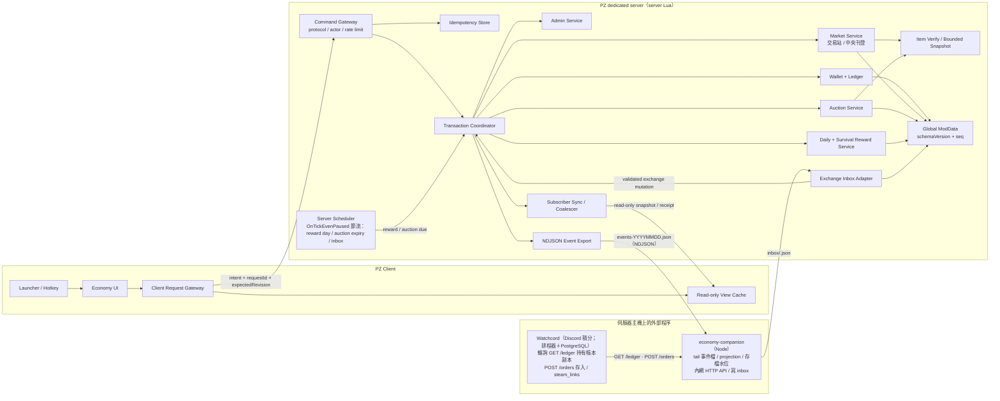
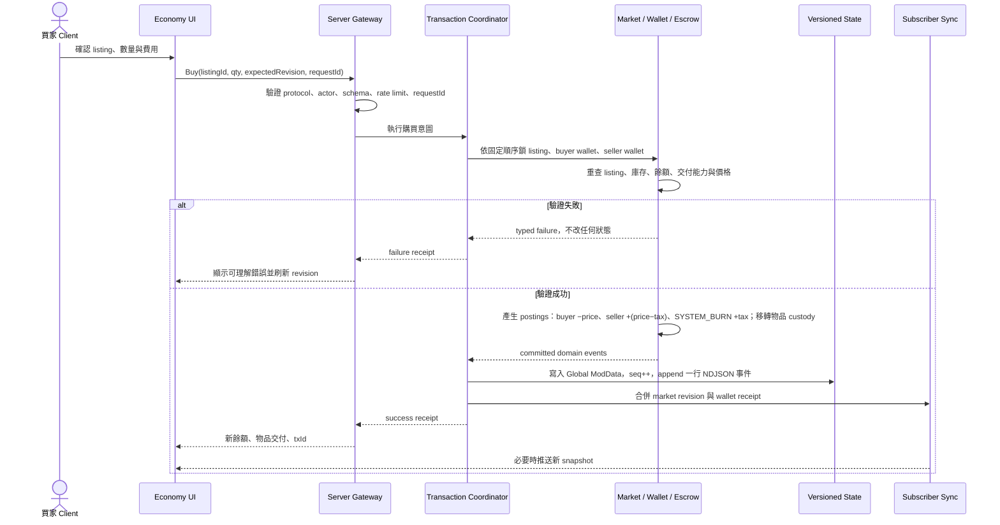

# MinidoracatEconomyFor42 經濟系統與 BONE > Bshop 參考分析

- 文件性質：產品功能、競品參考與技術架構決策草案
- 研究日期：2026-08-31；修訂：2026-09-02（v2：多人專用、儲存決策、Discord 整合、設計方案比較）
- 目標遊戲版本：Project Zomboid Build 42.20.4+，多人 dedicated server 專用（單人非目標）
- 參考 MOD：[BONE > Bshop](https://steamcommunity.com/workshop/filedetails/?id=3769028738&l=english)
- 決策狀態：建議方案；尚未代表已實作或已定版
- 相關文件：`docs/economy-persistence-and-integration.md`（引擎查證、儲存與 Discord 整合）、`docs/economy-design-proposals.md`（設計方案比較與推薦）、`docs/design-proposals/`（三份獨立設計稿）

## 1. 結論

BONE > Bshop 最值得參考的不是黑市外觀或預設數值，而是它公開描述的交易安全形狀：

1. client 只負責顯示與送出意圖，server 擁有餘額、物品、託管、價格、權限與交易狀態；
2. 固定價市場與拍賣場分離，避免不同交易規則混在同一流程；
3. request ID、防重複、限流、protocol version、交易鎖與稽核紀錄是經濟核心，不是後補功能；
4. 市場只同步給正在開啟介面的玩家，突發更新合併後再推送；
5. 物品狀態由 server 在刊登時擷取，client 只能讀取；
6. 管理員能調整經濟參數、處理刊登與查核交易。

MinidoracatEconomyFor42 不應照搬 Bshop。建議採用「雙貨幣＋小額簽到＋生存里程碑」的混合模式：

- **交易幣（暫稱）**：遊戲內市場的唯一結算貨幣，可由簽到、生存里程碑、交易與受控兌換取得。
- **社群幣（暫稱）**：Discord 積分兌換後取得的帳號型貨幣，不直接進玩家拍賣；如需轉成交易幣，必須有單向、限額、可稽核的兌換規則。
- **簽到獎勵**：小額、每日一次、需先達到最低有效遊玩時間，不採登入即領與連續簽到倍率。
- **生存獎勵**：角色達成一次性生存里程碑時自動發放，避免玩家不知道要開哪個介面領取。
- **殭屍擊殺**：不採 Bshop 預設的逐隻隨機發錢；若未來需要，改成每日有上限的任務或懸賞。

第一輪應先完成帳號識別、整數帳本、交易原子性、持久化、管理與獎勵，再做第一個玩家市場；拍賣與 Discord 兌換依序後接，bundle 部分購買只在觀測到真實需求後排入。

### 1.1 2026-09-02 修訂摘要

- **只支援多人 dedicated server**：所有單人路徑、單人測試情境自本版移除；公開文案「單人／多人皆支援」需在首次發布前改為「多人伺服器專用」。
- **帳戶主鍵已查證**：`player:getUsername()`（server 指派，`IsoPlayer.java:6445-6446`）；`getSteamID()` 在 Lua 會丟精度，Discord 對應改由 companion 讀 whitelist 資料庫完成。
- **儲存方案已決定**：遊戲內權威狀態＝Global ModData（與世界同輪存檔）；事件流＝NDJSON；外部帳本＝既有 PostgreSQL 18 實例的獨立 database，由 companion 寫入。Lua 不能直寫任何資料庫。
- **Discord 入站通道已決定**：companion 寫 inbox 檔、server Lua 以 `OnTickEvenPaused` 節流輪詢；RCON 與 HTTP 都到不了 Lua。
- **託管結論（2026-09-02，已於 09-06 被終端模型取代，見下）**：Lua 無法完整序列化物品（`ByteBuffer` 未暴露），中央託管市場只能開放「可重建物品白名單」；當時因此建議先做「物品留在世界容器的玩家交易站」。交易站的「可販售商品」仍要依站型與商品類型逐類驗證（腐壞、耐久等動態欄位需有 revision 規則），不承諾任何第三方物品第一天皆可。
- **空服暫停**：正式服 `PauseEmpty=true`，`EveryOneMinute`／`OnTick` 在無人時停止；到期、日切、inbox 輪詢一律以 `getTimestampMs()` 為準並掛 `OnTickEvenPaused`。
- **第二輪審查（2026-09-05，GPT-6）**：事件檔副檔名改 `.json`；存檔水位改由 companion 解析 `global_mod_data.bin` 取得；事件加 `epoch`；玩家背包存檔是背景佇列，三方對帳取代「錢與物品一起回滾」；SafeHouse 對外營業需要獨立的販售授權；階段 B 先完成事件匯出。處置全文見 §16。
- **2026-09-06 決策**：Discord → 遊戲改為 **v1 只進不出的固定比率存入**（比率與上限由遊戲端 config 擁有：沙盒預設、管理面板 runtime 覆寫，companion 以 `GET /currencies` 同步給 Watchcord）；每種 Discord 貨幣對應一種獨立遊戲內貨幣；存入由玩家在 Discord 指定 username 後直接入帳（無領取步驟），存檔前崩潰由 inbox 重放自癒、**不依賴存檔**；提領（遊戲 → Discord）保留為 v2 選項，v1 的唯一「出」路徑是管理員反向補償；**不再觸發 RCON save**（存檔會凍結全服，`ServerMap.java:365-371`）；外部帳本改由 Watchcord 輪詢 companion API 自行寫入 PG，`pz_economy` database 作廢。處置見 §16.2。
- **2026-09-06 第二輪決策（交易站型態）**：交易站**不是**玩家在安全屋擺的攤位，而是**管理員在公共區域建造的終端**；ATM 與交易站開同一個介面、連同一個市場，交易站只多電台功能。因此市場只能走**中央託管**（物品在伺服器端以有界快照保存、交付時重建），可上架物品限白名單；「櫃檯窗口」「站主」「安全屋依賴」全部移除。落點：§12 階段 D、§17.1。

## 2. 研究範圍與證據界線

### 2.1 已查證的公開資料

- Steam 頁面標示 `BONE > Bshop - Secure Market v1.6.0`，支援 Build 42.20+。
- Steam 頁面顯示 15 筆更新紀錄；第 1、2 頁均已查閱，但更新紀錄本文為空，功能變更主要寫在介紹頁的 v1.6.0、v1.5.2、v1.5.1 區塊。
- 留言頁顯示 0 則留言，討論區顯示 0 個主題，評價數不足。
- Workshop 僅提供一張封面圖，未提供可核對實際 UI 的遊戲內截圖。
- 以 Workshop ID 與完整名稱進行公開網頁交叉搜尋，未找到獨立評測、影片、GitHub 原始碼或玩家長期使用報告。
- 作者明示程式碼與素材保留所有權，但允許一般 marketplace 概念的獨立實作。本文件只分析公開功能概念，不取得或複製其程式碼、素材、翻譯或版面。

### 2.2 證據可信度

| 類型 | 本文件如何解讀 |
|---|---|
| Workshop 明列功能、按鍵、預設值 | 可確認「作者有公開宣稱」，不能等同已獨立驗證 runtime 行為 |
| security／performance 宣稱 | 可作架構檢查清單，不能當成已通過壓測或安全稽核 |
| UI 文字描述 | 可分析資訊架構；因無 UI 截圖，不能判斷字級、互動細節、實際可讀性 |
| 玩家滿意度、相容性、長期穩定性 | 無留言、討論、足夠評價或第三方資料，維持未知 |
| Bshop 內部模組與資料結構 | 公開頁面未提供；本文件的架構圖是 MinidoracatEconomyFor42 建議架構，不是 Bshop 逆向結果 |

## 3. 本專案現況與新增需求

目前 repo 只承諾以下方向，且仍是零遊戲功能的骨架：

- 雙貨幣與玩家餘額；
- 玩家交易中心與拍賣場；
- Discord 積分兌換遊戲貨幣；
- 單人與多人支援（公開文案；2026-09-02 決策改為多人專用，文案待同步）。

來源：`README.md:3, 7-15`、`STEAM_DESCRIPTION.md:6-24`、`MOD/MinidoracatEconomyFor42/Contents/mods/MinidoracatEconomyFor42/42/mod.info:1-5`。

本次新增產品需求是「遊戲內簽到或生存獎勵」。它不應只是獨立發錢按鈕，而要納入貨幣來源、每日上限、帳本、管理參數與防重複規則，否則市場上線後會直接形成不可控的通膨來源。

## 4. BONE > Bshop 公開功能盤點

下表只描述作者公開頁面的內容。

| 領域 | 公開功能 | 玩家／管理員使用方式 | 功能呈現方式 |
|---|---|---|---|
| 啟動入口 | `F2` 開關 Bshop；左下角另有購物車 launcher | 左鍵開介面；launcher 可右鍵永久隱藏；即使隱藏仍可用 `F2` | launcher 位於 vanilla 左側圖示列下方；世界地圖開啟時自動隱藏 |
| 固定價市場 | 永久玩家刊登、單件與 bundle、bundle 可部分購買 | 賣家選數量與單價刊登；買家可買 bundle 的部分數量 | 固定價市場與拍賣場是完全分開的 menu |
| 拍賣 | 作者列出的預設為起標 10 balance、刊登費 10 balance、持續 5 個真實分鐘；只接受正整數加價 | 出價時 server 預留資金；被超標者自動退款；到期由最高價者取得物品 | 獨立 Auction menu；不與固定價商品混排 |
| 刊登配額 | 預設固定價 5 格、拍賣 5 格 | 管理員可調整個別玩家的刊登限制 | 玩家可查看 personal listings |
| 搜尋與瀏覽 | 搜尋、固定分類、排序、grid/list、分頁 | 玩家依名稱／分類篩選並切換檢視 | 左側分類、中間商品區、右側物品 inspector、底部 refresh 狀態 |
| 商品列 | 名稱、賣家、數量、condition、價格各有獨立欄 | 點選商品後在右側看詳細資料 | 橫向 compact row；icon 有獨立區域與無法解析時的 placeholder |
| 物品狀態 | 液體容量、燃料公升、電池／drainable 百分比 | 刊登後所有 client 只讀 server 擷取的狀態 | inspector 與商品列顯示狀態摘要 |
| 錢包與物品兌值 | Money=1、Silver=2、Gold=3、StockCertificate=10（皆為預設固定值） | 頁面提及 wallet 與 withdraw button；確切提領規則未公開 | header 顯示 wallet value 與 withdraw button |
| 經濟參數 | 固定價最低價／刊登費、拍賣起標／刊登費、銷售稅 | 管理員介面調整；作者列出的預設銷售稅為 10% | Admin-only Black Market Management |
| 殭屍獎勵 | 預設每次擊殺有 30% 機率取得隨機 1–10 balance | 事件觸發，通知合併；無全域 zombie polling | 玩家收到合併後的獎勵通知 |
| 管理 | 查餘額、改餘額、改刊登限制、移除刊登、測試 Discord sale 通知 | 僅 `Admin` 使用；移除刊登時處理在線／離線物品歸還 | 獨立管理介面與 server audit event |
| Discord | 銷售通知；可選 Windows bridge；作者宣稱 B42.20 沒有受支援的 Workshop-Lua inbound REST server | bridge 是獨立 server-side process，market 本身不依賴它 | bridge 放在同一 Workshop package 的 `server-tools`；引擎能力仍須由本專案自行查證 |
| 安全 | server 驗證 ownership、價格、數量、餘額、配額、交付；限流、protocol、request ID、防重複、交易鎖 | client 只送 request；server 決定能否變更 | 錯誤應回到 UI；管理與安全事件寫 server log |
| 託管與還原 | bounded item ModData snapshot、persistent escrow recovery、物品重建 fallback | 刊登時物品進入 server 託管；取消／售出／管理移除後歸還或交付 | client 只看到唯讀 snapshot |
| 同步與效能 | 只推給開啟市場的訂閱者；突發更新每秒合併；關閉即退訂；dirty state 才保存 | 開啟介面建立訂閱與 lightweight heartbeat | footer 顯示 refresh 狀態 |
| 語言 | English、Türkçe | 依遊戲語言顯示 | 公開頁未提供實際翻譯畫面 |

### 4.1 介紹頁版本區塊可見的維護難點

以下修正描述取自 Workshop 介紹頁的 v1.6.0、v1.5.2、v1.5.1 區塊（不是 Change Notes 本文）：

- 缺失 icon 造成 client error；
- bundle request 組裝錯誤；
- persisted escrow 還原失敗後需要第二條物品重建 fallback；
- fluid、fuel、battery 等物品狀態缺少可見性；
- 商品欄位與 wallet UI 重疊；
- protocol 多次 bump。

這些不是可直接證明的 bug 統計，但足以顯示市場 MOD 的真正成本不在「畫出商店視窗」，而在物品完整性、跨版本 protocol、多人交易競爭與 UI 資料密度。

## 5. Bshop 頁面描述的使用流程

### 5.1 瀏覽與購買

1. 玩家按 `F2` 或 launcher 開啟 Bshop。
2. 透過分類、搜尋、排序、grid/list 與分頁找到商品。
3. 在右側 inspector 查看 condition、數量及可用的液體／燃料／charge 狀態。
4. 購買固定價商品，或進入獨立 Auction menu 出價。
5. server 驗證餘額、商品狀態與交付；client 顯示結果。

步驟 1–4 來自頁面描述；步驟 5 的具體錯誤畫面與交付動畫未公開。

### 5.2 刊登

1. 玩家在 personal listings／刊登流程選擇單件或 bundle。
2. bundle 流程輸入數量與單價。
3. server 驗證物品 ownership、價格、數量及 listing limit，並建立 escrow。
4. 固定價商品進固定價市場；拍賣商品進獨立 Auction menu。

頁面未公開「從背包哪個按鈕開始」、「取消刊登是否收費」、「過期固定價刊登如何處理」等細節。

### 5.3 拍賣

1. 賣家設定起標條件並支付刊登費。
2. 買家以可負擔的正整數增量出價。
3. server 保留最高出價者資金；新最高價成立時退回舊最高價者資金。
4. 到期時最高價者取得物品。

頁面未說明無人出價、server 停機跨越到期時間、最後一秒出價、角色死亡或背包無法收貨時的處理。

### 5.4 管理

管理員可透過專屬面板：

- 查改餘額；
- 查改每位玩家刊登限制；
- 移除刊登並歸還物品；
- 調整貨幣物品價值、殭屍獎勵、稅與刊登費；
- 設定及測試 Discord sale notification。

## 6. 功能呈現方式分析

### 6.1 Bshop 公開描述的資訊架構

```text
┌──────────────────────────────────────────────────────────────┐
│ Wallet / actions / status                                    │
├──────────────┬──────────────────────────┬────────────────────┤
│ Categories   │ Search / sort / view     │ Item inspector     │
│ Fixed market │ Horizontal offer rows    │ condition          │
│ Auction      │ or grid + pagination     │ amount / charge    │
│ My listings  │                          │ buy / bid action   │
├──────────────┴──────────────────────────┴────────────────────┤
│ Refresh / sync status                                        │
└──────────────────────────────────────────────────────────────┘
```

優點：市場資料密度高，瀏覽區與物品詳情分離，固定價與拍賣規則不會互相干擾。

風險：公開頁沒有 UI screenshot，無法確認實際視覺階層；grid/list 兩套檢視增加維護與測試面；固定 `F2` 可能與其他 MOD 衝突。

### 6.2 本專案建議的呈現方式

第一版只做一套資料密集的 list view，不做 grid view：

```text
┌──────────────────────────────────────────────────────────────────┐
│ 交易幣 12,340  社群幣 180       同步：已更新       關閉         │
├───────────────┬──────────────────────────────┬───────────────────┤
│ 錢包          │ 搜尋／分類／排序             │ 物品詳情          │
│ 交易中心      │ 商品橫列                     │ server snapshot   │
│ 拍賣場        │ 名稱 賣家 數量 狀態 價格     │ 費用與實收預覽    │
│ 獎勵          │ 分頁                         │ 主要操作          │
│ 我的刊登      │                              │                   │
│ 管理員（可見時）                              │                   │
├───────────────┴──────────────────────────────┴───────────────────┤
│ 最近更新時間／錯誤／交易收據                                   │
└──────────────────────────────────────────────────────────────────┘
```

呈現規則：

- 兩種貨幣同時顯示 icon、名稱與整數餘額，不能只靠顏色區分。
- 搜尋框必須支援中文 IME；依本專案既有踩坑，不能只依賴 `onTextChange`。
- launcher 與 hotkey 都可在設定中關閉／改鍵，不綁死 `F2`。
- 開地圖、ESC menu 或 modal 時不浮在上層；一般市場視窗不使用 `alwaysOnTop`。
- 視窗關閉即取消市場訂閱；隱藏後不繼續高頻更新。
- 通知採合併摘要，例如「本次生存獎勵 +30」，不逐隻殭屍或逐筆市場變更洗版。
- 翻譯以本專案 CH／CN／EN／JP 四語為目標，不沿用 Bshop 的 English／Türkçe 文案。

### 6.3 玩家的金流紀錄：「錢包」分頁是一張對帳單（2026-09-06 補充）

玩家看得到**自己**的每一筆收支，而且因為餘額鏈（§11.1）每筆都帶餘額後值，它可以做成銀行對帳單而不是流水帳：

- **左欄**：每幣別餘額卡（可用／保留）＋「本月收入／支出」小計（ModData `stats[username][currency]` 加 `monthKey, monthEarned, monthSpent` 兩個整數，跨月自動歸零）。
- **右欄「對帳單」**：篩選列「幣別 ▾」「類型 ▾（售出／購買／拍賣／獎勵／存入／整合／管理員）」「期間 ▾（本月／上月）」；表格欄位「時間｜類型｜對象／說明｜金額｜餘額｜狀態」。「對象／說明」顯示 counterparty username、市場物品名或整合來源（例如「小地圖 · GPS 月租」）；「狀態」三態：**已存檔**（durable）／**處理中**（live，尚未進世界存檔）／**已回滾**（崩潰回滾筆，灰字）。點列展開收據詳情：txId、幣別、前／後餘額（可用與保留）、來源、ref。
- **資料來源**：開啟時先顯示 ModData 收據環（10 筆，即時）；「載入本月」「載入上月」由 server 分批讀該玩家的收據檔（儲存規格 §4.3），每位玩家每 30 秒最多一次、同時最多一個讀取工作，結果在 client 快取到視窗關閉。
- **隱私與權限**：只能看自己的帳號；counterparty 名稱本來就在市場公開；管理員在管理面板看同一張表（多「鏈狀態 ✓／⚠」與「調整餘額」）。
- **底列**：「處理中＝尚未寫入世界存檔；伺服器崩潰時這些筆會回滾」——把 §19.6 的規則用一句話講給玩家。
- 唯讀模式下可看（§17.1）；「更多歷史」是唯讀操作，不需在終端旁。

## 7. 雙貨幣建議

### 7.1 貨幣職責

| 貨幣 | 主要來源 | 主要用途 | 是否可由玩家互轉 | 建議限制 |
|---|---|---|---|---|
| 倖存幣（`survivor`，預設名，管理員可改） | 簽到、生存里程碑、玩家售出物品、受控兌換 | 固定價市場、拍賣、刊登費、稅 | 只透過市場交易結果轉移 | 整數、餘額上限、單筆價格上下限、每日 mint 上限 |
| 貓幣（`cat`，預設名，管理員可改） | 經 Watchcord 的 Discord 積分存入（唯一 mint 來源） | 社群 catalog；必要時單向轉成倖存幣 | 不 P2P，不進市場 | **v1 只進不出**；比率與每日存入上限由遊戲端 config 設定（沙盒／管理面板），Watchcord 建單時讀取並釘進訂單；`orderId` 冪等；誤存走管理員反向補償 |
| 贊助幣（未來，暫稱） | Discord 斗內貨幣存入 | 專屬 catalog | 不 P2P，不進市場，不與貓幣互換 | 預設只進不出；是否可提領屬金流政策；新增只需註冊表一列（§18.1） |

這個分工讓市場只有一種報價單位，避免同一商品出現兩種價格、匯率套利與 UI 混亂。每種 Discord 貨幣對應一種獨立遊戲內貨幣、v1 只進不出，是為了不讓免費積分洗成付費貨幣，也拿掉提領對存檔週期的依賴。若日後開放提領（v2），只回原來源，且前提是該貨幣在遊戲內沒有其他 mint 來源（若遊戲內活動也發社群幣，提領就變成 Discord 積分的水龍頭，須重新評估）。若允許社群幣轉交易幣，轉換率與每日上限必須由 server 設定並寫入帳本。

### 7.2 不建議讓實體物品成為權威錢包

Bshop 公開頁提及 Money／Silver／Gold／StockCertificate 的固定兌值與 withdraw button。可參考「物品兌換」概念，但本專案第一版應以 server 虛擬帳本為唯一真相：

- 實體貨幣物品會增加複製、掉落、容器同步、死亡掉落與其他 MOD loot table 的攻擊面；
- 固定兌值容易與世界掉落率或其他 MOD 形成無限套利；
- 物品提領與存入必須再多做一次原子性處理。

若日後加入，僅允許管理員 allowlist 的物品與明確匯率，deposit／withdraw 都要 server 驗證、同一 transaction 內完成，且有每日上限。

## 8. 簽到與生存獎勵方案

### 8.1 三種方案比較

| 方案 | 優點 | 主要問題 | 決策 |
|---|---|---|---|
| 純登入簽到 | 規則最簡單、玩家容易理解、可穩定提供市場初始流動性 | 登入即離線、分身帳號、時區邊界、連續簽到 FOMO；和 PZ 生存主題弱 | 不單獨採用 |
| 純生存天數 | 符合遊戲主題、獎勵長期角色、降低登入洗獎勵 | 死亡後新玩家更難追上；老角色可能持續滾雪球；server 重開與角色識別要準確 | 不單獨採用 |
| 小額每日＋一次性生存里程碑 | 兼顧市場流動性、回流與生存成就；每日以 account、里程碑以 account-season 計 | 狀態與測試較多，但規則可清楚表達 | **採用** |

### 8.2 建議規則

#### 每日簽到

- 以 server 計算的 `rewardDayKey` 判斷每日一次；時區由 server 設定。
- 玩家先達到最低有效遊玩時間，才可在「獎勵」頁手動領取。
- 獎勵只發交易幣，金額小且有 server-wide 每日 mint 上限。
- server-wide cap 是安全閘門；當日額度已滿時拒絕發放但不消耗該次 claim，當日結束後不追溯補發。
- 不做連續簽到倍率；漏一天不清空玩家進度，避免 FOMO 與客服爭議。
- 斷線重連、重複按鈕、request retry 都回傳同一結果，不重複發錢。
- 一切以 dedicated server 的 `getTimestampMs()` 為準；正式服 `PauseEmpty=true` 時空服會停掉 `EveryOneMinute`，日切與領取資格判定掛在 `OnTickEvenPaused` 節流或玩家連線時補算。

#### 生存里程碑

- 里程碑以 **account-season** 為範圍：每個帳號在同一季（wipe 週期）內每個里程碑只領一次；例如第 1、3、7、14、30 個生存日，實際門檻由設定決定。
- 達標時由 server 自動發放，不要求玩家另外按領取。
- 角色死亡後新角色重新累計生存時數，但已領過的里程碑不再重發；避免反覆建角農早期里程碑。
- 同一帳號、同一里程碑只允許一個 ledger correlation ID：`survival:<accountKey>:<season>:<milestone>`。
- 每日簽到的「有效遊玩時間」用 server 壁鐘計算的連線時間（登入時記 `getTimestampMs()`），不用 `hoursSurvived`（它隨遊戲時間倍率累加，不是實際遊玩時間）。
- 生存時數以 server 端 `IsoPlayer.getHoursSurvived()` 為準（`IsoPlayer.java:7837-7839`，server 對在線玩家累加 `GameTime.java:532-538`）；新角色用 `OnNewGame`（`CreatePlayerPacket.java:296-300`）重置累計，死亡用 `OnCharacterDeath`（`IsoGameCharacter.java:4866-4867`；`OnPlayerDeath` 在 dedicated 不觸發，`IsoPlayer.java:6556-6574`）；引擎沒有 character UUID，改用 account-season 範圍後不需要 character key。

#### 殭屍與活動獎勵

不採「每隻殭屍 30% 機率隨機 1–10」作為預設來源，原因：

- 高擊殺流派與安全農場會快速放大貨幣供給；
- 隨機值讓玩家難以理解，也讓管理員難以預測每日 mint；
- 大量零碎通知與帳本事件會增加噪音；
- 擊殺歸屬、召喚／特殊殭屍與其他 MOD 互動需要額外規則。

如需戰鬥獎勵，改成每日有上限的任務／懸賞：例如完成「擊殺 N 隻」後一次發放固定整數，並在帳本記一筆彙總交易。

### 8.3 玩家呈現

「獎勵」頁建議同時顯示：

- 今日狀態：尚未達成有效遊玩時間／可領取／已領取／今日全服額度已滿；
- 下一個 server reward day 的時間；
- 當前角色生存進度與下一個里程碑；
- 最近獎勵收據：來源、金額、交易 ID 短碼；
- 管理員公告的活動倍率與有效期間。

### 8.4 面板總表（含最新調整）

| 分頁 | 誰看 | 內容 | 圖 |
|---|---|---|---|
| 交易中心 | 玩家 | 市場瀏覽與購買；「我的刊登」子分頁含白名單提示 | 01b、17 |
| 拍賣場 | 玩家 | 出價、保留、確認框 | 02b |
| 終端位置 | 玩家 | 所有終端座標、類型、距離；唯讀模式狀態帶 | 19 |
| 信箱 | 玩家 | 可領取／已入帳／背包不足／處理中；任一終端可領 | 18 |
| 錢包 | 玩家 | **對帳單**（§6.3）：餘額卡、本月小計、篩選、每筆餘額後值與狀態、載入更多 | 20（新） |
| 獎勵 | 玩家 | 每日簽到、里程碑 | 05b |
| 管理 › 玩家 | 管理員 | 帳戶摘要、對帳單（同玩家視角）＋鏈狀態、調整餘額、凍結 | 14b |
| 管理 › 案件 | 管理員 | 餘額異常（修復）、自動收斂紀錄、交付失敗、全域守恆 | 21（新） |
| 管理 › 儀表板 | 管理員 | KPI、來源、持有者、`SYSTEM_RECONCILE`／`MOD:*` 帳戶 | 16b |
| 管理 › 刊登／終端／貨幣設定／稽核／系統 | 管理員 | 如 §19.2；系統含資料目錄複製路徑 | 16b、15b |
| 管理 › 整合 | 管理員 | 已註冊 MOD 來源、額度、統計、停用 | 22（新） |
| 管理 › Discord | 管理員 | 訂單查詢、補償 | — |

## 9. 採用、修改、延後與不採用
以下以「具體做法」為判定單位：同一大功能可能有建議修改的版本與明確不採用的版本；延後表只表示排程，不改變其最終設計方向。

### 9.1 建議直接採用的概念

| 功能／原則 | 採用原因 | 本專案落點 |
|---|---|---|
| server-authoritative economy | 餘額與物品若由 client 決定，MP 必然可偽造或不同步 | 所有寫入只走 server command gateway；client DTO 不包含可信任的 actor、餘額或 item description |
| request ID＋防重複 | 網路 retry、double click、重連都可能重送 mutating request | 每個 mutation 有 request ID；server 保存 bounded idempotency result |
| protocol version | client/server MOD 版本不一致時必須 fail closed | handshake 與每個 command 檢查 protocol；錯誤明示需更新 MOD |
| 整數金額與正值驗證 | 避免 float 誤差、NaN、負數與 rounding exploit | 所有貨幣、價格、費用、稅後實收均為 bounded integer |
| 交易鎖／原子性 | 兩名買家同時購買或兩次出價必須只有一個有效結果 | 以 listing／auction／wallet key 排序取得 transaction lock；失敗路徑完整 rollback |
| escrow | 刊登後物品不能同時留在賣家背包 | 刊登成功前先由 server 建立可還原託管；取消、售出、管理移除都走同一歸還介面 |
| 固定價與拍賣分離 | 兩者的價格、到期、資金保留與取消規則不同 | UI、service、command 與狀態機分開，共用 wallet／ledger／item codec |
| 拍賣最高價資金保留 | 防止玩家同時在多場拍賣承諾同一筆餘額 | 出價 transaction 先 reserve；新最高價成立時同 transaction 退款舊 bidder |
| server item snapshot | client 不應決定 condition、fluid、charge 或 modData | server allowlist 擷取 bounded、read-only snapshot；UI 不寫物品 |
| 搜尋、分類、排序、分頁、我的刊登 | 市場的基本可用性，且只需一套 list renderer | 第一版保留 list view；查詢參數受限且 server 可分頁 |
| 費用、稅、價格與配額設定 | 經濟需要可調整 source／sink 與防 spam 上限 | sandbox 是啟動預設；admin panel 做有權限、可稽核的 runtime 變更 |
| 管理員處理與 audit | 線上經濟一定會遇到錯單、卡單與濫用 | 餘額調整必填 reason；刊登移除、物品歸還、Discord 兌換都有 audit event |
| 只同步 active subscribers | 市場資料不該廣播給未開 UI 的所有玩家 | 開窗 subscribe、關窗 unsubscribe；server 只推 revision 變更 |
| burst coalescing、dirty persistence、批次通知 | 降低 busy server 的 command、save 與 UI 更新成本 | mutation 標 dirty；短時間合併 snapshot；通知彙總為單一訊息 |
| icon fallback | MOD 物品缺 icon 不應炸掉整個市場 UI | renderer 使用安全 placeholder 並保留物品名稱／full type 供診斷 |

### 9.2 採用但修改

| Bshop 做法 | 本專案修改 | 原因 |
|---|---|---|
| 固定價 5 格＋拍賣 5 格 | 每種模式各有配額，再加一個 account hard total cap | 保留模式公平性，但不能讓兩套配額簡單相加造成刊登 spam |
| 拍賣預設 5 個真實分鐘 | server 可設定較長區間，持久化 `expiresAt`；短拍賣只作活動 preset | 低在線時段 5 分鐘看不到商品；重啟與最後一秒出價需要明確規則 |
| 固定最低價與刊登費 | 支援 min/max price、固定費、百分比稅與最小稅額 | 只有最低價、沒有安全上限會產生輸入錯誤、UI overflow 與整數邊界風險 |
| Money／Silver／Gold／StockCertificate 固定兌值 | 預設不啟用；改成 admin allowlist、可設定匯率與每日限額 | 世界 loot 與其他 MOD 可能讓固定價產生套利 |
| 戰鬥獎勵概念（不採逐隻隨機發錢） | 改成簽到、生存里程碑與 capped contract | 更可預測、符合 PZ 生存主題、可控制通膨 |
| `F2`＋固定 launcher | 提供預設鍵但可重綁；launcher 可關閉並遵守地圖／ESC／modal | 降低與其他 MOD hotkey、HUD、always-on-top 衝突 |
| Discord sale notification | 視為 optional outbound 功能；Discord 積分兌換另走 authenticated inbound adapter | 通知與兌換的信任方向不同，不能共用一個模糊 webhook 流程 |
| 同一 Workshop 包含 Windows bridge | companion 以正式服 Linux 為第一目標，獨立部署且不要求 client 下載 | 本專案正式服既定為 LinuxGSM（本機 `AGENTS.md:67-74`）；Windows-only 工具不符合部署環境，也不應增加 client package 負擔 |

### 9.3 延後採用

| 功能 | 延後原因 | 何時再做 |
|---|---|---|
| bundle 與部分數量購買 | 會增加 split、remaining quantity、不同狀態物品、取消歸還與競爭購買的組合數 | 單件固定價交易完成 restart／race／rollback 實測後；啟用時每次部分成交必須遞增 `listingRevision`，或改用獨立 `txSeq` |
| grid/list 雙檢視 | 兩套 renderer、選取狀態、分頁與 icon layout，沒有增加交易正確性 | list view 已證明不足，且有真實玩家需求時 |
| 實體貨幣 deposit／withdraw | 增加複製、容器同步、死亡掉落與原子性風險 | 虛擬帳本穩定且有明確 gameplay 用例時 |
| auction anti-sniping 自動延長 | 有公平性價值，但會擴充到期狀態機與 UI 倒數同步 | 基本拍賣 settle／restart 恢復穩定後 |
| Discord sale 通知與市場報表推播 | 不是 Discord 積分兌換的必要條件 | 核心兌換 exactly-once 完成後 |
| 玩家檢舉刊登 | 需要管理工作流、原因、冷卻與防濫用 | 管理面板與 audit 查詢成熟後 |
| 玩家自建攤位（安全屋實體容器） | 主持人定案市場是管理員終端＋中央託管；玩家攤位是另一種產品，且需要安全屋所有權與 loot 政策耦合 | 若日後想要「玩家商店」玩法再獨立評估 |
| 安全屋／車輛維護費 | 依賴尚未查證的資產所有權與轉移事件 | 資產識別 API 查證完成後，預設仍關閉 |
| 世界地圖 marker | 未查證 marker／label API；目錄先以文字座標呈現 | 找到原版用例後 |

### 9.4 明確不採用

| 做法 | 不採用原因 |
|---|---|
| 無 gameplay 上限的價格 | 會造成輸入錯誤、整數／字串邊界、洗版與管理負擔；每服應有可設定 hard cap |
| 逐隻殭屍隨機發錢作為預設核心來源 | 不透明、難平衡、可農、事件量高，且弱化生存里程碑的主題 |
| client 傳來的 item 名稱、價值、狀態或 actor 當權威 | 任何描述欄位都可偽造；server 必須由 ID 重查並自行擷取 |
| 未受限地保存整份 item ModData | 記憶體、save size、隱私與反序列化面都不可控；只保存 bounded allowlist |
| 直接複製 Bshop 黑市視覺、launcher、程式碼、翻譯或素材 | 作者明示禁止複製與衍生；本專案只獨立實作一般市場概念與自己的品牌 |
| Lua 內開 inbound HTTP listener | 不採；Bshop 作者頁面宣稱 B42.20 沒有受支援的 Workshop-Lua inbound REST server，但本專案仍須依階段 A 自行查證引擎能力。即使技術上可行，對外 listener 仍擴大安全與維運面 |
| 社群幣／贊助幣玩家對玩家交易，或社群幣與贊助幣互換 | 會形成套利、洗分與近似 RMT 的爭議；每種外部貨幣維持 account-bound 且只回原來源 |

## 10. 建議架構

### 10.1 架構原則

1. **dedicated server Lua 是唯一寫入者**：client／UI 只傳意圖與選取 ID；單人模式不在支援範圍，不設本機權威路徑。
2. **一切 mutation 都有交易 ID**：錢包、listing、auction、reward、Discord exchange 使用同一 ledger／correlation 規則。
3. **狀態機明確**：listing 與 auction 不能以數個互相矛盾的 boolean 表示。
4. **邊界有限**：價格、數量、字串、snapshot、idempotency cache、audit buffer 都有 hard cap。
5. **故障可恢復**：server restart 後能分辨 pending、committed、cancelled、settled，而不是猜測物品在哪。
6. **外部服務不擁有遊戲餘額**：Discord bridge 只能提交經驗證的兌換事件，最終 credit 仍由 game server 完成。
7. **先證明 item round-trip**：沒有無損託管／還原，就不能上線玩家市場。
8. **權威狀態與外部帳本分離**：遊戲內權威狀態放 Global ModData（與世界、玩家同一輪存檔）；外部帳本由 companion 依 NDJSON 事件寫 PostgreSQL；兩者以單調遞增 `seq` 對帳，崩潰回滾可被偵測（詳見 `docs/economy-persistence-and-integration.md`）。

### 10.2 元件圖



箭頭代表呼叫或資料流：`TransactionCoordinator` 在 transaction 內呼叫 domain service；scheduler 與 inbox adapter 只提交 server-derived mutation，不繞過 transaction。Lua 與外部程序之間只有檔案：出站是 append-only 事件檔，入站是 companion 寫入的 inbox 檔（引擎沒有 HTTP／RCON→Lua 通道，出處見 `docs/economy-persistence-and-integration.md` §2）。

### 10.3 Server 模組責任

| 模組 | 責任 | 明確不負責 |
|---|---|---|
| `CommandGateway` | protocol、actor、command schema、限流、權限、錯誤映射 | 不直接改 balance 或 inventory |
| `IdempotencyStore` | request ID 查重、回傳先前 receipt、bounded expiry | 不保存完整永久帳本 |
| `TransactionCoordinator` | lock ordering、前置條件、commit／rollback、correlation ID | 不含 UI 文案 |
| `WalletService` | mint、burn、transfer、reserve、release、balance cap、ledger；`transfer` 只供交易內部結算，不開放玩家轉帳 command | 不解析 client 提供的金額來源 |
| `MarketService` | 固定價 listing 狀態機、刊登／購買／取消／管理移除 | 不處理拍賣 bid |
| `AuctionService` | bid reserve、outbid refund、expiry settle、無人出價歸還 | 不混用固定價 purchase command |
| `RewardService` | reward day、有效遊玩、account-season milestone、每日 cap | 不依 client 時鐘或 client 自報生存天數 |
| `ExchangeInboxAdapter` | 節流讀取 companion 寫入的 inbox 檔、以 `discord:<orderId>` 冪等、直接 credit 訂單指定的 `username`、寫 `exchange.deposited/failed` 事件；v1 無玩家提領，反向只有 `AdminService` 的補償 posting（`玩家 → EXTERNAL_DISCORD_<currency>`）；v2 提領才加玩家 command 與 `exchange.withdraw` | 不接受 client command 觸發存入；不自行連網；不信任檔案以外的來源；不改寫 inbox 檔 |
| `ItemCodec` | 中央託管：只對可重建白名單擷取 bounded snapshot（type、condition、uses、age、允許的 modData 鍵；流體待查證）並以 `InventoryItemFactory.CreateItem` 重建；不在白名單即拒絕刊登 | 不保存任意／無界 ModData；不嘗試完整序列化物品；不承諾任何第三方 MOD 物品 |
| `TerminalService` | 管理員登錄的 ATM／交易站終端 registry；寫入類指令的「玩家在任一終端相鄰格」驗證；交易站電台廣播排程 | 不以世界物件存在為授權依據；刊登與信箱不綁終端 |
| `IntegrationApi`（`MinidoracatEconomy.v1`） | 其他 MOD 的 server 端加減錢入口：來源註冊、每來源每日 mint／burn 額度、冪等、rate limit、`MOD:<modId>` 系統帳戶（§21） | 不接受 client 來的第三方指令；不動市場；不內建訂閱狀態機 |
| `EventExporter` | 每筆 committed mutation 追加一行 NDJSON、`seq` 遞增、日切檔、`open → writeln → close` | 不承載權威狀態；不讀回檔案 |
| `AdminService` | 參數變更、餘額調整、刊登處理、reason 與 audit | 不信任 client 顯示的 admin flag |
| `SubscriberSync` | active subscriber、revision、coalescing、heartbeat timeout | 不廣播每筆變更給所有在線玩家 |

### 10.4 概念資料模型

這是 domain contract，不是已確認可直接照抄的 Lua table schema。所有 ID（account、listing、auction、order、request）一律是不透明字串；金額一律是有上限的整數（上限遠低於 2^53），拒絕小數、NaN、Infinity 與負值。

| Record | 最少欄位 | 核心限制 |
|---|---|---|
| `Wallet` | `accountKey`, `available{currency}`, `reserved{currency}`, `version` | 可由 `Posting` 重建的 projection；available 與 reserved 永不為負 |
| `Transaction` | `txId`, `seq`, `ts`, `kind`, `correlationId`, `actor`, `postings[]` | 同一 `txId` 內每種貨幣 `sum(postings.amount) = 0`；系統帳戶 `SYSTEM_MINT`／`SYSTEM_BURN`／`PLAYER_RESERVED` 參與守恆 |
| `Posting` | `account`, `currency`, `amount`, `reasonCode` | 不可修改；管理員調整以補償 posting 表示（`reversalOfTxId`），不刪改原交易 |
| `Reservation` | `reservationId`, `accountKey`, `currency`, `amount`, `auctionId`, `status` | 同一 auction、同一 bidder 最多一個 active reservation；outbid／取消／結算原子 release |
| `Listing` | `listingId`, `revision`, `sellerKey`, `status`, `currency`, `unitPrice`, `remainingQty`, `custody`（`stall`／`escrow`）, `itemRef` 或 `itemSnapshot`, `configRevision` | 狀態只能由 server transition；價格與數量 bounded；刊登時 pin 費率版本 |
| `Auction` | `auctionId`, `listingId`, `status`（`active → settling → settled`）, `startPrice`, `highestBid`, `highestBidder`, `reservationId`, `expiresAt` | highest bid 必須已全額 reserve；賣家不可自出價；同 bidder 加價只追加差額；同價以 server 序號先到者勝 |
| `RewardState` | `accountDayClaims`, `connectedSince`, `seasonMilestones` | daily 以 account scope；survival 以 account-season scope |
| `ExchangeOrder` | `orderId`, `username`, `currency`, `amount`, `status`, `creditSeq` | tombstone 保留到 companion 確認結清為止（生命週期見 `docs/economy-persistence-and-integration.md` §4.2）；同一 `orderId` 最多 credit 一次；相同 ID 不同內容回 conflict；達 hard cap 拒收新訂單 |
| `EconomyConfig` | currencies、caps、fees、tax、duration、reward rules、feature flags、`configRevision` | runtime 變更有 admin actor、reason 與 revision |

### 10.5 固定價購買交易序列



遊戲內錢與物品的原子性來自 dedicated server 的單執行緒 tick：驗證、postings、物品移轉、ModData 寫入在同一個 `OnClientCommand` 回呼內完成；tick 內不等待 companion、資料庫或網路回覆（事件檔 append 是同步磁碟 I/O，需量測成本）。若物品交付在 tick 內失敗（例如容器已不存在），整筆交易不寫入任何狀態。

限制：Global ModData 與世界 chunk 由主執行緒同輪寫出，但玩家背包由 `ServerPlayerDB` 背景佇列另行提交（`ServerPlayerDB.java:98-122`），崩潰後兩個方向都可能發生——「買家背包已含物品但錢包與交易站容器回滾」（複製）與「錢包與世界已保存但買家背包未提交」（買家付了錢、物品消失）——性質與 PZ 原生容器拾取在崩潰時的行為相同。減災：不以額外存檔縮短窗口（存檔會凍結全服，`ServerMap.java:365-371`）；companion 做世界容器、玩家資料、經濟義務的三方對帳，`listing.sold` 後同一 item 重新出現在交易站即標記可疑，買家回報物品缺失則依 `delivery` 事件開管理員案件；未證明交付的物品進隔離，不自動補造、不自動二次扣款（詳見 `docs/economy-persistence-and-integration.md` §2.3、§4.2）。

費用公式（第一版）：買家付 `price`；賣家實收 `price − tax`，`tax = max(minTax, ceil(price × taxRate))`；刊登費在刊登成功時扣除且不退；所有金額整數，四捨五入方向固定為對 burn 有利。

### 10.6 冪等 key（at-least-once 傳輸＋durable idempotent consumer）

| 事件 | 建議 correlation key |
|---|---|
| 每日簽到 | `daily:<accountKey>:<rewardDayKey>` |
| 生存里程碑 | `survival:<accountKey>:<season>:<milestone>` |
| Client mutation retry | `request:<accountKey>:<requestId>` |
| 固定價成交（domain） | `purchase:<listingId>:<listingRevision>` |
| 拍賣出價 | `bid:<auctionId>:<bidRevision>` |
| 拍賣結算 | `settle:<auctionId>` |
| Discord 存入 | `discord:<orderId>`（`orderId` 由 Watchcord 產生，字串；inbox 檔名同為 `inbox/<orderId>.json`） |
| Discord 提領（v2） | `withdraw:<epoch>:<seq>`（Lua 產生；Watchcord 端冪等鍵 `pz_withdraw:<epoch>:<seq>`） |
| 管理員餘額調整 | `admin:<adminKey>:<requestId>` |

client UI 可顯示短碼供客服查詢，但完整 account key、Discord identity、內部 security reason 不應回傳給其他玩家。「最多一次」指錢包效果：傳輸層允許重送，consumer 以持久化 key 去重。

## 11. 安全、效能與資料完整性要求

### 11.1 必守 invariant

- 餘額（available 與 reserved）永不為負；所有金額是有限整數。餘額 cap 只阻擋 **mint 來源**（獎勵、系統收購、Discord 兌換）；成交入帳、退款、reserve release 與管理員補償永不因 cap 被拒，既有義務必須能收斂。
- 每筆 `Transaction` 的 postings 每種貨幣總和為零；mint 與 burn 只透過系統帳戶表示。
- 每筆 mint、burn、transfer、reserve、release 都有唯一 transaction ID 與 reason code；所有 ID 為字串。
- **餘額鏈（2026-09-06 決策）**：每條 posting 記錄該帳戶該幣別的 `availableBefore`／`availableAfter`／`reservedBefore`／`reservedAfter`；同一帳戶同幣別的連續兩筆必須 `after[n-1] == before[n]`，且 ModData 目前餘額必須等於最後一筆有效紀錄的 `after`。任一條件不成立＝**異常**（不是回滾——回滾筆有 epoch 標記、預期不在鏈上），進入案件並可由管理員一鍵修復（§19.6）。
- **全域守恆**：所有帳戶（玩家＋系統帳戶）每幣別餘額總和恆為 0；server 每 10 分鐘分批掃一次，不為 0 即開全域案件（無一鍵修復，需查原因）。
- 修復也是 posting：`SYSTEM_RECONCILE ↔ 玩家`，帶證據（期望值、實際值、最後一致的 txId、案件 id）；`SYSTEM_RECONCILE` 餘額不為 0 就代表發生過修復，儀表板可見。永遠沒有「直接設定餘額」。
- server-wide 每日 mint cap 以 gross mint 計算，burn 不重開額度；額度不足整筆拒絕。
- Discord 兌換的 postings 只透過 `EXTERNAL_DISCORD_<currency>` 系統帳戶（存入 `EXTERNAL → 玩家`、管理員反向補償與 v2 提領 `玩家 → EXTERNAL`），不走 `SYSTEM_MINT`／`SYSTEM_BURN`；該帳戶餘額即 Discord 側負債，可與 Watchcord 端 `spend`／`admin_grant`／`refund` 總額對帳。
- 賣家不可對自己的拍賣出價；同一 bidder 加價只追加 reserve 差額。
- listing fee 與 sales tax 一律直接 burn，不建立可支出的 treasury 帳戶。
- 同一 escrow item 不可同時存在於玩家 inventory 與 active listing。
- escrow 關聯只存 server state；item ModData 不寫 `listingId`、`txId`、時間戳或其他高基數欄位。
- 同一 listing revision 最多成功賣出一次；bundle 才允許原子地減少 `remainingQty`。
- auction 的 highest bid 必須已 reserve；被超標的 reserve 必須在同一 transaction release。
- reward 與 Discord exchange 依 correlation key 最多 credit 一次。
- client 不能指定可信 actor、seller、admin、item snapshot、reward amount 或 tax。
- 價格、數量、搜尋字串、頁數、snapshot 欄位、ModData bytes、request rate 都有上限。
- 未知 protocol、未知 command、畸形參數與 stale revision 一律拒絕，不做猜測式 fallback。
- config 與持久資料有 schema version；migration 失敗時停止經濟 mutation，而不是重置玩家餘額。

### 11.2 效能策略

- 不使用全域 zombie polling；獎勵以事件或低頻彙總驅動。
- 市場關閉後 client 退訂，server 不再推送市場 snapshot。
- 連續 mutation 在短窗口內合併一次 revision push。
- 搜尋、排序、分頁在 bounded 資料集上執行；每頁大小由 server cap。
- dirty state 才安排持久化；同一 burst 只保存一次。
- audit 一次 transaction 一行，不逐 item field 寫 log；避免 PZ log 10MB 截斷風險。
- idempotency cache、recent receipt、notification queue 與 audit preview 都採 bounded retention。

### 11.3 管理與觀測

管理員至少需要看到：

- 兩種貨幣的總存量、當日 mint、burn（含 listing fee 與 sales tax）與 Discord credit；
- 固定價成交量、刊登量、取消量；
- 拍賣成交／流標／未結算數；
- reward grant 數與被防重複擋下的請求數；
- escrow pending／return failed／delivery failed；
- protocol mismatch、rate limit、malformed request；
- 可依 transaction ID 查到 server-side audit receipt。

不需要把完整攻擊參數或玩家識別資訊公開到一般 client／Workshop changelog。

## 12. 建議實作順序

### 階段 A：引擎驗證清單（寫任何正式 Lua 之前）

設計裡每一條「引擎會這樣做」的假設都來自反編譯與原版 Lua 出處，但沒有一條在本機 **Linux dedicated server＋兩個獨立 client** 上跑過。階段 A 就是用拋棄式原型把這些假設逐條打勾；**任一項不通過，先改設計，不硬寫 code**。每項有明確的通過條件與失敗時的替代方案。

| # | 假設 | 怎麼驗 | 通過條件 | 不通過時 |
|---|---|---|---|---|
| — | **進度（2026-09-06，Windows dedicated 42.20.4，原型在 `42/media/lua/server/MinidoracatEconomy/proto/`，以 `Lua/MinidoracatEconomy/proto/enable.txt` 啟用）** | A1 ✓ A2 ✓（加上限）A3 ✓ A4 ✓ A5 ✓ A6 ✓ A7 ✓ A8 ✓ A9 ✓ A10 ✓ A11 ✓ A12 ✓ A13 ✓ A14 ✓ A15 ✓ A16 ✓A18 ✓（單 client）A19 ✓ A20 ✓；A17 等 UIFor42 ImageSync；A18 第二 client 併入階段 B 實 UI 測 | | |
| A1 | `getFileWriter`／`getFileReader` 在 dedicated 可寫讀 `Lua/MinidoracatEconomy/` 子目錄；`.json` 白名單；`close()` 即落盤 | 寫 1,000 行後 `kill -9`，重啟讀回 | 行數完整、無半行 | 改為單檔或減少 flush 頻率 |
| A1 結果 | **✓**（Windows）：`.ndjson` 回 nil、巢狀子目錄自動建立、append／truncate 語意正確；SIGKILL 後 1,072 行全部完整、Lua 啟動掃描正確報 lastSeq；**`writeln` 用 `System.lineSeparator()`（Windows CRLF、Linux LF），companion 兩者都要吃**；Linux 實機再驗一次路徑權限 | | | |
| A2 | 同一 tick 合併寫三個檔（events／receipts／audit）的成本 | 100 筆／tick，GameProfiler 量 | 單 tick < 3 ms | 降批次或改單檔 |
| A2 結果 | 300 行×3 檔／tick＝5.4–6.0 ms（最大 16 ms 含暖機）；單次 open＋1 行＋close 只 **0.13 ms**，成本幾乎全在每行字串組裝（5–18 µs/行）→ **定案：每 tick 寫檔上限 50 行、超出排隊**，實際負載（每日 3,000 筆）遠低於此 | | | |
| A3 | `OnTickEvenPaused` 在 `PauseEmpty=true` 空服仍觸發，節流排程 CPU 可接受 | 空服 1 小時，量 tick 時間 | 平均 < 0.5 ms | 改事件驅動＋玩家連線補算 |
| A3 結果 | **✓** 空服 602 ticks／60 s ≈ 10 Hz，1 秒節流的心跳與 2 秒輪詢皆正常 | | | |
| A4 | Global ModData 隨世界存檔落盤；崩潰回滾到存檔點；`.bin` 可被 companion 解析出 `meta.seq` | 灌 5 MB 合成資料 → 存檔 → 解析 → `kill -9` → 重啟比對 | seq 一致、`Saving took` 增量可接受（< 100 ms） | 縮小預算或分表 |
| A4 結果 | **✓ 機制**：§20 典型規模合成資料實測 **4.63 MB**；Python 依 `GlobalModData.java:290-299`＋`KahluaTableImpl.java:292-327` 解析出 `meta.seq=55`；崩潰時檔案水位 88、重啟 Lua 載入 55（回滾點一致）、新 epoch 從 55 續編。**成本超標**：`Saving GlobalModData` ≈ 213 ms（載入 35 ms）、填表 107 ms → 見 §20 修訂（縮表） | | | |
| A5 | inbox 重放自癒：`POST /orders` → 入帳 → 存檔前 `kill -9` → 重啟 | 只入帳一次，tombstone 正確 | 正確 | 改 tombstone 落檔 |
| A5 結果 | **✓** tmp→rename 投遞後 2 s 入帳；存檔前 SIGKILL → 重啟 wallet／tombstone 回滾、inbox 仍在 → 重放恰一次（balance=100）；崩潰前 10 s 內多次輪詢無重複；存檔後 `.bin` 含錢包與 tombstone，companion 刪 inbox 後無再入帳 | | | |
| A6 | `OnNewGame`／`OnCharacterDeath` 在 dedicated 的觸發時機（重連、死亡重建） | 兩個 client 各做一次 | 事件各觸發一次且順序正確 | 改用 `OnCreatePlayer`／輪詢 |
| A6 結果 | **✓ 事件**：server 端 `suicide` 後約 1 s `OnCharacterDeath` 一次（`OnPlayerDeath` 不觸發，`IsoPlayer.java:6556-6574`）；建新角色時 `OnNewGame(player, square)` 一次、當下 `square=nil`（`CreatePlayerPacket.java:296-300`）；`OnCreatePlayer` server 不觸發。**三個設計後果**：① 死亡→建角是同一個 client session，**不會再經過 `OnGameStart`**，登入收斂沒被觸發；② 新角色手動 reconcile 得到 `redeliver M-3`——屍體上一把、新背包又一把＝**複製**（信箱 `claimed` 但新角色背包沒有戳記）；③ 角色 modData（`pendingOuts`／`pendingClaims`、`hoursSurvived`）隨角色歸零，帳號與錢包（Global ModData）不變。→ §19.7 規則五。另：**B42 MP 血量是 server 權威**——client 端 `BodyDamage.Update()` 對活著的玩家直接 return（`BodyDamage.java:2099-2107`），client 扣血下一次同步就被蓋回；`ReduceGeneralHealth(200)` 也太小（攤到 17 部位再除係數，`:1060-1066`） | | | |
| A7 | 白名單物品重建 round-trip：`instanceItem` ＋ `setCondition`／`setCurrentUses`／`setAge`／modData | 每類 3 件：刊登→存檔→重啟→重建，逐欄比對 | 全部相等；`FluidContainer` 讀寫結果記錄 | 該類移出白名單 |
| A7 結果 | **✓** 斧頭（耐久）、膠帶（用量）、木工書（頁數）、汽油桶（**流體**：`Empty`＋`addFluid(Fluid.Get(name), amount)` 精確保留 3.5）、罐頭玉米（age／rotten）、蘋果、獵槍（`getAllWeaponParts`／`detachWeaponPart` 拆下 x2Scope）同輪與跨存檔重啟皆逐欄相等；**燃料／液體容器可進白名單（初版限單一流體）**。踩坑：`InventoryItemFactory` 不是 Lua 全域，要用 `instanceItem`（`LuaManager.java:5610-5620`） | | | |
| A8 | `sendAddItemToContainer`／`sendRemoveItemFromContainer` 對在線玩家背包同步；離線玩家不可 | 兩個 client | 背包即時更新、無複製 | 改信箱唯一路徑 |
| A8 結果 | **✓** 給／收斧頭即時同步。踩坑：`sendAddItemToContainer`／`sendRemoveItemFromContainer` **只送封包**（`GameServer.java:2389-2391`），server 端要先 `inv:AddItem(item)`／`inv:Remove(item)` 再送（原版 `ClientCommands.lua:185-188`），否則 client 看到、server 沒有 | | | |
| A9 | `claim-in`／`list-out` 兩階段收斂（§19.7）：玩家已存檔／未存檔 × 世界已存檔／未存檔四種 `kill -9` | 每種各一次，登入後檢查 | 規則三每列自動收斂、無複製無遺失 | 補規則或改為只開案件 |
| A9 結果 | **✓ 四象限全部收斂**（實機：`save` 由伺服器主控台 stdin 觸發、`SIGKILL` 硬殺；玩家線用外部 `BEGIN IMMEDIATE` 鎖 `players.db` 讓 `serverUpdateNetworkCharacterInt` 吃 `SQLITE_BUSY` 來製造「玩家未存」）：(A) 玩家已存／世界未存 → `remove-orphan M-3; recreate-listing(seq 1 > loadedSeq 0) op-1`；(B) 世界已存／玩家未存 → `redeliver M-3; remove-dup-original op-1`，背包恰 1 把；(D) 兩邊都未存 → `nothing to do`；(C) 兩邊都存 → 無分歧。**修正一**：`list-out` 的 pending 必須**保留到 listing 確定 durable**（原設計「③ 清 pending」會在 (A) 造成物品消失），收斂以 `pend.seq > meta.loadedSeq` 判定回滾。**修正二（原型 bug）**：收斂重建 listing 後 `meta.seq` 沒推進，下一筆 `list-out` 重用 `op-1`／`seq=1` 覆蓋了剛重建的 listing → production 的 listingId／mailId／txId 一律 `<epoch>:<seq>`，且重建時 `meta.seq = max(meta.seq, pend.seq)`（§19.7 規則四） | | | |
| A10 | 角色 modData 與背包在同一份玩家存檔；`players.db` 更新時機（背景佇列延遲） | 寫水位後觀察 db mtime | 延遲有界（< 2 分鐘），modData 與背包同時出現 | 改用其他玩家端存放點 |
| A10 結果 | **✓** 角色 modData 與背包同在 `players.db` 的 `data` blob（Round A 的 pending＋戳記物品一起回來）。玩家線落盤時機（全部排進 `ServerPlayersVehicles` 背景執行緒）：**每連線 180 s 週期**（`NetworkPlayerManager.java:26-27`、`UdpConnection.java:88`）、斷線（`GameServer.java:3003`）、世界存檔（`ServerPlayerDB.java:98-108`）、交易完成（`TradingManager.java:130-131`）、建角（`CreatePlayerPacket.java:301`）；世界線只在 `QueuedSaveAll`（`ServerMap.java:409`，正式服 60 分鐘）→ **正常情況玩家線永遠比世界線新**，崩潰的主要形態是 (A)。寫入失敗**無重試**（`ServerPlayerDB.java:187-190`，只 log＋rollback）：實測第二個 GameServer 程序共用存檔目錄、或外部程式對 `players.db` 持有交易，都會讓斷線存檔靜默失敗 → companion 讀 `players.db` 必須「複製後讀」或 `immutable=1`，絕不持有交易 | | | |
| A11 | 管理員建造：`entity` 腳本＋`OnAddToMenu` 權限過濾在 dedicated 對非管理員隱藏；`terminal.register` 後右鍵出現「使用終端」 | 管理員與一般玩家各一 client | 一般玩家看不到建造項；未登錄物件無選單 | 改為只用 `/econ terminal add` 指令登錄座標 |
| A11 結果 | **✓** `OnAddToMenu` 在建造視窗列舉時呼叫（`ISRecipeScrollingListBox.lua:344-351`），admin `show=true` 可見、降為 `user` 後 `show=false` 消失；`terminal.register` server 端 `role=admin hasCapability(AddItem)=true`；登錄過的格子右鍵才有「Use terminal」。**兩個坑**：entity 建造配方的顯示名與搜尋名不是 recipe 名，而是 `UiConfig.entityStyle` 指到的 xuiSkin `DisplayName`（`CraftRecipeComponentScript.java:99-122, 44`；原型借 `ES_Cooking_Pit` 就顯示成「火坑 (石磚)」），分類取 `Tags` 第一項（`:124-126`）→ production 自帶 `xuiSkin default { entity ES_EconomyTerminal { DisplayName, Icon } }`（格式 `entity_cooking_pit_xuiSkin.txt`）；B42 access level 是 `banned/user/priority/observer/gm/moderator/admin`（沒有 `none`） | | | |
| A12 | 終端距離驗證：在 ≤ 2 格與 3 格各送購買指令 | server 座標判定 | 前者成功、後者拒絕零扣款 | 調整距離公式（同層／對角） |
| A12 結果 | **✓** server 端以最近登錄終端距離判定：0.80／1.25 格 ACCEPT、3.77 格 REJECT（零扣款） | | | |
| A13 | `getAccessLevel()`（client）與 `getRole():hasCapability()`（server）對 admin／moderator 的回傳 | 三種角色登入 | 分頁可見性與 server 重驗一致 | 改 capability 名 |
| A13 結果 | **✓** admin：client `getAccessLevel()`＝`admin`，server `AddItem／SaveWorld／ToggleGodModHimself／LoginOnServer` 皆 true。moderator：client `moderator`，server **`AddItem=true SaveWorld=false ToggleGodModHimself=true LoginOnServer=true`** → `Capability.AddItem` 擋不住 moderator，管理員專屬操作（終端登錄、餘額調整、config）不能用它當閘門；B42 角色可由服主編輯（`Roles.save()`），production 改為**以角色名清單設定**（沙盒／ini，預設 `admin`）判定管理員、moderator 預設唯讀（回答總覽 §6.1 的 moderator 決策） | | | |
| A14 | 電台：`getZomboidRadio()` 在 dedicated 非 nil；`addChannelName`＋`SendTransmission` 能被範圍內調頻的收音機收到 | 兩個 client 一近一遠 | 近者收到、遠者收不到 | 電台改為 v2 或改用聊天頻道 |
| A14 結果 | **✓** server `getZomboidRadio()` 非 nil、`addChannelName`＋`SendTransmission` 成功；近端（收音機在玩家 4 格內、玩家離終端 ≈ 6.7 格）收到字幕與聊天列 `Radio (92.4 MHz): …`；69 格外 strength 50 收不到、500 收到。**規則**：client 端 `DistributeToPlayerInternal` 要求玩家與訊號源距離 `> 3 且 < strength`（`ZomboidRadio.java:698-701`）→ 訊號源一律用**終端座標**（原型初版用玩家座標永遠收不到）；可收聽的收音機＝背包內開機者＋玩家 ±4 格內開機的世界收音機（`VoiceManager.java:842-899`）。頻道名是 client 端登錄表（`RWMGeneral.lua:71,77` 查 `getChannelName`），server 的 `addChannelName` 不同步 → client Lua 啟動時也 `addChannelName`（實測後面板顯示 MarketRadio）。文字廣播無聲音；**語音轉播是引擎原生**：雙向電台（`HamRadio1`：`TwoWay=true`、`MicRange=5`、`TransmitRange=7500`，`items/radio.txt:203-220`）5 格內玩家的語音與聊天會轉播到同頻收音機 → 交易站可在建造完成時由 server 生成一台固定頻率、常開、免電池的 `IsoRadio`（原版 `IsoRadio.new(cell, sq, sprite)`＋`setDeviceData`，`ISMoveableSpriteProps.lua:2133`、`ISTransferAction.lua:114-117`）——列 Stage B 驗證 A14b | | | |
| A15 | 收據檔分批讀取：5,000 行月檔以 `getFileReader` 每 tick ≤ 200 行 | 量單 tick 與總時長 | 單 tick < 2 ms | 降每 tick 行數或改月檔更小 |
| A15 結果 | **✓** 跨 tick 保持 `BufferedReader` 開啟，200 行／tick：平均 0.27 ms、最大 1 ms，26 tick 讀完；可放寬到 1,000 行／tick | | | |
| A16 | `Clipboard.setClipboard` 在 client 可用；server 端 `getMyDocumentFolder()` 回 cachedir 絕對路徑 | 面板複製路徑 | 貼上得到正確伺服器路徑 | 只顯示相對路徑 |
| A16 結果 | **✓** client：`Clipboard.setClipboard` 可寫，貼上得到 `A16 clipboard ok <cachedir>`；server：`getMyDocumentFolder()` 回 cachedir 絕對路徑（本機 `%USERPROFILE%\Zomboid`，正式服即 `Zomboid/` 根），面板「複製路徑」以此組出事件／收據／稽核目錄的伺服器端絕對路徑 | | | |
| A17 | 圖示同步（沿用 NoticeBoard 管線）：64x64 PNG 從 server 到 client 快取並以絕對路徑 `getTexture` 顯示 | 上傳一張、兩個 client | 兩端顯示新圖、缺圖退回預設 | 等 UIFor42 ImageSync |
| A18 | 兩個 client 的 E2E：`OnGameStart` 零 command、首個 `OnTick` 才送；第二 client 看到第一 client 的刊登 | 兩個獨立遠端 client | 目錄同步、無重複 command | 調整訂閱時機 |
| A18 結果 | **✓（單 client）** `OnGameStart` 零 command；首個 `OnTick` 送 `reconcile`＋`terminals`，server 約 23 ms 後收到。第二 client 的目錄同步待測 | | | |
| A19 | 整合 API：假 consumer MOD 在 server 呼叫 `credit`／`debit`，未註冊與超額被拒，`requestId` 重送冪等 | 拋棄式 MOD | 六種錯誤碼各命中一次 | 補錯誤碼 |
| A19 結果 | **✓** 假 consumer 於 server 呼叫：`unknown_source`、`cap_exceeded`、`insufficient_funds` 各命中；`debit` 成功（bal=380）；同 `requestId` 重送不重複扣款 | | | |
| A20 | `IsoPlayer.getHoursSurvived()` 與連線壁鐘在 dedicated 的行為（有效遊玩計時） | 掛機 30 分鐘、切時間倍率 | 壁鐘不受倍率影響 | 改純壁鐘 |
| A20 結果 | **✓** 預設日長下 `hoursSurvived` 約每真實分鐘 +0.4 h；**死亡建新角色歸零**（0.24 → 0.64 從頭算），壁鐘 `getTimestampMs()` 獨立。MP 沒有玩家可操作的時間倍率（日長是伺服器選項），倍率測試不適用。結論：有效遊玩計時用壁鐘＋AFK 判定；生存里程碑的「已達成」紀錄以帳號＋季為範圍（總覽 §1 決策，死亡不重發），`hoursSurvived` 只是新生命從頭累積的計數器，已領過的門檻不再發 | | | |

**刊登物品的選取方式（2026-09-06 定案）**：面板自己列出背包清單（主背包＋身上背袋一層，排除已裝備／穿戴中；預設只顯示白名單內、可切「顯示全部」並標原因；同名可堆疊合併一列），以 UIFor42 VirtualList 與原版 `ISToolTipInv` 實作；**不做**從原版背包視窗拖放（原版 `ISMouseDrag.dragging` 機制已查證可接，`ISInventoryPane.lua:1706-1713, 1244-1248`，日後有需求再以 additive 方式加）。

A1–A5、A9、A10 決定儲存與一致性設計能否成立，先做；A7、A11、A14 決定市場與終端的形狀；其餘可與階段 B 並行。每個 PZ Lua／Java API 呼叫都依專案規則在原版 Lua 或 42.20.4 反編譯 snapshot 找到出處後才進 production。

### 階段 B：帳本、雙貨幣、獎勵與管理

- Wallet／Ledger／Idempotency／Config／Admin audit；貨幣註冊表與名稱覆寫（§18.1–18.2）；預設圖示隨 MOD 出貨，圖示覆寫同步等 UIFor42 `ImageSync` 就緒再接（§18.3）；
- 管理面板 v1 子集（§19）：玩家查詢、調整餘額、貨幣設定、稽核、系統；刊登與交易站管理子分頁隨階段 D–F 增補；
- ModData 大小預算與自我量測（§20）從第一筆錢包開始生效；
- 事件檔匯出（`epoch`＋`seq`）與 companion 對帳、存檔水位——**必須在對玩家發幣之前上線**，否則發出去的幣沒有外部帳本可查；
- 小額每日簽到與生存里程碑；
- 獎勵頁、錢包 header、交易 receipt；
- 重連、double click、server restart 的防重複測試。

這一階段先建立貨幣 source、匯出與觀測能力，讓後續市場可以量測供給，而不是先硬編數值。

### 階段 C：系統商店售出（burn）

- 管理員 catalog、`askPrice`、每帳號每日限購、信箱交付；
- 只消耗交易幣、不 mint，先建立價格錨與貨幣回收口；
- 系統收購（mint）**不在此階段**，留到階段 G。

### 階段 D：管理員終端（ATM／交易站）＋中央託管市場＋簡易信箱

- **模型（2026-09-06 主持人定案）**：市場是**中央市場**。管理員在公共區域建造終端——「ATM」與「交易站」——所有終端開同一個經濟中心介面、連同一個伺服器市場；兩者唯一差別是交易站多電台功能（§17.3）。沒有玩家自建攤位、沒有安全屋依賴、沒有站主。
- 終端登錄：管理員以建造選單放置（`OnAddToMenu` 權限過濾，§17.2）後送 `terminal.register {type=atm|trade, x,y,z}`，server 以 `hasCapability` 重驗後登錄；拆除走 `terminal.unregister`。刊登**不綁終端**（全服共用），拆站不影響任何在途交易。
- 位置規則（**2026-09-06 定案**：距離 ≤ 2、同層）：所有**寫入類**操作（刊登、購買、出價、領取信箱、Discord 目錄消費、管理員調整以外的錢包動作）要求玩家在任一已登錄終端的相鄰格，由 server 以座標驗證；**唯讀**（瀏覽目錄、看錢包與收據）預設可遠端開啟，沙盒選項可改為「一律到終端」（§14）。
- 中央託管：刊登時 server 從賣家背包依 `item:getID()` 移除（`sendRemoveItemFromContainer`），擷取**有界快照**存進 listing；購買時以 `InventoryItemFactory.CreateItem(type, useDelta)`（`InventoryItemFactory.java:55-57, 76-78`）重建並套用快照——`setCondition`（`InventoryItem.java:2818-2820`）、`setCurrentUses`（`:2577-2579`；Drainable `DrainableComboItem.java:72-75`）、`setAge`（`:2629-2631`）、`setHaveBeenRepaired`（`:3147-3149`）、允許的 `getModData()` 鍵（`:433-437`）——再 `sendAddItemToContainer` 交付到買家背包；背包滿 → 信箱（快照留在信箱項）。
- **只有白名單類別可上架**（重建保真度可保證者）：初版＝工具與武器、材料、彈藥、醫療、非腐敗食物（罐頭等 `BaseHunger=0` 或不腐敗者）、未讀書籍；燃料／液體容器待 `FluidContainer` API 查證後開放；**排除**：容器類（背包含內容物）、會腐敗食物、衣物（污血破洞層）——不在白名單的物品拒絕刊登並說明原因，不做「任何物品第一天可上架」。
- **含配件武器：自動拆配件退回背包後上架**（2026-09-06 決策）。server 以 `HandWeapon.getAllWeaponParts()`（`HandWeapon.java:1690-1692`）列舉、`detachWeaponPart(part)`（`:1807-1809`）拆下，配件本身是獨立的 `WeaponPart` 物品（`WeaponPart.java:169-171`），原物直接 `sendAddItemToContainer` 回賣家背包，不需重建；背包超重則拒絕刊登（不拆）。MOD 配件因此**不是問題**——它們同樣是 `WeaponPart` 實體、原封退回。真正的風險在 **modData**：MOD 若把狀態寫在武器的 `modData`，不在允許鍵清單的鍵會在重建時遺失，所以**含未知 modData 鍵的物品一律拒絕刊登**（fail closed，提示「含 MOD 資料無法託管」），由服主把該鍵加進白名單檔後才放行。
- **白名單是伺服器可編輯的檔案**：`{cachedir}/Lua/MinidoracatEconomy/whitelist.json`（`getFileReader` 讀；啟動與管理面板「重新載入」時載入），內容為「類別／物品 fullType → 允許欄位與 modData 鍵」；MOD 出貨附預設版；解析失敗沿用上一份並 log。服主不必改 MOD 就能為自家 MOD 物品開放上架。
- 同 tick 原子（只動 Global ModData）：驗證終端距離、餘額、刊登仍存在與 revision → 買家扣款、賣家入帳、稅銷毀、託管快照移入買家**信箱**、寫事件；任一步失敗全部不變。物品進背包是購買完成後立即執行的 `claim-in`（§19.7）：信箱 (ModData) → 背包 (玩家存檔) 的兩階段操作，離線或背包滿就留在信箱。
- 刊登與賣給系統是唯一另一種跨存檔線的操作 `list-out`：玩家 modData 先記 pending（含 `itemId` 與快照）→ 移除物品 → ModData 建立 listing／入帳 → 清 pending。登入時依 §19.7 規則三自動收斂，不需要管理員。
- 單一 list view、搜尋、分類、排序、分頁、我的刊登；listing fee、sales tax、價格／配額 cap；兩名買家競爭同一商品、失敗 rollback、離線賣家收款；
- 最小信箱（delivery claim、背包滿保留 READY，任一終端可領）在此階段先上，供交付失敗與退件使用。

### 階段 E：完整信箱＋白名單擴充＋電台

- 完整帳號信箱（slot 預留、quarantine、跨死亡保留政策）；
- 白名單 codec 的 round-trip 矩陣擴充（流體容器、可修理物、有限 modData 的 MOD 物品）；
- 交易站電台廣播（§17.3）：定時行情摘要、拍賣即將到期。

### 階段 F：拍賣

- 獨立 Auction service／UI，只接受中央託管白名單物品；
- bid reserve、outbid refund、賣家不可自出價、同 bidder 只追加差額、server restart 恢復、無人出價歸還、空服到期以 `OnTickEvenPaused` 結算一次；
- 可設定時長；先不做 anti-sniping 延長。

### 階段 G：系統收購（mint）

- `bidPrice`、canonical 白名單、同 tick 銷毀原物、帳號／全服／SKU 分層 gross mint cap、faucet kill switch、轉換環路稽核；
- 上線前先有儀表板觀測售出與費稅的 burn 量。

### 階段 H：Discord 存入（v1 只進不出）

- companion 提供內網 HTTP API（`GET /accounts`、`POST /orders`、`GET /orders/{id}`、`GET /ledger`、`GET /health`；HMAC、只綁內網）；Watchcord 是唯一呼叫方；
- 存入：玩家在 Discord 選 username（來源 `whitelist` + `players.db` 的記憶體快取，`MaxAccountsPerUser` 現值 2）→ Watchcord `spend` 積分並 `POST /orders` → companion 寫 inbox → Lua 直接入帳；存檔前崩潰由 inbox 重放自我修復，**不需等存檔**；
- 反向（v1）：只有管理員補償——遊戲內補償 posting `玩家 → EXTERNAL_DISCORD_<currency>`（必填 reason、`reversalOfTxId`）＋ Watchcord 後台 `admin_grant` 退積分（`lifetime_delta = 0`）；不提供玩家自助提領；
- 提領（v2 選用）：玩家在遊戲內錢包頁發起 → Lua 扣款、事件 `exchange.withdraw` → Watchcord 在事件 durable（下一次自然存檔）後 `refund`；開放前先決定 `SaveWorldEveryMinutes`（等待上限＝存檔週期）；
- 比率與上限由遊戲端 `config.currencies[id].exchange` 擁有（沙盒預設、管理面板覆寫、`rateVersion` 遞增），companion `GET /currencies` 暴露；Watchcord 建單前讀取並釘進訂單，Lua 入帳時驗證 `rateSnapshot`／`rateVersion`（不合 → `exchange.failed` 退回積分）；遊戲端只處理整數幣量與 `EXTERNAL_DISCORD_<currency>` 科目；
- 至少一個 server-defined 社群幣消費端，例如受控兌換 catalog；沒有 sink 前不對玩家開放存入；
- Watchcord 輪詢 `GET /ledger` 儲存**全部**事件作為帳本副本（異地備份）；
- optional outbound sale／audit notification 留後續。

### 階段 I：以實際需求決定的擴充

只有觀測到真實需求才加入 bundle partial purchase、grid view、實體貨幣 deposit／withdraw、anti-sniping、玩家檢舉、玩家自建攤位、維護費與更多通知。這些功能不是核心正確性的前置條件。

## 13. 驗證情境

後續實作的 smoke harness 與實機多人測試至少覆蓋：

| 情境 | 必須觀察到的結果 |
|---|---|
| 同一每日簽到 request 重送三次 | 只增加一次餘額，三次都回同一 tx receipt |
| 空服（`PauseEmpty=true`）期間拍賣到期 | `OnTickEvenPaused` 節流排程仍能依 `getTimestampMs()` 結算一次 |
| 今日 server-wide mint cap 已滿 | 顯示額度已滿、不增加餘額、不消耗 claim，且當日不追溯補發 |
| 同帳號斷線重連後再領 | server 回已領取，不重複 mint |
| 同一帳號同一季內兩個角色先後達成同一里程碑 | 只發一次；第二個角色不重發 |
| 兩名買家同時購買同一 listing | 恰一人成功；另一人取得 stale／sold response；無負餘額、無複製物品 |
| 同一買家重送同一 Buy request 三次 | 只成交一次，三次依 `request:<accountKey>:<requestId>` 回同一 receipt |
| server 崩潰回滾到上一存檔 | 重啟後 Lua 發 `server.started{loadedSeq}`；companion 標記 `seq > loadedSeq` 的事件為 rolled_back；Discord 訂單重送且只入帳一次 |
| 買家餘額剛好等於價格＋費用 | 交易成功且餘額為 0；少 1 則完整失敗 |
| 新出價超越最高價 | 新 bidder reserve；舊 bidder 同 transaction 全額 release |
| server 在拍賣到期前重啟 | 重啟後依 persisted `expiresAt` 恰好結算一次 |
| 賣家離線時成交／取消／管理移除 | 餘額與物品可安全待領或歸還，不要求在線物件存在 |
| 第三方物品含 condition／fluid／drainable／有限 ModData | snapshot 正確；交付後狀態無損；未知欄位不造成 unbounded copy |
| icon 缺失 | 顯示 placeholder，市場仍可操作，server full type 可供診斷 |
| Discord external tx 重放 | 第一次 credit，之後回同一結果且不再加錢 |
| client 偽造價格、actor、admin flag、item description | server 重新解析並拒絕；無任何 mutation |
| 開窗／關窗與 burst mutation | 只對 active subscriber 合併推送；關窗後無持續 snapshot |
| 中文 IME 搜尋、ESC、世界地圖、不同解析度 | 搜尋即時更新；視窗不浮在 modal 上；文字與按鈕不重疊 |
| schema migration 失敗 | 停止所有經濟 mutation，保留原資料並產生可診斷錯誤，不重置餘額 |
| 管理員調整餘額未填 reason／重送同一 request | 無 reason 時拒絕；有效 request 只套用一次並寫一筆 audit |
| 每筆交易的 postings 守恆 | harness 對所有交易斷言每種貨幣 `sum(postings) = 0`；故意漏掉 seller credit 的交易被拒絕 |
| MP client 在 `OnGameStart` 送出首個請求 | 斷言 `OnGameStart` 零 dedicated command，首個 `OnTick` 才送一次（`IngameState.java:762-775`、`LuaManager.java:8912-8924`） |
| Watchcord 在讀到 durable 事件後、寫入自己 PG 前崩潰 | 重啟後從 cursor 重拉事件並補寫；訂單不會被標 failed，也不會二次入帳 |
| Watchcord 或 companion 停機 | 遊戲內市場照常運作；事件檔持續累積；Discord 存入訂單維持 pending，恢復後補處理 |
| 金額輸入 `1e18`、`0.5`、`NaN`、負數、超過 gameplay 上限 | 全部在 server 端被拒絕，不寫任何狀態 |
| 賣家對自己的拍賣出價／同 bidder 連續加價 | 前者拒絕；後者只追加 reserve 差額，總 reserved 等於最高價 |
| 交易站已售物品在崩潰回滾後重新出現 | companion 依 `listing.sold` 與後續交易站狀態標記可疑，管理員可查到買家、賣家與 txId；不自動二次扣款或補發 |
| Discord 訂單 tombstone 上限 | tombstone 只保留 companion 尚未確認結清的訂單；達到 hard cap 時拒收新 inbox 訂單（fail closed），不逐出既有 tombstone |
| 存入在存檔前崩潰 | 重啟後 inbox 重放恰入帳一次；玩家看到的餘額與 Watchcord 訂單最終一致 |
| 管理員在有在途訂單時改比率 | companion 已受理（inbox 內）的舊版訂單：`rateVersion` 在版本環且 `rateSnapshot` 相符 → 照釘住的比率入帳；版本不在環或比率不符 → `exchange.failed{rate_mismatch}`，Watchcord 等該事件 durable 後才退回積分；companion 對新建單回 409 `rate_changed`，Discord 端重新顯示預估 |
| `exchange.failed` 後伺服器在存檔前崩潰、管理員又改回舊比率 | inbox 重放後入帳成功；因 Watchcord 尚未退款（等 failed durable），不會雙付 |
| 存入撞到每人／全服每日上限 | Lua 拒絕入帳、`exchange.failed{daily_cap}`、Watchcord 退回積分；隔日 `rewardDayKey` 切換後可再存 |
| 管理員反向補償 | 補償 posting 使玩家餘額減少、`EXTERNAL_DISCORD_<currency>` 負債同額減少；事件 `admin.adjust` 帶 `reversalOfTxId`；Watchcord 端 `admin_grant` 冪等鍵 `pz_reverse:<txId>` 重送不重複加分 |
| 收據鏈斷裂（模擬：直接改 ModData 餘額、或刪掉收據檔中一行） | 該帳號登入或管理員開啟玩家頁時偵測到 `after ≠ before`／餘額 ≠ 最後 `after`，案件列出期望值、實際值、最後一致 txId；「修復」產生 `SYSTEM_RECONCILE` posting 使餘額回到期望值，事件 `admin.reconcile` 帶證據，audit 記錄 |
| 全域守恆被破壞（模擬：直接在 ModData 加錢） | 10 分鐘內開全域案件，顯示每幣別差額與最近變動的帳戶；沒有一鍵修復 |
| 崩潰回滾後的紀錄 | 回滾筆帶舊 epoch、標「已回滾」、**不算**鏈斷裂；面板依類型標示：存入「已自動補回」、獎勵「可重新領取」、管理員調整「請重做」（一鍵重做）、購買「已取消」、整合 MOD「由該 MOD 重送」 |
| `claim-in` 在「玩家已存檔／未存檔」×「世界已存檔／未存檔」四種時機 `kill -9` | 登入後依 §19.7 規則三自動收斂：重新交付／直接標 claimed／收回戳記物品；四種結果都讓信箱、背包、錢包一致，面板顯示「自動收斂」 |
| `list-out` 在同樣四種時機 `kill -9` | 自動收斂：重建 listing／清 pending／移除背包內原物；不會出現「物品與刊登並存」或「兩者皆無」 |
| 玩家領取後立刻把戳記物品交給另一名玩家，接著崩潰回滾 | 本人背包無戳記、信箱無該 mailId → 無法自動收斂，寫 `ledger.anomaly` 開案件（原生物品轉移的固有風險） |
| 提領在存檔前崩潰（v2） | 幣退回玩家、事件標 `rolled_back`、Watchcord 不加積分、訂單 `cancelled` |
| 玩家在 Discord 選錯 username 存入 | 幣進入該 username 錢包，玩家以該帳號登入可用；不提供跨 username 搬移 |
| 在 A 終端刊登、在 B 終端購買、在 C 終端領信箱 | 三步皆成立；listing 與 mailbox 不帶終端 id |
| 管理員拆除終端（`terminal.unregister`）時有在途刊登與待領信箱 | 全部不受影響；玩家改到其他終端完成 |
| 玩家離開終端相鄰格後送出購買／刊登指令 | server 依座標拒絕，零扣款；唯讀分頁照常 |
| 未登錄的終端精靈圖（改過 client 放置） | 右鍵無「使用終端」選項；任何指令因不在登錄表而被拒 |
| 白名單物品重建 round-trip | 每類合成資料：刊登 → 存檔 → 重啟 → 購買，重建物品的 condition／uses／age／允許 modData 與快照逐欄相等 |
| 刊登不在白名單的物品（含配件武器、背包、腐敗食物） | 拒絕並說明原因；不移除物品、不收費 |
| 託管中的物品在賣家背包被 MOD 合法複製或改動 | 不可能：刊登時物品已自背包移除，託管的是快照；購買時以快照重建，與賣家之後的動作無關 |
| 同帳號分段連線、跨日在線、伺服器重啟 | 今日有效遊玩分鐘不重複、不沿用昨日資格 |
| 拍賣到期前賣家已達餘額 cap，或管理員調低 cap | 成交款、退款、release 仍完成，不永久卡在 settling |
| 預告維護或長停覆蓋大部分拍賣時窗 | 依既定公平政策延長或取消退款；reserve、退件與收據恰一次 |
| Global ModData 保存失敗但 console 仍印 `Saving finish` | companion 不提升 durable 水位、不完成外部訂單，產生可定位告警 |
| 世界與經濟已保存、玩家資料佇列未提交時崩潰 | 三方對帳識別未證明交付；不盲目補造物品 |
| 回滾後新 epoch 出現同號 `seq`，舊 epoch 事件晚到 | companion 以 `(epoch, seq)` 區分，不清除新事件、不覆寫舊歷史 |
| tombstone 已 compact 後舊訂單再次到達 | PostgreSQL 第一道與已結清 hash 環第二道擋下，不再入帳且可追溯原結果 |
| pending 匯出佇列或 tombstone 滿載後 companion 恢復 | 新義務停止，查單、settle、既有義務收尾仍可進行，無需人工刪隊列 |
| 同 Steam 多 username，訂單建立後登入順序改變 | 原訂單不改投其他錢包；不一致進人工處理 |
| `.bin` 損毀 | 伺服器啟動中止並可定位 log；依備份 manifest 還原，還原後先對帳再開放兌換 |
| 最低支援解析度、大中文字級、IME 組字期間收到新版資料 | 主操作可見；不破壞輸入、不混用不同版本餘額、不靜默修改確認價格 |

## 14. 尚未能由公開資料確認的事項

### Bshop 本身

- 實際 UI 畫面與完整互動細節；
- escrow 的資料格式、物品序列化 API 與 fallback 順序；
- transaction lock 的粒度與 deadlock／rollback 策略；
- server restart、crash 中斷 transaction、無人出價與背包滿的實際行為；
- 壓測數據、安全測試、玩家滿意度與跨 MOD 相容性；
- Windows bridge 的協定與安全模型。

### 本專案實作前必須決定

- ~~兩種貨幣正式名稱、圖示與用途~~ → 已定（2026-09-06）：預設「倖存幣」「貓幣」，管理員可覆寫名稱與圖示（§18）；貓幣圖示母題（貓掌／貓臉）在透明版重生時定案；
- 積分→貓幣的比率與上限的**初始沙盒值**（機制已定 2026-09-06：遊戲端 config 擁有、沙盒預設、管理面板可改、Watchcord 建單時讀取；建議 1:1、單筆 10–5,000、每人每日 5,000、全服每日 50,000）；
- ~~唯讀分頁是否允許遠端開啟~~ → 已定：允許，沙盒 `Economy_RemoteReadOnly` 可關；呈現用 UIFor42 浮鈕＋唯讀狀態帶（§17.1）；~~終端距離門檻~~ → 已定 ≤ 2、同層；
- ~~含配件武器怎麼處理~~ → 已定：自動拆配件退回背包後上架；未知 modData 鍵一律拒絕（§12 階段 D）；白名單檔的預設內容與流體容器開放時機；
- 信箱是否跨角色死亡保留、READY 是否永不過期（這決定了「跨死亡安全倉庫」是否為刻意玩法）；
- 預告維護與意外長停覆蓋拍賣時窗時的公平政策（延長、取消退款或照常結算）；
- 每日獎勵的全服上限分配：先到先得（明示為限量）或依時段預留預算；
- 是否以及何時開放 v2 玩家提領（開放時才決定 `rateOut`／價差、每日提領上限，並評估把 `SaveWorldEveryMinutes` 由 60 調 30 以縮短等待——由引擎排程，不走 RCON）；贊助幣即使 v2 也預設不提領，其 catalog 內容另定；
- 交易站與 ATM 的自製 tile 包範圍（四面向精靈圖；ATM 是否借用原版櫃員機 tile 待查）；交易站電台的頻率、廣播間隔與內容範本；
- 社群幣消費 catalog 的可轉售性審核（社群商品若可轉售，等於繞過社群幣→交易幣的兌換上限）；
- 每日 reward day 的時區、有效遊玩判定與 server-wide mint cap；
- 生存里程碑門檻與死亡後政策；
- listing 到期、取消、背包滿、離線交付與無人出價的完整狀態機；
- 中央託管的可重建物品白名單（type、condition、uses、fluid、有限 modData）；
- ~~Global ModData 對所有登入玩家可讀（`GlobalModDataRequestPacket.java:15`）是否可接受~~ → 已接受（2026-09-06），條件是 §20 的大小預算與「不放歷史」規則；
- 管理面板的調整門檻數值（單筆 5,000、每日 10,000、原因 ≥ 10 字為預設）與 moderator 是否可見玩家餘額；
- 社群幣消費 catalog 的內容、定價與上線範圍；
- companion 部署方式（PM2、checkpoint 存放、API port 與 HMAC 密鑰管理、事件檔保留天數）。

這些不是文件遺漏，而是需要產品選擇或 B42 API／實機證據的決策 gate。未取得證據前，不應用猜測寫入 production Lua。

## 15. 來源

### 外部來源

1. [BONE > Bshop Workshop 介紹頁](https://steamcommunity.com/workshop/filedetails/?id=3769028738&l=english) — 功能、拍賣與經濟預設值、security、performance、admin、Discord、inbound REST 作者宣稱與授權；只證明作者有公開描述，不等同 runtime 已驗證。
2. [Bshop Change Notes 第 1 頁](https://steamcommunity.com/sharedfiles/filedetails/changelog/3769028738?l=english) — 15 筆中的第 1–10 筆；僅有日期，無本文。
3. [Bshop Change Notes 第 2 頁](https://steamcommunity.com/sharedfiles/filedetails/changelog/3769028738?l=english&p=2) — 第 11–15 筆；僅有日期，無本文。
4. [Bshop Comments](https://steamcommunity.com/sharedfiles/filedetails/comments/3769028738) — 查閱時顯示 0 則。
5. [Bshop Discussions](https://steamcommunity.com/sharedfiles/filedetails/discussions/3769028738) — 查閱時顯示 0 個主題。
6. [Workshop 封面圖](https://images.steamusercontent.com/ugc/15520458866837707177/01BDFDF61F65A0B3C4770A110C5C9E81F64B1E91/) — 僅為主題封面，非遊戲內 UI screenshot。

### 本地來源

- `README.md:3, 7-15` — 專案定位、仍為骨架、規劃功能。
- `STEAM_DESCRIPTION.md:6-24` — 公開規劃、支援版本與「單人／多人皆支援」文案（待改為多人專用）。
- `MOD/MinidoracatEconomyFor42/Contents/mods/MinidoracatEconomyFor42/42/mod.info:1-5` — Mod ID、版本與最低支援 build。
- `AGENTS.md:13-23, 67-74, 129-148, 150-197` — API 查證、正式服 LinuxGSM、Kahlua、MP server authority、item ModData、UI 與 log 限制；此檔為本機未入庫開發指南，clone repo 的讀者以本文件 §§6、10–13 的自足約束為準。
- `docs/economy-persistence-and-integration.md` — 反編譯出處（LuaManager／GlobalModData／ServerMap／ServerWorldDatabase／IsoPlayer／GameTime／IngameState 等）、Watchcord 原始碼閱讀、正式服環境事實。
- `docs/economy-design-proposals.md` 與 `docs/design-proposals/*.md` — 三份設計稿與比較。

## 16. 跨模型審查處置（2026-09-02）

以 OpenAI Codex（gpt-5.6-sol）對 v1 文件做對抗式審查後，逐項處置如下；審查全文保留在工作階段紀錄，未入庫。

| 審查發現 | 處置 | 說明 |
|---|---|---|
| server Lua 取不到精確 SteamID64（`KahluaNumberConverter.java:140-142`） | 採納 | Discord 對應改由 companion 讀 whitelist 資料庫的 `steamid` 字串完成；Lua 端帳戶鍵只用 `username`；所有 ID 為字串 |
| dirty persistence 不能當金融 commit；Global ModData 隨世界存檔且非 atomic rename | 部分採納 | 保留 Global ModData 為遊戲內權威（與世界 chunk 同輪由主執行緒落盤；玩家背包另有背景佇列，見 §16.1），但明定「外部副作用只在存檔水位之後才生效」（`docs/economy-persistence-and-integration.md` §4.2），並以 PostgreSQL 事件帳本作為災難復原來源；不改成 PostgreSQL 為同步權威——Lua 無法在 tick 內等待外部 commit，改成非同步收據會讓每筆遊戲內交易變成 pending，複雜度與失敗面都更大 |
| PZ inventory／world save 與資料庫不可能同一 ACID transaction | 採納（重述） | 遊戲內原子性來自單執行緒 tick＋同輪存檔，不宣稱跨系統 ACID；外部只做對帳與補償 |
| companion 必須是必要元件而非可選 | 採納 | companion 是 Discord 兌換與外部帳本的必要元件；但市場本身不依賴 companion，companion 停機只凍結兌換 |
| 任意第三方物品無損託管不現實 | 採納 | 中央託管只開放可重建白名單，未知物品拒絕刊登（原「實體容器交易站優先」已於 2026-09-06 由終端模型取代） |
| 單式 `delta` 帳本無法證明守恆 | 採納 | 資料模型改為 `Transaction + Posting[]` 與系統帳戶，harness 斷言每筆守恆；新增 `Reservation` |
| `isServer()` 不足以排除 co-op host | 採納 | 部署契約明定 headless dedicated `GameServer`、不得 `-coop`；E2E 至少兩個獨立遠端 client |
| 外部 I/O 不得阻塞主迴圈 | 採納 | tick 內只做 append 一行檔案；不做任何等待 |
| `OnGameStart` 不能直接送 command | 採納 | 已列入 §13 驗證情境 |
| Discord 狀態機未閉合（credit 已 commit 但 ACK 遺失） | 採納 | timeout 一律維持 pending；`fulfilled` 只由存檔水位之後的 `exchange.fulfilled` 事件觸發；`orderId` tombstone 永久保存 |
| 生存里程碑可反覆建角農；`hoursSurvived` 不是實際遊玩時間 | 採納 | 里程碑改 account-season 一次；每日簽到有效遊玩改用 server 壁鐘連線時間 |
| mint cap 缺原子 counter | 採納（Lua 單執行緒下天然原子）| 明定 gross mint、burn 不重開、不足整筆拒絕 |
| 數值邊界（Double、NaN、大 ID） | 採納 | ID 字串化、金額有限整數與上限，列入 §11.1 與 §13 |
| 費用公式、rounding、退款未定 | 採納 | §10.5 補第一版公式；刊登費不退 |
| 拍賣 self-bid、同 bidder 加價、tie-break、CAS | 採納 | §10.4／§11.1 補規則 |
| single writer fencing、備份與還原演練 | 部分採納 | PZ 進程天然單寫者、companion PM2 單實例；備份依 PZ 存檔備份＋PostgreSQL；還原後先對帳再開放兌換，列入維運待辦 |
| 建議 PostgreSQL 為 live financial SSOT、SQLite 次選、JSON 只作匯出 | 部分採納 | PostgreSQL 為外部帳本與整合匯流；JSON（NDJSON）只作傳輸與匯出，不作權威；不採 PostgreSQL 為同步權威（理由同上） |
| Discord 契約應含 `attemptId`、hash、`getStatus`、`cancel`、`reverse`、mTLS/HMAC | 部分採納 | 第一版走同一內網、companion 直接讀寫 PostgreSQL，暫不需要 HTTP 簽章；`orderId` 冪等、內容 hash、cancel／reverse 語意納入契約待辦，HTTP API 另案時再補簽章 |
| Global ModData 可被 client 以可猜 tag 請求（設計稿 A 提出） | 採納（已查證） | `GlobalModDataRequestPacket` 只需 `Capability.LoginOnServer`，任何玩家可讀整表；client `transmit` 在 server 只觸發 `OnReceiveGlobalModData`、不自動覆寫，但其他 MOD 的粗糙 handler 可能代為寫入 → 經濟表只放當前狀態、不放秘密，每次 mutation 自檢表參照；是否接受餘額公開可讀列入 §14 決策 |
| 永久 tombstone 與「Global ModData 不放歷史、bounded」衝突（新讀者驗證提出） | 採納，第二輪再修 | 第二輪改為三道去重（PostgreSQL 訂單狀態、Lua tombstone、已結清 hash 環），見 §16.1 |
| `durableSeq` 若以「companion 讀到的最大 seq」計算會把存檔後的事件誤標 durable（新讀者驗證提出） | 採納，第二輪再修 | 第一輪改為事件時間比較；第二輪指出 `Saving finish` 不證明經濟表已落盤，改為解析 `.bin` 取 `meta.seq`，見 §16.1 |

### 16.1 第二輪審查處置（2026-09-05，OpenAI Codex `gpt-6-astra`）

審查全文保留在工作階段紀錄（Codex session `01a06e28-8c13-7070-8354-4b51441c075f`，可 `codex resume` 續談）。10 條引擎反證已逐條核對反編譯出處；處置如下。

| 審查發現 | 處置 | 說明 |
|---|---|---|
| `.ndjson` 不在 `getFileWriter` 白名單（`LuaManager.java:1034`） | 採納（本文件與儲存文件原本寫錯） | 事件檔改名 `events-YYYYMMDD.json`，內容維持 NDJSON |
| `Saving finish` 在經濟表保存失敗時照印（`ServerMap.java:408-412, 426`）；`.bin` 非 atomic | 採納 | 存檔水位改由 companion 解析 `global_mod_data.bin` 讀 `meta.seq`；mtime／console 只作觸發；解析器未完成前標 `durable-unverified` 不做不可逆副作用 |
| 玩家存檔是背景佇列（`ServerPlayerDB.java:98-122`），「錢與物品一起回滾」不成立 | 採納 | §10.5 改寫；補「買家付款、背包未提交」方向；三方對帳與隔離規則 |
| `.bin` 損毀會中止啟動（`GlobalModData.java:301-303`、`IsoWorld.java:1995`），Lua 無法自救 | 採納 | 復原改為主機層啟動前流程與備份 manifest；刪除「Lua 發 recovery 由 companion 回灌」的設計 |
| 回滾後 `seq` 重用，舊事件／ACK 會與新分支混淆 | 採納 | 事件與 `server.started` 加 `epoch`；companion 以 `(epoch, seq)` 為身分 |
| inbox 由 companion 寫、Lua 覆寫 ACK，違反單寫者 | 採納 | Lua 只讀 inbox；結果只走 outbox 事件；companion `.tmp`→rename 後才可見，處理完由 companion 刪除 |
| tombstone compact 後失去去重證據 | 採納 | 去重分三道：PostgreSQL 訂單狀態（主）、Lua tombstone（在途窗口）、已結清 hash 環（bounded）；滿載仍接受 settle 與收尾 |
| 「同一 PostgreSQL 實例可直接 join」錯誤（不同 database 不能跨庫） | 採納 | companion 用兩條連線、各自交易、以 `orderId` 冪等交換 |
| Discord 目標帳號「取最近登入」與 C 稿「明示綁定」矛盾 | 採納 | 目標帳號在訂單建立時固定；明示綁定列入 §14 決策；最近登入只作未設定時的預設 |
| SafeHouse loot 關閉會擋非成員買家（`SafeHouse.java:245`），與對外營業衝突 | 已失效 | 2026-09-06 終端模型下沒有安全屋攤位，衝突不存在；此證據改作「公共容器無法保護 → 必須中央託管」的依據 |
| 「任何第三方物品第一天皆可上架」過度承諾；食物會持續更新（`Food.java:739`） | 採納 | 改為站型／商品類型矩陣；動態欄位以報價 revision 處理，不重收刊登費 |
| 交易站生命週期：未載入 ≠ 拆除；同格同形重建不得自動繼承 | 已失效 | 終端不承載物品，刊登不綁終端；registry 只記座標與類型 |
| 餘額 cap 可能卡死既有債務（拍賣退款、成交入帳） | 採納 | §11.1 改為 cap 只擋 mint 來源 |
| 「不做任何等待」過度表述（檔案 append 是同步 I/O） | 採納 | §10.5 改為「不等待外部回覆」，I/O 成本列入實測 |
| 事件匯出排在發幣之後（階段 D 才上） | 採納 | 匯出與對帳移到階段 B，發幣前必須有外部帳本 |
| 最小信箱應在交易站之前 | 採納 | 最小 delivery claim 移到階段 D，完整信箱留階段 E |
| 獎勵分配公平性（先到先得 vs 時段預留）、跨死亡信箱政策、維護期間拍賣政策、多帳號群組配額、社群商品可轉售性 | 列入 §14 決策 | 屬產品選擇，不在文件中預設答案 |
| companion 停機時「只凍結兌換」與 C 稿「匯出佇列滿則停止新交易」不一致 | 採納（以本文件為準） | 市場不依賴 companion；事件檔在磁碟持續累積，沒有 Lua 端佇列上限問題；只有 tombstone 滿載才停新兌換 |
| §16 表參照自檢只能檢出換表 | 部分採納 | 定位為診斷手段；補啟動時帳本一致性檢查（postings 重算 vs projection）與異常鎖定，不宣稱能隔離其他 MOD |
| 系統收購（階段 G）可長期關閉；社群幣→交易幣與可轉售社群商品延後 | 採納 | 階段 G 與社群幣兌換維持「有觀測數據後才開」 |
| 首個公開版本停在階段 B–D 閉環 | 採納 | 階段 E 之後各自獨立放行 |

### 16.2 產品決策更新（2026-09-06，與專案主持人討論）

| 議題 | 決策 | 對設計的影響 |
|---|---|---|
| 餘額只能加減、不能直接設定 | 確認 | 已是 §10.4／§11.1 規則；補充：API 無 set-balance；Discord 兌換走 `EXTERNAL_DISCORD_<currency>` 科目 |
| Discord 交互只對 Watchcord 已綁 Steam 的成員 | 確認 | 未綁定或 nosteam 帳號 fail closed |
| Discord 端呼叫我們主機上的簡易 API | 採用 | API 由 companion 提供（Lua 無 HTTP）；Watchcord 是唯一呼叫方（pull）；companion 不再需要讀寫 Watchcord 的 DB |
| 積分 → 社群幣固定比率存入，**v1 只進不出** | 採用 | 提領流程、對 Discord 的 durable 等待、`refund` 語意、來回價差、「最多等一個存檔週期」UX 全部移出 v1；誤存走管理員反向補償（遊戲內補償 posting＋Watchcord `admin_grant`）；提領保留為 v2 契約，前提是社群幣無其他遊戲內 mint 來源 |
| 未來的斗內貨幣 | 一種外部貨幣對應一種遊戲內貨幣，互不兌換；即使 v2 開放提領也只回原來源 | 帳本已多幣別，新增貨幣是設定＋catalog；斗內幣預設永不提領 |
| Watchcord 輪詢帳本並自行寫 PG | 採用 | `pz_economy` database 作廢；Watchcord 持有完整帳本副本＝異地備份；復原走管理員確認的 restore inbox，不自動灌回 |
| 存檔會凍結全服，不要頻繁觸發 | 採用 | 移除所有 RCON `save` 用法（RCON 路徑不重置引擎 `lastSaved`，`ServerMap.java:149-151` vs `:507-509`，會與自動存檔疊成兩個排程）；存入不需等存檔（inbox 重放自癒）；v1 無提領故不需改存檔頻率；若 v2 開提領，縮短等待只調 `SaveWorldEveryMinutes`，不讓 companion 成為存檔路徑；正式服現值每小時 |
| 存入時先指定角色 | 採用 | Watchcord 以 `GET /accounts` 顯示 username／角色名／是否死亡供玩家選擇；訂單釘住 `username`；Lua 直接入帳，不需領取 UI，也就不需要待領取過期機制 |
| 貨幣預設名「倖存幣」「貓幣」，名稱與圖示可由管理員覆寫 | 採用 | 註冊表＋`nameOverride`＋`iconHash`（§18）；圖示同步沿用 NoticeBoard 作法並提案抽到 UIFor42 `ImageSync` |
| 遊戲內管理面板 | 採用 | §19：moderator 唯讀／admin 可寫；調整餘額最小安全規則；完整歷史由 Watchcord 提供，遊戲內只放有界資料 |
| 接受 Global ModData，但不得膨脹 | 採用 | §20 預算表：典型 2–3 MB、上界約 5 MB；6 MB 警告、8 MB 降級；歷史只進事件檔 |
| 所有參數指定幣別（未來加斗內幣） | 採用 | §18.1 不變量：無寫死幣別；`/econ … <currency>`、`POST /orders {currency}`、posting 帶 `currency`；新增幣別＝註冊表一列 |
| UI 全由 MinidoracatUIFor42 承載 | 採用 | 面板用 Theme／Skin／Icons／VirtualList；彩色貨幣圖示為 Economy 自有貼圖；需要的單色圖示以 additive key 提給框架 |
| 遠端唯讀＋終端內才可交易；距離 ≤ 2 同層；含配件武器自動拆配件；白名單為伺服器可編輯檔 | 採用（2026-09-06 第三輪） | §12 階段 D、§17.1；未知 modData 鍵 fail closed |
| 存檔點之後的交易只剩檔案可追溯；錢與物品不同步的風險要從結構上消除 | 採用（第四輪修訂） | 市場交易只動 ModData（物品先進信箱）；跨存檔線只剩 `claim-in`／`list-out` 兩種、皆兩階段＋雙邊紀錄；登入時自動收斂、不讀檔、不需管理員（§19.7）；檔案回到純追溯 |
| 每筆紀錄帶異動前／後餘額；面板顯示餘額異常並可一鍵修復 | 採用 | 餘額鏈 invariant（§11.1）；鏈斷裂／現值不符／全域守恆四項檢查、`anomalies` 案件、`SYSTEM_RECONCILE` 補償 posting（§19.5）；回滾筆不算異常、依類型標示處理（§19.6） |
| 預留給其他 MOD 的加減錢接口（小地圖月租 GPS、成就發錢、地契租金） | 採用 | `MinidoracatEconomy.v1` server facade：`registerSource`／`post`／`credit`／`debit`／`getBalance`；每來源獨立 mint／burn 額度、`MOD:<modId>` 系統帳戶、必填 `requestId`＋`reasonCode`、選填 `ref`／`meta`；面板「整合」子分頁（§21） |
| 歷史用檔案、ModData 只留最少；面板提供資料目錄「複製路徑」 | 採用 | 收據檔／稽核檔（儲存規格 §4.3）；收據環 10、稽核環 100（§20）；面板「系統」資料目錄區塊（§19.2）；不做事件檔自動 replay |
| 交易站是管理員建造的公共終端；ATM 與交易站同介面、同市場；交易站多電台 | 採用（推翻方案 B 的安全屋攤位） | 市場改中央託管＋白名單重建（§12 階段 D、§17.1）；移除櫃檯窗口、站主、安全屋依賴；ModData 預算加入快照（§20）；圖 03／08 重生 |
| 大家 Discord 積分很高，需要比率 | 採用；**比率與上限由遊戲端擁有、可自由調整**（2026-09-06 第二輪） | `config.currencies[id].exchange` 沙盒預設＋管理面板覆寫＋`rateVersion`；companion `GET /currencies`；Watchcord 建單釘住 `rateSnapshot`；Lua 驗證不合即 `exchange.failed` 退積分；存入 `floor(points / rateIn)`（v2 提領才有 `rateOut` 與價差） |

### 16.3 第三輪審查處置（2026-09-06，GPT-6：管理面板／ModData 預算／幣別參數化／比率競態）

審查文本由 `codex-companion` 取回（session `01a072fe-073b-7103-b5ea-c11931c05ce7`）。逐條處置：

| 建議 | 處置 | 落點 |
|---|---|---|
| 管理面板補「全服／帳號凍結新交易」「交付失敗與對帳案件」「收據標 live／durable」 | 採用 | §19.2 凍結、案件列；收據列標記 |
| 不要用短收據環推算 30 日金流 | 採用：帳戶摘要改「本季累計」（來自 `stats`），30 日分來源統計由 Watchcord 提供 | §19.2 玩家列；mockup 圖 14 下一版改文字 |
| 補償精靈與檔案橋查歷史移到 v2 | 採用：v1 以「調整餘額＋`reversalOfTxId`」完成反向補償 | §19.2 Discord 列 |
| 收據環是最危險的表，建議完全移到外部 | **部分採用**：保留小環（預設 20、硬上限 50、14 天不活躍即移除）供離線顯示；服主可設 0 | §20 |
| 8 MB 降級不得丟退款／去重證據，要預留退件容量 | 採用 | §20 自我量測條 |
| idempotency LRU 2,000 只有 16 小時，不能防永久重放 | 採用：`requestId` 內含 client 時間戳，server 拒絕 >10 分鐘的請求 | §20 |
| audit 環在 ModData 對所有 client 可讀，reason 不保密 | 採用：環內 reason 截 40 字、不得含個資；全文只進事件檔 | §19.3 第 7 條 |
| ImageSync 作獨立可選能力；手動 reload 重算 hash；新圖驗證完才切換；限制換圖頻率與快取檔名數 | 採用 | §18.3；UIFor42 側提案 |
| `transferable` 改名 `directTransfer`；id／marketUnit 永不變 | 採用 | §18.1 |
| adjust 帶 `expectedRevision`；`POST /orders` 帶原始積分、幣量、版本 | 採用 | §19.3；儲存規格 §5.2 |
| 停用只停新發行；另設交易凍結 | 採用 | §18.1、§19.2 |
| 管理調整：加減各自計上限、管理員與全服都計、不能自調、不能動保留款、reason 10–200 字、外部告警；超額 v1 拒絕、v2 雙人核可 | 採用 | §19.3 |
| 比率競態：取消 10 分鐘寬限窗，改嚴格版本比對 | **修改採用**：改為「版本環＋比率相符」的無時鐘規則；companion 只受理目前版本，故舊版訂單集合有界且都是玩家當時看到的比率 | 儲存規格 §5.4 |
| 退款要等 `failed` 終態 durable，逾時不自動退 | 採用（否則崩潰回滾＋比率改回會雙付） | 儲存規格 §5.4、§5.5 步驟 5–6 |
| 改設定不清已用配額 | 採用 | 儲存規格 §5.4 |
| 「存入 durable 前不可花」作為最簡安全版 | **不採用**：遊戲內效果與入帳同輪回滾、帳仍平；外部效果本就只對 durable 事件執行；全域不可花會把存檔週期重新綁回玩家體驗 | 儲存規格 §5.4 末條 |
| 未結清 tombstone 只依 durable 結清回執清除；滿了停收 | 確認（既有設計） | 儲存規格 §4.2 第 7 點 |
| 盜用管理權洗錢：調整與退點分權、外部補償綁原單、限制累計未退額 | 採用 | §19.3 第 5 條 |

## 17. 新需求評估（2026-09-06：ATM 面板、管理員建造、電台、建模）

結論摘要見 `economy-plan-overview.md` §7；本節給引擎證據與設計落點。所有引用對版 `42.20.4-20260826` 快照與原版 Lua。

### 17.1 終端模型：ATM 與交易站是同一個介面的兩種入口

- **定案（2026-09-06）**：ATM 與交易站都是管理員建造的公共**終端**，右鍵「使用」開同一個經濟中心（交易中心、拍賣場、信箱、錢包、獎勵、社群目錄、管理），連同一個伺服器市場；**唯一差別是交易站多電台功能**（§17.3）。不存在「ATM 只能看錢包」之類的功能切分。
- 入口：client 端事件 `OnFillWorldObjectContextMenu`（`LuaEventManager.java:619`；另有 `OnPreFillWorldObjectContextMenu` `:620`）在玩家右鍵世界物件時觸發，MOD 對已登錄終端所在格加入「使用終端」選項。快捷鍵也可開經濟中心，但只有唯讀分頁可用（見下）。
- **終端是伺服器端的閘門，不是 UI 裝飾**：所有寫入類指令（刊登、購買、出價、領取信箱、Discord 目錄消費）由 server 在 `OnClientCommand` 驗證「玩家所在格與任一已登錄終端距離 ≤ 2、同層」，登錄表在 Global ModData（`terminals[<id>] = {type, x, y, z, enabled}`）；client 只是把玩家帶到選單。唯讀（看目錄、餘額、收據）預設可遠端，沙盒選項可改為一律到終端（§14）。
- 所有終端共用同一市場：在 A 站刊登、在 B 站購買、在 C 站領信箱都成立；刊登與信箱**不綁終端**，拆站不影響在途交易。
- **唯讀模式的呈現（2026-09-06 決策：允許遠端唯讀，沙盒 `Economy_RemoteReadOnly` 可關）**：入口用 MinidoracatUIFor42 的 `FloatButton`（家族 NoticeBoard／MiniMap 同款浮鈕，可拖曳、可關閉）＋可重綁的快捷鍵，浮鈕角落顯示信箱待領數。遠端開啟時視窗標題列下方有一條琥珀色狀態帶「唯讀模式 · 最近終端：交易站 #3（東北 120 格）」，所有寫入按鈕停用並附 tooltip「請到終端操作」；client 以 snapshot 內的終端清單算距離，玩家走進 ≤ 2 格時**同一個視窗即時切成完整模式**（狀態帶變成「終端：交易站 #3（在範圍內）」），不必重開；server 仍對每個寫入指令重驗距離。沙盒關閉遠端唯讀時，浮鈕／快捷鍵只開「終端位置」分頁，讓玩家找得到最近的終端。
- **未查證**：原版 tile 定義（`newtiledefinitions.tiles`）是否含可直接使用的 ATM／櫃員機精靈；二進位檔無法直接文字搜尋。若無，ATM 與交易站共用一個自製 tile 包（§17.4）。

### 17.2 只有管理員能建造的建築物

- **可行，走 B42 建造選單的 `OnAddToMenu` 回呼。** B42 的可建造物是 `entity` 腳本：`SpriteConfig` 定義四個面向的 tile（`media/scripts/generated/entities/admin/entity_piano.txt:5-37`），`CraftRecipe` 定義材料與選單行為；原版 `entity Piano` 以 `OnAddToMenu = debugTest, category = Debug`（同檔 `:38-43`）做成 Debug 專屬建造項。引擎在解析腳本時把 `OnAddToMenu` 存成 Lua 函式名（`CraftRecipe.java:379-380`，`getOnAddToMenu()` `:1139-1141`）；建造選單在列出項目時呼叫它並以回傳值決定是否顯示（`ISRecipeScrollingListBox.lua:344-347`、`ISTiledIconPanel.lua:193-197`，參數 `{player, recipe}`）。
- 本 MOD 的回呼以 client 端權限判斷：`getAccessLevel()` 回傳連線角色名（`LuaManager.java:4435-4436`，讀 `GameClient.connection`，**僅 client 可用**）；非管理員看不到「交易站」「提款機」建造項。
- **信任邊界**：建造放置本身是 client 主導的世界變更（原版信任模型），改過的 client 仍可能放出精靈圖。因此伺服器**不以「物件存在」為準**，而是在管理員送出 `terminal.register` 指令時以 `player:getRole():getName()` 對照 config 角色名清單（§19.1；不用 `hasCapability`，A13 實測 moderator 也有 `AddItem`）驗證後才把該座標登錄為終端；未登錄的物件只是擺設，任何經濟指令都會被拒。拆除同理走 `terminal.unregister`。（A11／A12 已實機通過：admin 可見、`user` 不可見；登錄後右鍵才有「使用終端」；距離 ≤ 2 格 ACCEPT、3.77 格 REJECT。）
- 需自製四面向精靈圖與 `SpriteConfig`（§17.4），**以及自己的 xuiSkin entity style**：建造清單的顯示名與搜尋名來自 `UiConfig.entityStyle` 指到的 `xuiSkin default { entity ES_… { DisplayName, Icon, LuaWindowClass } }`（`CraftRecipeComponentScript.java:99-122, 44`；格式同 `entity_cooking_pit_xuiSkin.txt`），分類取 `Tags` 第一項（`:124-126`）；借用原版 style 會顯示成原版名稱（A11 原型借 `ES_Cooking_Pit` 就變「火坑」）。伺服器端直接放置物件（不經建造選單）的 API **未查證**，第一版不依賴。

### 17.3 交易站的電台功能

- **可行但範圍有限。** server Lua 可取得 `getZomboidRadio()`（`LuaManager.java:2909-2911`；`ZomboidRadio.hasInstance()` 為 false 時回 `nil`，需在啟動時檢查）。`ZomboidRadio.SendTransmission(source, x, y, channel, msg, guid, codes, r, g, b, signalStrength, isTV)` 在 `GameMode.Server` 下先套天氣干擾（`ZomboidRadio.java:903-913`），再分發給伺服器端裝置並 `GameServer.sendIsoWaveSignal` 送給 client（`:917-919`）。`addChannelName(name, frequency, category)`（`:135-139`）可註冊具名頻道（例如「市場電台」）讓收音機顯示頻道名。
- 設計落點：以**交易站座標為訊源**、固定頻率、有限 `signalStrength`，定時廣播摘要（新刊登、價格看板、拍賣即將到期），範圍內調到該頻率的收音機才收得到——這給了「靠近交易站才聽到行情」的玩法，也天然限制洗版。內容由 server 節流產生（例如每 10 個真實分鐘一則、每則 ≤ 200 字），不逐筆交易廣播。ATM 沒有電台；這是兩種終端唯一的功能差異。
- **A14 已實測（2026-09-06）**：dedicated 上 `getZomboidRadio()` 非 nil；client 端收訊條件是 `DistributeToPlayerInternal` 的**玩家與訊源距離 `> 3` 且 `< signalStrength`**（`ZomboidRadio.java:698-701`），可收聽裝置＝背包內開機收音機＋玩家 ±4 格內開機的世界收音機（`VoiceManager.java:842-899`）；實測 strength 50 在 69 格外收不到、500 收到。頻道名是 client 端登錄表（`RWMGeneral.lua:71,77`），server 的 `addChannelName` 不會同步 → client Lua 啟動時也登錄一次（翻譯後名稱）。文字廣播只有字幕與聊天列、無聲音。
- **語音／聊天轉播不用自己做**：雙向電台是引擎原生功能——`HamRadio1`（`TwoWay=true`、`MicRange=5`、`TransmitRange=7500`，`items/radio.txt:203-220`）5 格內玩家的語音與文字聊天會轉播到同頻收音機。交易站要「本身是一台電台」的做法：建造完成時 server 生成一台固定頻率、常開、免電池的世界收音機（原版 `IsoRadio.new(cell, sq, sprite)`＋`setDeviceData`，`ISMoveableSpriteProps.lua:2133`、`ISTransferAction.lua:114-117`）擺在終端旁；玩家在交易站旁說話＝上市場頻道。**Stage B 驗證 A14b**：server 端建立 `IsoRadio` 的 MP 同步、`DeviceData` 免電池／不可關機／不可調頻的設定、拆站時一併移除。第一版若 A14b 不過，退回「管理員自己放一台 HAM 電台」。
- 原版另有 `media/radio/RadioData.xml` 的腳本化電台，只能放靜態預錄內容，適合世界觀氛圍，不適合動態行情。

### 17.4 生成建模

- B42 的建築與家具是 **2D 等角 tile**：`SpriteConfig` 引用 tile 名（`entity_piano.txt:11-35`），tile 來自材質包與定義檔，不是 3D 模型。3D 模型只用於物品、車輛與角色（`media/scripts/` 的 model 腳本；**未查證**世界家具是否有 3D 路徑）。
- 可行做法：AI（gpt-image-2）產出四面向等角草稿與材質參考 → 人工對齊 64x128 格、透明背景、與原版光源方向一致 → TileZed 打包成 tile 包並寫定義 → `SpriteConfig`。這是「AI 加速草稿」不是一鍵產出；每個新物件仍要在專用伺服器上驗證 client 同步與碰撞。
- 若之後要做 3D 物品（例如提款卡、代幣），可用 3D 生成工具產生後整理拓樸與貼圖再匯入 model 腳本；同樣需要人工整理。
- 排程：先做一顆 ATM 與一座交易站的 tile 包，在階段 A 與其他原型一起驗證。

## 18. 貨幣註冊表、名稱覆寫與圖示覆寫（2026-09-06 決策）

### 18.1 預設貨幣與註冊表

| 幣別 id | 預設名（CH／CN／EN／JP） | 角色 | 預設圖示 |
|---|---|---|---|
| `survivor` | 倖存幣／幸存币／Survivor Coin／サバイバーコイン | `marketUnit=true`：簽到、里程碑、售出的來源；市場唯一報價單位 | `media/ui/MinidoracatEconomy/currency_survivor.png`（小屋剪影硬幣） |
| `cat` | 貓幣／猫币／Cat Coin／ネココイン | Discord 積分存入（只進不出）；社群目錄消費；不進市場 | `media/ui/MinidoracatEconomy/currency_cat.png`（貓掌硬幣；定稿前為候選稿去背版） |

```lua
EconomyConfig.currencies = {
  survivor = { id = "survivor", nameKey = "IGUI_MinidoracatEconomy_Currency_survivor", nameOverride = nil,
               iconDefault = "media/ui/MinidoracatEconomy/currency_survivor.png", iconHash = nil,
               marketUnit = true, directTransfer = false, enabled = true, sortOrder = 1,
               caps = { balanceMax = 10000000, dailyMintServer = 50000 } },
  cat      = { id = "cat", nameKey = "IGUI_MinidoracatEconomy_Currency_cat", nameOverride = nil,
               iconDefault = "media/ui/MinidoracatEconomy/currency_cat.png", iconHash = nil,
               marketUnit = false, directTransfer = false, enabled = true, sortOrder = 2,
               caps = { balanceMax = 10000000 },
               exchange = { rateIn = 1, perOrderMin = 10, perOrderMax = 5000,
                            perAccountDaily = 5000, serverDaily = 50000, rateVersion = 1 } },
}
```

**不變量**

- 恰好一個 `marketUnit=true`；市場、拍賣、費稅、系統商店只認它，其餘貨幣不得進市場（既有規則）。
- `id` 與 `marketUnit` 一經出貨永不變更（事件檔與外部帳本都以 id 為鍵）。`directTransfer=false` 指「玩家對玩家直接轉帳」關閉，**不影響**市場結算的轉移（買家→賣家 posting 是市場結算，不是直接轉帳）；命名刻意避開 `transferable` 以免誤擋結算。
- 帳號級 `frozen` 與全服級「暫停新交易」是獨立於 `enabled` 的凍結旗標：凍結只拒新交易、保留既有義務；`enabled=false` 只停新發行／存入。
- **任何程式路徑不得寫死幣別 id**：錢包、posting、command、事件、API、UI 一律以 `currency` 參數／欄位帶入，並先查註冊表（未註冊 → 拒絕）。新增斗內幣＝新增一列註冊表＋翻譯鍵＋預設圖示＋catalog，不改協定。
- 指令與 API 形狀：`/econ adjust <username> <currency> <±amount> <reason>`、`/econ balance <username> [currency]`、`/econ currency <id> name <text>|icon reload|enable|disable`、`/econ currency <id> rate <rateIn> [perOrderMin perOrderMax perAccountDaily serverDaily]`；`POST /orders { currency, points, amount, rateSnapshot, rateVersion }`；`GET /currencies`（companion 投影 config）；事件 `postings[].currency`（已有）；`GET /accounts` 回每幣別餘額（已有）。
- **`exchange` 只對外部存入貨幣有意義**（`marketUnit=false` 且有 Discord 對應者）；沙盒選項提供啟動預設（每幣別一組 `Economy_<id>_RateIn`…），管理面板 runtime 覆寫寫 ModData 並使 `rateVersion` +1，companion 由 `admin.config` 事件投影，Watchcord 建單前讀取（儲存規格 §5.4）。
- **停用（`enabled=false`）語意**：不可新增該幣（mint、Discord 存入、系統收購一律拒絕）；既有餘額保留、可繼續消費與退款；UI 顯示灰標「已停用」；停用不是刪除，刪除不提供（帳本守恆不允許憑空消失）。
- 註冊表的靜態部分（id、nameKey、iconDefault、marketUnit）在 MOD 內；runtime 可變部分（`nameOverride`、`iconHash`、`enabled`、caps）存 Global ModData `config.currencies[id]`，每次變更寫 `admin.config` 事件。

### 18.2 名稱覆寫

- 管理面板「貨幣設定」可改顯示名稱；覆寫是**單一字串、不分語言**（管理員決定；要多語就留空用預設翻譯）。
- 驗證：1–16 個字元、去頭尾空白、不含控制字元與 `<`／`>`（避免任何 RichText 面板誤解）、不得與另一幣別同名。
- 生效：寫入 `config.currencies[id].nameOverride` → 事件 → 下一次 snapshot 推給在線 client；client 一律呼叫 `Currency.displayName(id)`（覆寫 → 翻譯 → id），不自行快取字串。

### 18.3 圖示覆寫（沿用家族圖片同步作法，管線放 UI 框架）

- 目錄：`{cachedir}/Lua/MinidoracatEconomy/icons/<currencyId>.png`；規格 64x64 RGBA PNG、≤ 32 KB、檔名即幣別 id（ASCII）；不符者 log `icon-invalid` 並沿用預設。
- 同步：server 以 `getFileInput` 讀位元組、分批 base64、以 hash 命名 → client 收分塊、`getFileOutput` 寫到 `getMyDocumentFolder()/Lua/MinidoracatEconomy/cache/<addr>_<hash>.png`、驗證後以絕對路徑 `getTexture()` 載入（引擎出處：`LuaManager.java:5818`、`:6863`、`:8431-8433`、`:8835`；作法已在 NoticeBoard 實證：`NBImage.lua`、`NBImageCache.lua`）。**管線不在本 MOD 重寫**：提案把 NoticeBoard 的 `NBImage`（純邏輯）＋`NBImageCache`／server 掃描器抽到 `MinidoracatUIFor42` 成為 `CAPABILITIES.imageSync`（兩個真實 consumer，符合該框架「≥1 consumer 才收」原則）；Economy 只呼叫 `UI.ImageSync.request(hash)`／`UI.ImageSync.pathFor(hash)`。框架未提供該能力時，Economy 只顯示預設圖示（不做自己的同步）。
- 退回鏈：已同步覆寫圖 → MOD 內預設圖 → 兩字縮寫文字（例如「倖」「貓」）；任何一層失敗都不得讓面板開不了（框架 fail-soft 紅線）。
- 生效時機：server 啟動掃描一次；管理面板「重新載入圖示」command 重掃；ModData 只存 `iconHash`（8 字元），client 以 hash 判斷是否需要下載，不存圖片位元組。
- 顯示尺寸 16／20／24／32 px，由 64 px 原稿縮放；UI 由 `MinidoracatUIFor42` 承載（Theme／Skin／Icons／VirtualList），彩色貨幣圖示是 Economy 自有貼圖、不進框架的白圖 Icons 集；管理分頁需要的單色圖示（盾牌、鉛筆、警示等）以 additive key 提給框架。

## 19. 管理面板

### 19.1 權限

- client 端以 `getAccessLevel()`（`LuaManager.java:4435-4436`）決定是否顯示「管理」分頁；**每個管理 command 在 server 以 `player:getRole():getName()` 對照 config 的角色名清單重驗**，client 顯示不是授權。不用 `hasCapability` 當管理員閘門：A13 實測 moderator 的 `Capability.AddItem=true`、`SaveWorld=false`，而 B42 角色與能力可由服主編輯（`Roles.save()`），能力集合不是穩定的權限等級。
- 兩級：`moderator` 以上唯讀（查帳、儀表板、稽核、看玩家餘額與收據）；`admin` 可寫（調整、移除、設定、終端登錄）。角色名清單在 config 可改（`adminRoles = {"admin"}`、`readOnlyRoles = {"moderator"}`），預設如上。B42 內建等級：`banned/user/priority/observer/gm/moderator/admin`。

### 19.2 功能分級

| 子分頁 | v1 | v2／不做 |
|---|---|---|
| 玩家 | 依 username 查詢；帳戶摘要（各幣別可用／保留、**本季累計**收支——來自 `stats`，不從短收據推算）；最近收據環（見 §20，每筆標 live／durable）與「更多歷史」（server 分批讀該帳號的收據檔，回滾筆標「已回滾」）；刊登數、信箱待領數、里程碑與簽到狀態、最後上線；按鈕「調整餘額」「凍結帳號」「查看刊登」「市場黑名單」 | 30 天分來源統計與跨期報表：Watchcord（它有全部事件）；跨帳號搜（依 SteamID）走 companion |
| 調整餘額 | 選幣別、±金額、必填原因（10–200 字）、前後餘額確認、`expectedRevision`（錢包版本；不符即拒絕重讀）、單筆與每日上限、`admin.adjust` posting（`reversalOfTxId` 選填）；不可造成負餘額、不可動保留款 | 超額雙管理員核可 v2（v1 超額直接拒絕）；批次調整不做 |
| 凍結 | 帳號級 `frozen`（拒絕該帳號所有新交易，保留既有義務：拍賣結算、信箱領取照常）；全服級「暫停新交易」開關（維護、疑似漏洞時用）；兩者皆寫 audit 與事件 | — |
| 案件 | 三類自動開案：(a) 交付失敗與三方對帳可疑（`listing.sold` 後快照仍 active／買家缺件）；(b) **餘額異常**（收據鏈斷裂、ModData 餘額 ≠ 鏈上最後 `after`、負餘額、reserved 異常；§19.5）；(c) 全域守恆不為 0。每件顯示證據，(b) 有「修復」按鈕，管理員標記處置結果 | 案件與 Watchcord 票務對接 v2 |
| 儀表板 | 今日／7 天／30 天：發行、銷毀、市場成交、費稅銷毀（每幣別）；總供給；`EXTERNAL_DISCORD_<currency>` 負債；前 10 持有者；發行來源長條 | 趨勢圖、匯出：Watchcord 端 |
| 刊登 | 全服刊登與拍賣清單、篩選；移除刊登（物品進賣家信箱）、取消拍賣（退款）；市場黑名單（禁止刊登／出價／購買，含到期） | 玩家檢舉工作流 v2 |
| 終端（ATM／交易站） | 登錄清單（座標、類型、啟用狀態、最後使用）；停用／解除登錄（不動世界物件）；交易站電台頻率與廣播開關 | 傳送到終端不做（用原版管理指令） |
| 貨幣設定 | 名稱覆寫、圖示狀態（預設／已上傳、同步進度）、啟用／停用、**存入比率與上限**（`rateIn`、單筆下上限、每人每日、全服每日；改動即 `rateVersion` +1 並顯示「Watchcord 將於下次建單採用」）；獎勵與費稅參數的 runtime 覆寫（sandbox 是啟動預設，覆寫寫 ModData 並帶 audit） | 新增幣別在 MOD 內（需翻譯與預設圖），不在面板 |
| 稽核 | 管理員操作環（時間、管理員、動作、對象、幣別、金額、原因），篩選；每筆同時進事件檔 | 完整歷史與搜尋：Watchcord |
| 系統 | seq／epoch、上次存檔時間、inbox 待處理、tombstone 數、ModData 估計大小、companion 心跳（companion 定期寫 `inbox/heartbeat.json`）；**資料目錄**區塊：事件檔、收據檔、稽核檔、inbox、icons、`whitelist.json` 的伺服器端絕對路徑、估計大小、最舊檔月份，每項一顆「複製路徑」（`Clipboard.setClipboard`）與清理提醒 | 遊戲內刪檔不做（Lua 無刪檔 API；由服主或 companion 清理） |
| 整合 | 已註冊的其他 MOD 來源：額度與今日已用、啟用／停用、7／30 天 mint／burn／呼叫／被拒統計、該來源最近 50 筆（§21.5） | — |
| Discord | 依 `orderId`／username 查訂單狀態（來自 inbox／tombstone／事件）；反向補償以「調整餘額」帶 `reversalOfTxId` 完成 | 「補償精靈」（選訂單自動填反向 posting）與自動對接 Watchcord `admin_grant`：v2 |

### 19.3 調整餘額的最小安全規則

1. 原因必填 10–200 字；金額為非零整數；目標帳號必須存在且不是操作者自己；幣別必須啟用（停用幣只允許扣款）；帶 `expectedRevision`，錢包版本不符即拒絕（避免與玩家同時交易時算錯前後餘額）。
2. 每幣別單筆上限（預設 5,000）；每位管理員每日**加、減各自**上限（預設各 10,000，不互抵）；全服每日管理調整總額另有上限（預設各 50,000）；每分鐘 ≤ 10 筆。上限只能在沙盒／config 檔改，不能在面板自行提高。
3. 不可使目標餘額為負；不可動保留款；不可調整 `EXTERNAL_*`／`SYSTEM_*` 帳戶。
4. 每筆產生 `admin.adjust` 事件（adminKey、target、currency、delta、reason、requestId、`expectedRevision`、`reversalOfTxId`）；Watchcord 輪詢到即推 Discord 管理頻道通知——管理員帳號被盜時，外部告警是最有效的防線（Watchcord 已有 `admin_alerts`／`discord_outbox`）。
5. **分權**：遊戲內「調整餘額」與 Watchcord 端「退回積分」由不同角色執行；退回積分必須綁原訂單 `orderId`，且同一訂單的累計退回不得超過該訂單實扣金額。
6. 面板不提供刪除或修改歷史；錯誤調整只能再做一筆反向調整。
7. ModData 的 audit 環對所有登入 client 可讀，故環內 `reason` 只留前 40 字且政策上不得含個資；全文只進事件檔（companion／Watchcord 側）。

### 19.4 資料來源

- 即時值（餘額、刊登、站點、設定）：Global ModData。
- 短期歷史（最近收據、稽核環、每日彙總）：Global ModData 的**有界**環與彙總（§20）。
- 完整歷史、匯出、跨期報表：Watchcord（完整帳本副本）與 companion `GET /ledger`；遊戲內不重造。

### 19.5 餘額異常偵測與一鍵修復（2026-09-06 決策）

每筆收據帶異動前／後餘額（§11.1 餘額鏈），所以「對不對」不必猜：

| 檢查 | 何時跑 | 成本 |
|---|---|---|
| 鏈連續性：同帳戶同幣別連續兩筆 `after[n-1] == before[n]` | 該玩家登入時讀當月收據檔（分批）、管理員開玩家頁時、背景掃描（每分鐘 5 個活躍帳號輪流） | 每帳號一次讀檔，幾百行 |
| 現值一致：ModData 餘額 == 最後一筆有效紀錄的 `after` | 同上 | O(1) |
| 保留一致：`reserved` == 該帳戶所有 active 出價保留之和 | 同上 | 掃該帳戶的 reservation |
| 全域守恆：所有帳戶每幣別總和 == 0 | 每 10 分鐘，`OnTickEvenPaused` 分批 | 5,000 錢包一次加總，分 10 個 tick |

偵測到即在 ModData `anomalies` 環（≤ 200 筆）記 `{account, currency, kind, expected, actual, lastGoodTxId, detectedAt}`，事件 `ledger.anomaly`，面板「案件」顯示並在管理員登入時 toast 提醒；companion／Watchcord 也看得到（事件檔）。

**一鍵修復**：管理員在案件頁點「修復」→ 對話框列出證據（期望值、實際值、差額、最後一致的收據）→ 確認後 server 產生 `SYSTEM_RECONCILE ↔ 玩家` 的 posting（差額＝期望 − 實際），事件 `admin.reconcile{anomalyId, expected, actual, lastGoodTxId}`、audit 一筆、案件標「已修復」。它是**一筆有證據的補償 posting**，不是改數字：帳本仍守恆、可再反向、Watchcord 副本同步看得到。`SYSTEM_RECONCILE` 累計餘額顯示在儀表板，不為 0 就代表發生過修復，該去找 bug。

「期望值」取自收據鏈（最後一致點之後逐筆重算），管理員可在對話框看到鏈的最後 5 筆再決定；若鏈本身可疑（例如收據檔被手動改過、多段斷裂），對話框只給「開人工案件」不給一鍵。全域守恆異常沒有一鍵修復——它代表有帳戶被繞過帳本改動，要先找出來源。

### 19.6 崩潰回滾後的紀錄怎麼處理（不是異常）

伺服器崩潰、回到上次存檔時，收據檔裡會有「舊 epoch、seq 超過存檔點」的紀錄；它們與 ModData 不一致是**預期的**（世界也回滾了），標「已回滾」、不計入鏈。面板在玩家頁與案件頁列出這些筆，依類型標示處理方式；只有 money-only 且沒有其他 MOD 狀態牽連的類型才提供重做：

| 類型 | 標示 | 處理 |
|---|---|---|
| Discord 存入 | 已自動補回 | inbox 重放（§儲存規格 5.5），不可手動重做（會雙付） |
| 簽到／里程碑 | 可重新領取 | 領取狀態也回滾了，玩家再領一次即可 |
| 管理員調整 | 請重做 | 案件頁「一鍵重做」：以原 reason 重新 post，事件帶 `restoreOf=<epoch:seq>` |
| 購買／拍賣／刊登 | 已取消 | 物品與錢同輪回滾，帳一致；不重做 |
| 整合 MOD（§21） | 由該 MOD 重送 | consumer 的狀態也回滾，會以同 `requestId` 重送；經濟 MOD 不代重做 |
| 交易站終端登錄 | 請重登錄 | 管理員重送 `terminal.register` |

**檔案是存檔點之後唯一的證據**：交易當下事件檔與收據檔就已寫出（`close()` 即落盤），ModData 要等下一次世界存檔。崩潰後 ModData 回到存檔點，檔案裡「舊 epoch、seq > loadedSeq」的行就是那段期間的全部交易——Lua 啟動時記成 `meta.rolledBack` 範圍，面板據此標「已回滾」並分類。**大多數情況不需要拿檔案還原**，因為世界（託管快照、領取狀態）也回到同一點，帳仍一致。

### 19.7 錢與物品不同步的根因與治本設計（2026-09-06 第四輪）

**根因**：PZ 有兩條互不同步的存檔線——(1) 世界＋Global ModData（`ServerMap.QueuedSaveAll`，`ServerMap.java:373-428`，整體快照；只在 `SaveWorldEveryMinutes`（範圍 0–MAX、**預設 0＝不排程**，`ServerOptions.java:80-82`；正式服 60）到期、RCON／主控台 `save`、正常關服時執行）與 (2) 玩家存檔（背包＋角色 modData 同一個 blob，`ServerPlayerDB.java:98-122` 背景佇列；**每連線 180 s 一次** `NetworkPlayerManager.java:26-27`＋`UdpConnection.java:88`，另在斷線 `GameServer.java:3003`、世界存檔、交易 `TradingManager.java:130-131`、建角 `CreatePlayerPacket.java:301` 觸發；失敗無重試 `ServerPlayerDB.java:187-190`）。錢、託管快照、信箱都在 (1)；背包在 (2)。（chunk／車輛是第三條線，卸載即寫 `ServerMap.java:997-1001`，與本 MOD 無關——物品永不放進世界容器。）因此**正常情況 (2) 永遠比 (1) 新**：崩潰後世界最多回滾一個存檔週期（正式服 60 分鐘），背包只回滾 ≤ 3 分鐘；「(1) 比 (2) 新」只在玩家存檔失敗時發生（實測：第二個 GameServer 共用存檔目錄、或外部程式持有 `players.db` 交易 → `SQLITE_BUSY` 靜默失敗）。任何「一步跨兩條線」的操作，崩潰後就可能只有一邊落盤。事後偵測四種不對稱再修是治標；治本是**把跨線操作減到最少、每一次跨線都在兩邊各留一份紀錄、登入時對照自動收斂**。階段 A 的 A9 已在四種象限實機驗證（§12）。

**規則一：市場交易本身不跨線。** 購買、出價、結算、取消、系統商店收購的錢與物品變動全部只動 (1)：買家扣款、賣家入帳、稅銷毀、託管快照 → **信箱**——同一輪存檔，天然原子。物品**永遠不會**在購買當下直接進背包。

**規則二：只有兩種跨線操作，且都是兩階段、雙邊紀錄。**

| 操作 | 方向 | 兩階段 | 玩家存檔那一邊留什麼 |
|---|---|---|---|
| `claim-in`（領取） | 信箱 (1) → 背包 (2) | ① 信箱項標 `claiming`＋玩家 modData 記 `pendingClaims[mailId] = {txId, snapshotHash}` ② 重建物品（戳記 `modData.MinidoracatEconomy = {txId, mailId}`）放入背包 ③ 信箱項標 `claimed`、清 pending | pending 記錄＋物品戳記 |
| `list-out`（刊登／賣給系統） | 背包 (2) → 託管或銷毀 (1) | ① 玩家 modData 記 `pendingOuts[opId] = {itemId, snapshot, kind, seq}` ② 從背包移除該 `itemId` ③ (1) 建立 listing／入帳；**pending 不在此清**——(2) 每 3 分鐘落盤、(1) 一小時一次，若 ③ 就清，(1) 回滾後 listing 與 pending 都不見、物品消失（A9 Round A 實測）。pending 只在兩處清：登入收斂（規則三），或 server 從 companion 心跳讀到 `durableSeq ≥ pend.seq`（§4.2 水位）。每人 pending 上限 64，超出時最舊者寫 `ledger.anomaly` 後淘汰 | pending 記錄（含快照與 `seq`），保留到確定 durable |

在終端旁購買時，「立即到背包」就是購買完成後**馬上執行同一個 `claim-in`**，UX 不變；離線或背包滿就留在信箱。取消刊登、拍賣得標、退件一律先回信箱（(1) 內部），再走 `claim-in`。

**規則三：登入時自動收斂（純本地比對，不讀檔、不需管理員）。**

| 崩潰後看到 | 代表 | 自動處理 |
|---|---|---|
| 信箱 `claimed`，背包沒有該戳記 | 玩家存檔比 (1) 舊 | 重新交付（依信箱項快照），戳記、標 `claimed` |
| 信箱 `ready/claiming`，背包有該戳記 | 玩家存檔比 (1) 新 | 直接標 `claimed`（物品已在） |
| 信箱沒有這個 mailId，背包有戳記 | (1) 回滾到該交易之前、玩家存檔新 | 交易在 (1) 已不存在（買家錢也回來了）→ **收回該戳記物品**（`sendRemoveItemFromContainer`），玩家再買一次即可；因為錢在 (1) 已一併回滾，這是唯一讓帳一致的動作，且是確定性的 |
| 玩家 `pendingOuts` 有、(1) 無對應 listing／入帳，背包也無該 `itemId` | 看 `pend.seq`：`> meta.loadedSeq`＝(1) 回滾、玩家存檔新；`≤ loadedSeq`＝listing 曾 durable、之後正常售出／取消 | 前者依 pending 快照**重建 listing**（或重新入帳），並 `meta.seq = max(meta.seq, pend.seq)`；後者只清 pending |
| 玩家 `pendingOuts` 有、背包仍有該 `itemId` | 移除前崩潰 | 清 pending，什麼都不做 |
| (1) 有 listing、玩家存檔仍有該 `itemId`（無 pending） | 玩家存檔比 (1) 舊 | 未售出：移除背包內該原物（(1) 的 listing 是權威）；已售出：同樣移除原物（買家已付款並持有重建品），寫 `ledger.anomaly` 讓管理員知悉 |

每一列都是確定性的，所以全部自動；全部寫 `ledger.anomaly{kind, resolution}` 事件與 audit，面板「案件」顯示為「自動收斂」供查閱。沙盒可切成「只開案件不自動」給想手動的服主。收據檔**不再**需要帶物品快照——重建材料在信箱項與 pending 紀錄裡，檔案回到純追溯用途。

**規則四：ID 不得跨回滾分支重用。** `meta.seq` 回滾後會從 `loadedSeq` 重新編號；若 listingId／mailId／txId 只用 `seq`，新分支會撞到舊分支留在玩家存檔裡的戳記與 pending（A9 Round B 原型實測：重建 listing 後 `meta.seq` 未推進，下一筆刊登重用 `op-1` 直接覆蓋剛重建的 listing）。因此所有 ModData 內的 ID 一律 `<epoch>:<seq>`（與事件身分同形，§4.2），收斂重建時 `meta.seq = max(meta.seq, pend.seq)`；戳記與 pending 都帶 `epoch`，比對時 epoch 不同即視為不同分支。

**規則五：死亡即封存，新角色重新收斂（A6 實測）。** 死亡→建新角色是同一個 client session（不再經過 `OnGameStart`），而角色 modData 與背包整個換新；戳記物品留在屍體上。若沿用規則三，新角色登入會把所有「信箱 `claimed`、背包沒有戳記」的項目重送（實測 `redeliver M-3`＝屍體一把、新背包一把，複製）。因此：

| 時機（server 事件） | 動作 |
|---|---|
| `OnCharacterDeath(character)`（dedicated 唯一可靠的死亡事件；`OnPlayerDeath` 不觸發） | ① 該 username 所有信箱 `claimed` 項標 `settled`——永不再重送（物品已在屍體上，被撿走就是正常流通）；② 把角色 modData 的 `pendingOuts`／`pendingClaims` 複製到 server 記憶體 `carryOver[username]`（同時寫一筆 `player.died` 事件帶這些 pending，供事後查證）；③ 寫 `ledger.anomaly` 不算異常、只供面板顯示「角色死亡，信箱已封存」 |
| `OnNewGame(player, square)`（新角色；當下 `square=nil`，不可動背包） | ① 把 `carryOver[username]` 寫回新角色 modData 並 `transmitModData`，清 carryOver；② 標 `needsReconcile[username]`；③ 在該玩家第一個 `getSquare() ~= nil` 的 tick（或第一個 client command）執行規則三收斂——此時 `claimed` 已是 `settled`，不會重送；`ready` 項留在信箱等新角色領取；pending 仍能在 (1) 回滾時重建 listing |

殘餘窗口：死亡與建新角色之間伺服器崩潰 → `carryOver` 遺失；影響只有「尚未 durable 的刊登在 (1) 回滾時無法從玩家端重建」，機率是（存檔週期內死亡 × 建角前崩潰），列案件不自動修。`hoursSurvived` 隨角色歸零；里程碑已達成紀錄在帳號＋季（Global ModData），死亡不重發（A20）。

**還剩什麼風險**：(a) 兩條線都沒存到 → 全部回滾，帳一致，不是問題（A9 Round D 實測 `nothing to do`）；(b) 玩家在崩潰前的最後幾秒領取後立刻把物品丟給另一名玩家（PZ 原生掉落／交換）→ 我方戳記物品跑到第三人背包，收斂規則只掃本人背包——這是原生物品轉移的固有風險，同 PZ 任何複製漏洞，列入案件由管理員處理；(c) 玩家存檔每 3 分鐘一次，世界一小時一次：崩潰後玩家會失去最多一小時的**市場**狀態（刊登由 pending 重建、購買退款重買），但背包只失去 ≤ 3 分鐘——這是引擎行為，不是本 MOD 能縮短的；面板在 `server.started{loadedSeq}` 後對受影響玩家顯示「伺服器回滾，已自動收斂」。

**為什麼不改用其他做法**：把錢放進玩家存檔（與背包同單位）會讓買賣雙方的錢落在兩份不同時間的存檔、離線玩家無法入帳，更糟；讓錢跟檔案走（永不回滾）則與世界脫鉤，回滾後「錢動了物品沒動」成為常態；每筆交易後強制存檔會凍結全服。兩階段＋雙邊紀錄是唯一不需要引擎配合、又能讓每種崩潰結果都有確定性收斂的做法。

## 20. Global ModData 大小預算（回答「會不會膨脹」）

原則：ModData 只放「現在的狀態」與**有上限**的短期彙總；歷史只進事件檔。每張表有硬上限，超過就淘汰或拒收，不會無界成長。

| 表 | 每筆估計 | 上限規則 | 規模假設 | 估計大小 |
|---|---|---|---|---|
| `wallets[username][currency] = {available, reserved}` | ~200 B／帳號（2 幣別） | 只為曾有交易的帳號建立；零餘額且 180 天無活動可歸檔（寫事件後移除） | 5,000 帳號 | ~1.0 MB |
| `stats[username][currency] = {earned, spent, monthKey, monthEarned, monthSpent}` | ~200 B／帳號 | 同上 | 5,000 | ~0.75 MB |
| `receipts[username]` 最近收據環（含前／後餘額） | ~160 B／筆 | **每帳號 10 筆**（可設 0–50）；14 天無活動即整環移除；完整歷史在收據檔 | 500 活躍 | ~0.6 MB |
| `listings`／`auctions`（**含託管物品快照**） | ~250 B 表頭＋~350 B 快照（type、condition、uses、age、≤ 8 個 modData 鍵） | 每人配額 5＋5；全服硬上限 5,000；快照欄位白名單、modData 鍵數與字串長度有硬上限 | 2,000 | ~1.2 MB（上限 5,000 → ~3 MB） |
| `mailbox[username]`（待領項含快照） | ~150 B 表頭＋~350 B 快照 | 每帳號 50 筆；全服硬上限 10,000 | 3,000 | ~1.5 MB（上限 10,000 → ~5 MB） |
| `claims`（簽到日鍵、里程碑集合） | ~80 B／帳號 | 隨帳號 | 5,000 | ~0.4 MB |
| `exchange.tombstones` | ~60 B／筆 | 環 4,096；達上限拒收新訂單（fail closed） | 滿 | ~0.25 MB |
| `idempotency` | ~100 B／筆 | LRU 2,000 | 滿 | ~0.2 MB |
| `audit` 管理員操作環 | ~200 B／筆 | 環 100（完整在稽核檔） | 滿 | ~20 KB |
| `terminals`（ATM／交易站） | ~120 B／筆 | 硬上限 500 | 200 | ~25 KB |
| `sources`（整合 MOD 註冊與今日額度用量） | ~200 B／來源 | 硬上限 32 個來源 | 5 | ~1 KB |
| `anomalies` 餘額異常案件環 | ~200 B／件 | 環 200；已修復者 30 天後淘汰 | 滿 | ~40 KB |
| `rollups` 伺服器層每日彙總 | ~30 B／格 | 60 天 × 幣別 × 來源（≤ 10） | 滿 | ~40 KB |
| `config`、`meta` | — | 固定 | — | < 50 KB |
| **合計** | | | 500 活躍／5,000 曾活躍／每日 3,000 筆／2,000 刊登／3,000 信箱 | **典型 3.5–4.5 MB；全部撞上限約 11 MB** |

- **A4 實測（2026-09-06）**：上表「規模假設」的合成資料在 `.bin` 內共 **4.63 MB**；每筆實際位元組：wallets 125、stats 243、claims 77、receipts 168／行、listings 266（含 4 鍵 modData 快照）、mailbox 232、tombstones 63、idempotency 39。**存檔成本 `Saving GlobalModData` ≈ 213 ms、載入 35 ms**——單獨看在 600 ms 凍結門檻內，但正式服世界存檔本身就要幾百 ms，213 ms 的固定加成不能接受。**修訂**：(1) `stats` 是最大表（1.22 MB）——`monthKey` 字串改月份整數、`earned/spent` 只留一幣別各一對，目標 < 120 B；(2) `claims` 的里程碑改位元遮罩整數；(3) 零餘額且 90 天無活動的錢包／stats／claims 一併歸檔（原 180 天）；(4) 收據環預設 10 → **5**（完整歷史在收據檔）；(5) 目標把典型規模壓到 **≤ 2.5 MB、存檔 ≤ 100 ms**，階段 B 實作時以 A4 的解析器回歸量測。
- 每筆估計依 Kahlua 序列化（字串 UTF＋數字 8 bytes＋型別位元組，`KahluaTableImpl.java:233-289`）；A4 解析器已證明格式（`GlobalModData.java:290-299`：int worldVersion、int count、每表 int blockSize＋short-length UTF 字串 tag＋table）。
- 中央託管把物品快照放進 ModData（2026-09-06 終端模型的直接後果），是預算裡最大的兩塊；壓制手段是**上限**（刊登 5,000、信箱 10,000）與**快照瘦身**（欄位白名單、modData 鍵 ≤ 8、字串 ≤ 64 字）。信箱是唯一會被玩家「當倉庫」撐大的表：跨死亡保留政策若採「永不過期」，要搭配每帳號 50 筆與全服 10,000 的硬上限（§14）。
- 自我量測：Lua 無法直接量序列化大小，改以「筆數 × 常數」估算寫進 `meta.sizeEstimate`；達 **8 MB** 發 `meta.sizeWarning` 事件並在管理面板「系統」顯示；達 **10 MB** 起，收據環縮成 10 筆、拒收新信箱項目（退回到賣家／改走直接交付）、拒收新刊登，**但不得丟棄退款與去重證據**：tombstone、idempotency、保留款、既有義務照常，並預留約 0.5 MB 給這些「退件容量」；錢包與既有刊登不受影響。
- 收據環大小可設（預設 10、硬上限 50）；完整歷史改放**收據檔**（儲存規格 §4.3），面板「更多歷史」分批讀檔——這是 2026-09-06 採納主持人「歷史用檔案、ModData 只留最少」的結果，也回應第三輪審查「收據移到外部」的建議。
- `idempotency` LRU 2,000 筆只覆蓋重送窗口（每日 3,000 筆下約 16 小時），不能防「很久以後重放同一 requestId」：因此 `requestId` 內含 client 時間戳，server 拒絕超過 10 分鐘的請求；Discord 訂單的永久去重另由 tombstone＋Watchcord PG 負責。
- 明確**不進** ModData：完整交易歷史、事件內容、Discord 訂單 payload、物品完整快照（只允許白名單的有界快照）、管理員原因全文以外的附件、任何圖片位元組（圖示只存 hash）。
- 存檔成本：`.bin` 每次存檔整份重寫（`GlobalModData.java:290-299`）；10 MB 在本機磁碟為數十到百餘毫秒級【推論】，仍小於世界 chunk 寫入，但已接近 `checkClientPause` 的 600 ms 門檻的一部分，階段 A 一併量測。

## 21. 整合 API：給其他 MOD 的加減錢介面（2026-09-06 需求）

用例：`MinidoracatMiniMapFor42` 的月租 GPS／自動導航（定期扣款）、成就 MOD 完成成就發錢、`MinidoracatSafehouseFor42` 的地契／租金、`MinidoracatVehicleManagerFor42` 的租車。設計目標：其他 MOD **只碰帳本，不碰市場**；每一筆都走同一條 posting 路徑，因此收據、事件檔、收據檔、Watchcord 副本、管理面板通通看得到「哪個 MOD、為什麼、對應哪個東西」。

### 21.1 形狀：與 UIFor42 同款的版本化 facade（server 端）

```lua
MinidoracatEconomy.v1 = {
  API_MAJOR = 1, API_REVISION = 1,
  CAPABILITIES = { post = true, transfer = false, subscribe = false },
  registerSource = function(spec) end,   -- 見 21.2
  post           = function(req)  end,   -- 通用：一筆平衡的 postings
  credit         = function(username, currency, amount, opts) end,  -- 語法糖：MOD:<id> → 玩家（mint）
  debit          = function(username, currency, amount, opts) end,  -- 語法糖：玩家 → MOD:<id>（burn）
  getBalance     = function(username, currency) end,                -- {available, reserved}
  currencies     = function() end,                                  -- 註冊表（id、顯示名、enabled、marketUnit）
}
```

- **只在 server Lua 可用**（`isServer()` 且非 client）；client 端只提供唯讀 `MinidoracatEconomy.v1.Client.getWallet()`（讀既有的錢包快照）與 `onWalletChanged(fn)`。其他 MOD 想從自己的 UI 扣款，路徑是「它的 client → 它的 `sendClientCommand` → 它的 server handler → `MinidoracatEconomy.v1.debit(...)`」——經濟 MOD 不接受任何來自 client 的第三方指令。
- 版本規則同 UIFor42：`MinidoracatEconomy.v1` 在全部模組初始化成功後**最後賦值**；同 major 只 additive；consumer 樣板：`local E = MinidoracatEconomy and MinidoracatEconomy.v1; local ok = E and E.API_MAJOR == 1 and E.API_REVISION >= 1`，`ok == false` 時 consumer 必須 fail-soft（GPS 月租 → 服務免費或停用，不得帶半套狀態）。
- consumer 的 `mod.info` 若把經濟當硬依賴就寫 `require=MinidoracatEconomyFor42`；當選用整合就不寫、以能力探測決定。

### 21.2 註冊與額度（防止任何 MOD 變成印鈔機）

```lua
MinidoracatEconomy.v1.registerSource({
  modId = "MinidoracatMiniMapFor42",  -- 唯一鍵；未註冊的 modId 所有呼叫都拒絕
  displayName = { CH = "小地圖", EN = "MiniMap" },  -- 收據與面板顯示
  currencies = { "survivor" },        -- 允許動的幣別；動到其他幣別 → 拒絕
  reasonCodes = { "gps_subscription", "nav_route" },  -- 允許的 reasonCode 集合
})
```

- 每個來源在 config 有**獨立的每日 mint／burn 上限**（`config.sources[modId] = { dailyMintCap, dailyBurnCap, enabled }`），預設 mint 0（=只能扣款）、burn 無上限；服主在管理面板「整合」子分頁調整。成就 MOD 要發錢 → 服主明確給它 mint 額度；額度計入全服 gross mint cap。
- `post`／`credit`／`debit` 一律要求 `requestId`（consumer 產生、含時間戳、每筆唯一）；冪等鍵 `mod:<modId>:<requestId>`，重送回同一結果。
- 每個來源每 tick 呼叫數有上限（預設 20），超過回 `rate_limited`，保護主迴圈。

### 21.3 一筆呼叫要帶什麼（可追溯欄位）

```lua
local res = E.debit("playerA", "survivor", 120, {
  requestId  = "1757142000123-gps-playerA-202609",  -- 必填
  reasonCode = "gps_subscription",                   -- 必填，須在註冊集合內
  reasonText = "GPS 月租 2026-09",                    -- 選填 ≤ 64 字，收據顯示
  ref        = { type = "subscription", id = "gps:playerA" },  -- 選填，對應外部物件
  meta       = { plan = "monthly" },                 -- 選填，≤ 8 鍵、字串 ≤ 64
})
-- res = { ok = true, txId = "…", seq = 184204 } 或 { ok = false, error = "insufficient_funds" | "unknown_source" | "currency_not_allowed" | "cap_exceeded" | "account_frozen" | "currency_disabled" | "rate_limited" | "duplicate" | "invalid_args" }
```

- 帳本語意：`credit` = `MOD:<modId> → 玩家`（系統帳戶，計 mint）；`debit` = `玩家 → MOD:<modId>`（計 burn）。`MOD:<modId>` 帳戶餘額就是「這個 MOD 淨發了多少錢」，儀表板直接可讀。`post` 允許多條 postings 但每種幣別總和必須為 0，且只能涉及玩家帳戶與該 MOD 自己的 `MOD:<modId>` 帳戶。
- 玩家對玩家轉帳（例如租金付給地主）不在 rev 1；`CAPABILITIES.transfer=false`。日後開放時是 additive：`transfer(from, to, currency, amount, opts)` 只對 `marketUnit` 幣、每來源要在 config 明確 `allowTransfer=true`，且同樣計費稅（§14 決策）。
- 事件：`tx.committed{ kind="mod", payload={ sourceMod, reasonCode, reasonText, ref, meta } }`；收據列顯示「小地圖 · GPS 月租 2026-09 · −120」；收據檔與 Watchcord 副本同樣帶 `sourceMod`／`ref`，所以「這個玩家這個月被哪個 MOD 扣了幾次」一行查詢就有。
- 不可負餘額、凍結帳號拒絕、停用幣別拒絕 mint——與管理員調整同一套規則（§19.3）。

### 21.4 訂閱型服務怎麼用

經濟 MOD **不**內建訂閱狀態機（YAGNI）：MiniMap 自己記「到期日」，到期時在 server 端呼叫 `debit`；`ok=false, error="insufficient_funds"` 就把服務降級並通知玩家。這樣訂閱規則（寬限、提醒、續約）全在 consumer 手上，經濟 MOD 只保證每一筆扣款可追溯、可退（管理員反向調整帶 `reversalOfTxId`）。若日後有三個 consumer 都在重造同一套到期輪詢，再抽 `subscribe` 能力（additive）。

### 21.5 管理面板「整合」子分頁（v1）

| 欄位 | 內容 |
|---|---|
| 來源 | modId、顯示名、註冊時間、目前是否載入 |
| 額度 | 每日 mint／burn 上限與今日已用；啟用／停用開關 |
| 統計 | 7／30 天 mint、burn、呼叫數、被拒次數（依 error 分） |
| 動作 | 停用該來源（既有義務不受影響）；查看該來源最近 50 筆（讀收據檔篩 `sourceMod`） |

### 21.6 驗證情境（補進 §13）

| 情境 | 期望 |
|---|---|
| 未註冊的 modId 呼叫 `credit` | `unknown_source`，零變動、寫一筆 `integration.rejected` 事件 |
| 來源超過每日 mint 上限 | `cap_exceeded`，零變動；面板「整合」顯示已用 100% |
| `debit` 餘額不足 | `insufficient_funds`，零變動；consumer 自行降級 |
| 同一 `requestId` 重送 | 回第一次的結果（`duplicate=true`），不重複扣款 |
| 經濟 MOD 未載入或 API 版本不合 | consumer 走 fail-soft；本 MOD 無事可做 |
| 對凍結帳號 `credit` | `account_frozen`；管理員解凍後 consumer 重送同 `requestId` 成功 |
